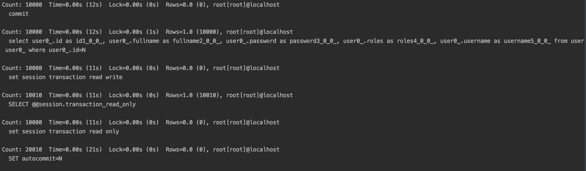
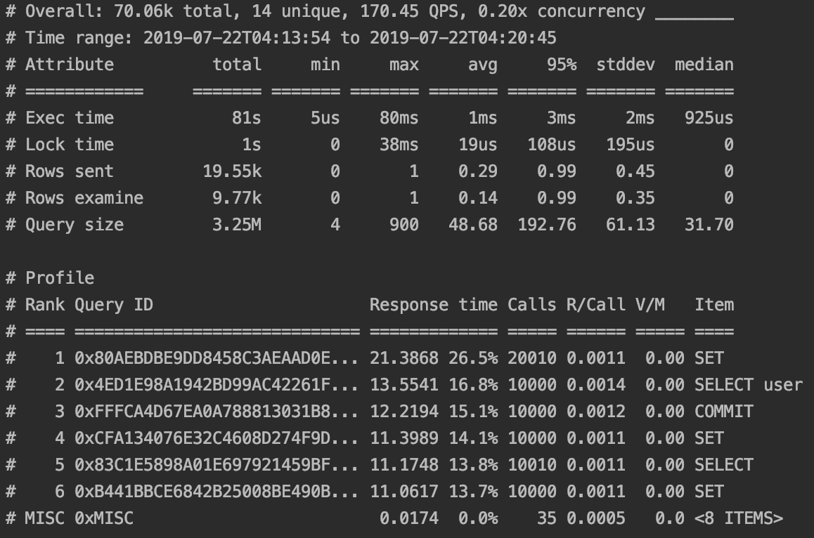
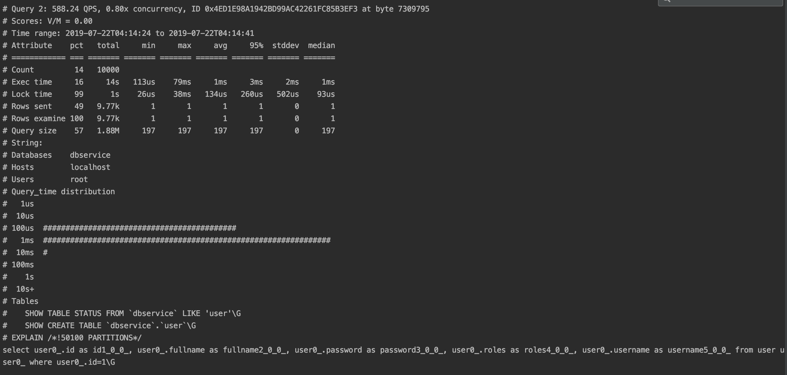

## 分析Slow Query

### 开启Slow Query Log的步骤

默认情况下，Slow Query Log是关闭的。为了开启Slow Query Log，调优MySQL Query，步骤如下：

1. 在MySQL的安装根目录，新建my.cnf文件。打开my.cnf文件，添加如下内容：

    * slow query log为1，表示开启；为0，表示关闭  - 默认是只记录使用index的query。
    * slow query log file中，配置绝对路径。
    * long query time是以秒为单位。如下设置表示，query时间超过1秒，则记录在slow query log中。
    * log queries not using indexes为1，表示没有使用index的query，也记录在slow query log中。

```
[mysqld]
slow_query_log=1
slow_query_log_file=/.../db-slow.log
long_query_time=1
log_queries_not_using_indexes=1
```

查看数据库的安装根目录，可以在MySQL中执行如下命令：

```
mysql> SELECT @@BASEDIR;
```

2. 这时启动MySQL，如果有超过1秒的long query，则会被记录在slow query log中。

### 分析Slow Query

可以用如下两种工具分析slow query。

1. 在Terminal中，使用mysqldumpslow，分析slow query log：

```
$ mysqldumpslow /.../db-slow.log
```

这时可以看见如下分析：

* Time为query time
* Lock为lock time
* Rows为发送到client的rows总数
* 最后是statement，比如查询语句



2. 使用Percona的pt-query-digest工具。

在目标folder中，下载pt-query-digest：

```
$ curl -LO https://percona.com/get/pt-query-digest
```

使其executable：

```
$ chmod +x pt-query-digest
```

分析slow query log：

```
$ ./pt-query-digest /.../db-slow.log
```

这时可以看见如下分析：

* 在Profile中，可以看到占最多时间的query。最后针对耗时的query，在MySQL中，用EXPLAIN执行，决定是否建index或temporary表。





以上每个指标的意思如下：

| Column        Meaning                                                    |
|--------------------------------------------------------------------------|
| Rank          The query's rank within the entire set of queries analyzed |
| Query ID      The query's fingerprint                                    |
| Response time The total response time, and percentage of overall total   |
| Calls         The number of times this query was executed                |
| R/Call        The mean response time per execution                       |
| V/M           The Variance-to-mean ratio of response time                |
| Item          The distilled query                                        |

### Reference

* https://dev.mysql.com/doc/refman/8.0/en/slow-query-log.html
* https://www.percona.com/doc/percona-toolkit/LATEST/pt-query-digest.html