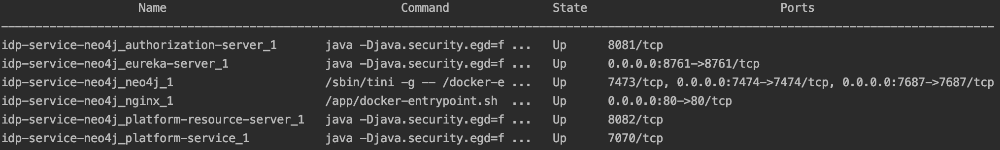
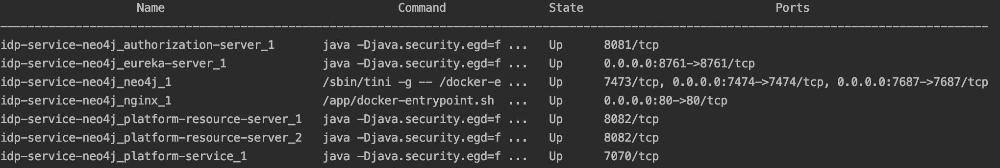

## Docker for Microservice

### Build the Docker image

For each service, add the Maven build plugin as below:

```
<plugin>
    <groupId>com.spotify</groupId>
    <artifactId>dockerfile-maven-plugin</artifactId>
    <version>1.4.0</version>
    <executions>
        <execution>
            <id>default</id>
            <goals>
                <goal>build</goal>
                <goal>push</goal>
            </goals>
        </execution>
    </executions>
    <configuration>
        <repository>${project.artifactId}</repository>
        <tag>${project.version}</tag>
        <buildArgs>
            <JAR_FILE>target/${project.build.finalName}.jar</JAR_FILE>
        </buildArgs>
    </configuration>
</plugin>
```

For each service, write its own Dockerfile in the root of the classpath as below:

```
# Start with a base image containing Java runtime
FROM java:8-jre

# Add a volume pointing to /tmp
VOLUME /tmp

# Make port 8761 available to the world outside this container
EXPOSE 8761

# The application's jar file
ARG JAR_FILE

# Add the application's jar to the container
ADD ${JAR_FILE} app.jar

# Run the jar file
ENTRYPOINT ["java","-Djava.security.egd=file:/dev/./urandom","-jar","/app.jar"]
```

When the above configuration is set up, execute the Maven command to build the Docker image from the Dockerfile:

```
mvn package
```

When you check the Docker images:

```
docker images
```

You can see below results:

```
REPOSITORY                 TAG                 IMAGE ID            CREATED             SIZE
authorization-server       1.0.0-SNAPSHOT      a1fdfd251035        32 hours ago        240MB
```

When every service is set up with the above configuration, you can prepare the docker-compose configuration.

### Docker compose for all services

Prepare the docker-compose.yml file as below:

```
version: '2.1'
services:
  eureka-server:
    image: 93e5e05faf08
    ports:
      - 8761:8761

  neo4j:
    image: e89d0c320043
    ports:
      - 7687:7687
      - 7474:7474

  authorization-server:
    image: a1fdfd251035
    ports:
      - 8081:8081

  platform-resource-server:
    image: 42571135a4bf

  platform-service:
    image: 7459bff173be
    ports:
      - 7070:7070
```

Run the below commands to start all the containers:

```
docker-compose up -d
```

When all the containers are up and running, you can check the status of each service with below command:

```
docker-compose ps
```

With the following result:




To scale up the platform-resource API service, just execute below command:

```
docker-compose scale platform-resource-server=2
```

And when you check the status of each service again, the added service displays as "idp-service-neo4j_platform-resource-server_2", as in the below snapshot.



The added services will be discovered by the Spring Cloud Ribbon's LoadBalancedClient.

