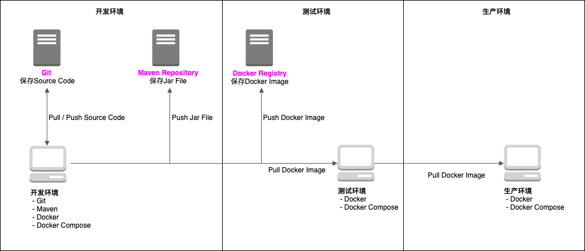
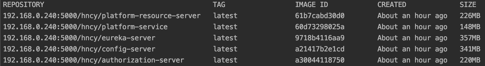

## Dev + Test + Prod Environments

### 环境迭代

在环境迭代中，目前分为三个环境：

1. 开发环境
2. 测试环境
3. 生产环境



下面来分别说明三个环境。

### 开发环境

开发环境，即开发人员的本地环境。开发人员只需安装如下应用：

* Git
* Maven
* Docker
* Docker Compose

当如上应用安装成功，开发人员只需做如下几个步骤，即可搭建好开发环境。

拿用户平台作为例子：

1. 下载源代码，源代码的根目录下包含Dockerfile。

2. 在需要启动的服务的根目录，执行mvn package。

    * buildVersion需要自己设置，buildVersion会成为部署的Jar File的版本和Docker Image的Tag。
    * buildVersion包含SNAPSHOT时，比如1.0.0-SNAPSHOT，build的好的Jar包会在deploy时上传到Maven的snapshot repository；否则其上传到Maven的release repository。
    * profile分为local和docker，通过Maven加载resources时的变量"spring.profiles.active"传入。

```
mvn clean package -Pdocker -DbuildVersion=latest
```

此时执行docker images，会看到刚刚build成功的Docker Image。



3. 最后下载docker-compose.yml文件，执行docker-compose命令启动所有相关服务。

```
docker-compose -f docker-compose.yml up
```

4. 如果需要发布某个service版本到Maven Repository和Docker Registry，执行mvn deploy命令即可。

```
mvn deploy -Pdocker -DbuildVersion=1.0.0
```

### 测试环境

在测试环境中，只需编辑好docker-compose.yml文件，从Docker Registry中下载相关的服务。其他测试工具，比如性能测试工具，安全测试工具，需要测试环境自己维护。

### 生产环境

在生产环境中，只需编辑好docker-compose.yml文件，从Docker Registry中下载相关的服务。和测试环境不同的是，配置文件中所有的密码，需由环境变量传入。比如：

```
docker-compose -f docker-compose.yml up -e DB_PASSWORD=db_password
```

在生产环境中，还需安装Hystrix Dashboard等Monitoring，Aggregated的日志监控和DNS服务，Nginx服务等。
