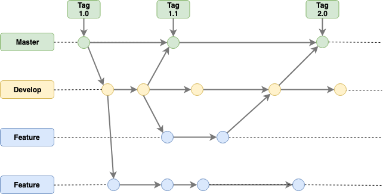

## Git Branching

Git Branching策略如下图，目前分为3个branch:

1. Master：在发布版本时，从Develop分支merge到Master分支，并打上相应版本的Tag。当Develop分支merge到Master分支后，需要自动执行相关测试，比如功能测试，性能测试、安全测试和可访问性测试，测试成功后才能merge，并随后部署Jar包到Maven Repository和Docker Image到Docker Registry，触发生产环境Docker Image更新和启动。
2. Develop：CI持续集成代码分支。当Feature分支merge到Develop分支后，需要自动执行Code Quality测试，单元测试和集成测试，测试成功后才能merge。
3. Feature：当每个开发人员，在自己分领任务后，创建的自己的代码分支。

Maven的Default Lifecyle包含以下phase：

* validate
* compile
* test
* package
* verify
* install
* deploy

对应于以上Branching：

1. 在Master上会执行的phase包含：validate → compile → test → package → verify → install → deploy
2. 在Develop上会执行的phase包含：validate → compile → test → package → verify → install
3. 在Feature上会执行的phase包含：validate → compile → test
