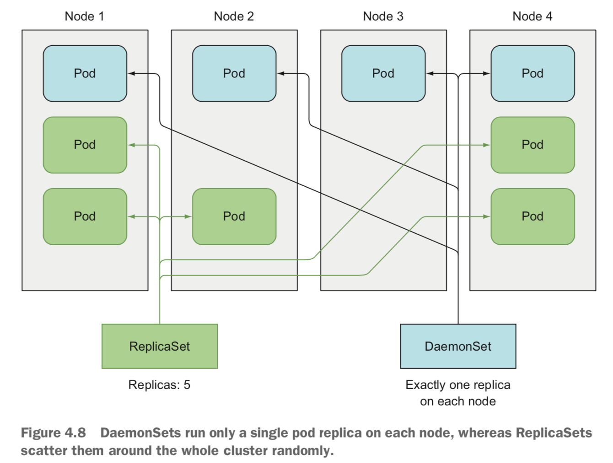

## Kubernetes

### kubectl + minikube

<p float=left>
	
</p>

```bash
$ minikube start
$ kubectl cluster-info

$ kubectl run kubia --image=tintinrevient/kubia --port=8080
$ kubectl expose pod kubia --type=LoadBalancer --name=kubia-http
$ kubectl get services

$ minikube service kubia-http

$ kubectl scale pod kubia --replicas=3
```

```bash
$ minikube dashboard
```

```bash
$ kubectl get nodes --all-namespaces
$ kubectl get pods --all-namespaces -o wide
$ kubectl get services
```

```bash
$ kubectl cordon minikube
$ kubectl delete pod kubia
$ kubectl uncordon minikube

$ kubectl delete pod -l env=debug
$ kubectl delete pod --all
$ kubectl delete namespace custom-namespace
$ kubectl delete all --all
```

```bash
$ docker container prune -f
$ docker image prune -f
$ docker volume prune -f
```

```bash
$ kubectl explain pods
$ kubectl explain pod.spec
```

<p float=left>
	
</p>

```bash
$ kubectl create -f kubia-manual.yaml
$ kubectl get pod kubia-manual -o yaml

$ kubectl logs kubia-manual
$ kubectl logs kubia-manual -c kubia

$ kubectl port-forward kubia-manual 8888:8080
$ curl localhost:8888
```

```bash
$ kubectl get pods --show-labels
$ kubectl get pod kubia-manual-with-labels --show-labels

$ kubectl get pods -L creation_method,env
$ kubectl get pod kubia-manual-with-labels -L creation_method,env

$ kubectl label pod kubia-manual creation_method=manual
$ kubectl label pod kubia-manual-with-labels env=debug --overwrite

$ kubectl get pods -l env
$ kubectl get pods -l '!env'
$ kubectl get pods -l creation_method=manual
$ kubectl get pods -l creation_method!=manual
$ kubectl get pods -l creation_method=manual,env=debug
```

```bash
$ kubectl get namespaces
$ kubectl create -f custom-namespace.yaml
```

```bash
$ docker build -t kubia-unhealthy .
$ docker images
$ docker tag kubia-unhealthy tintinrevient/kubia-unhealthy
$ docker push tintinrevient/kubia-unhealthy

$ kubectl create -f kubia-liveness-probe.yaml
$ kubectl get pods
$ kubectl port-forward kubia-liveness 8000:8080

$ kubectl logs kubia-liveness --previous
$ kubectl describe pod kubia-liveness
```

<p float=left>
	
</p>

```bash
$ kubectl create -f kubia-rc.yaml
$ kubectl get rc
$ kubectl get pods --show-labels

$ kubectl edit rc kubia
$ kubectl scale rc kubia --replicas=10
$ kubectl delete rc kubia
$ kubectl delete rc kubia --cascade=orphan
```

```bash
$ kubectl create -f kubia-replicaset.yaml
$ kubectl get rs

```

<p float=left>
	
</p>

```bash
$ kubectl create -f kubia-daemonset.yaml 
$ kubectl get ds
```

<p float=left>
	
</p>

```bash
$ kubectl create -f kubia-job.yaml 
$ kubectl get jobs

$ kubectl scale job batch-job--1-pgh67 --replicas 3
```

```bash
$ kubectl create -f kubia-cronjob.yaml
$ kubectl get cj
```

```bash
$ kubectl create -f kubia-service.yaml
$ kubectl get svc

$ kubectl exec kubia-l2pfp -- curl -s http://10.107.70.66
$ kubectl exec kubia-mdb4l -- curl -s kubia (kubia.default.svc.cluster.local)

$ kubectl exec kubia-hxtfc -- env

$ kubectl exec -it kubia-mdb4l -- bash
$ curl http://kubia
$ curl kubia
$ cat /etc/resolv.conf
$ ping kubia

$ kubectl describe service kubia
$ kubectl get endpoints kubia
```

<p float=left>
	
</p>

```bash
$ minikube service kubia-nodeport
```

```bash
$ minikube addons list
$ minikube addons enable ingress

$ kubectl create -f kubia-ingress.yaml
$ kubectl get ingress
```

<p float=left>
	
</p>

```bash
$ openssl genrsa -out tls.key 2048
$ openssl req -new -x509 -key tls.key -out tls.cert -days 10 -subj /CN=kubia.example.com

$ kubectl create secret tls tls-secret --cert tls.cert --key tls.key 

$ kubectl apply -f kubia-ingress-tls.yaml
```

<p float=left>
	
</p>

```bash
$ kubectl create -f kubia-headless.yaml
$ kubectl describe service kubia-headless

$ kubectl run dnsutils --image=tutum/dnsutils --command -- sleep infinity
$ kubectl exec dnsutils -- nslookup kubia-headless
```

<p float=left>
	
</p>

```bash
$ kubectl create -f fortune-pod.yaml
$ kubectl port-forward fortune 8080:80

$ curl http://localhost:8080

$ kubectl describe pod etcd-minikube --namespace kube-system
$ 
```

<p float=left>
	
	
</p>

```bash
$ kubectl get sc
$ kubectl get sc standard -o yaml
```

```bash
$ ps x
```

<p float=left>
	
</p>

```bash
$ kubectl create configmap fortune-config --from-literal=sleep-interval=15
$ kubectl get configmap fortune-config -o yaml

$ kubectl create configmap fortune-config --from-file=configmap-files

$ curl -H "Accept-Encoding: gzip" -I localhost:8080
$ kubectl exec fortune-env -c web-server -- ls /etc/nginx/conf.d
```

```bash
$ ls -lA
```

```bash
$ kubectl get secrets

$ openssl genrsa -out https.key 2048
$ openssl req -new -x509 -key https.key -out https.cert -days 14 -subj /CN=www.kubia-example.com
$ echo bar > foo
```

<p float=left>
	
</p>

```bash
$ kubectl create secret generic fortune-https --from-file=https.key --from-file=https.cert --from-file=foo
$ kubectl create configmap fortune-config --from-file=configmap-files
$ kubectl create -f fortune-https.yaml

$ kubectl port-forward fortune-https 8443:443 &

$ curl https://localhost:8443 -k
$ curl https://localhost:8443 -k -v
```

<p float=left>
	
</p>

```bash
$ kubectl create -f downward-api-env.yaml
$ kubectl exec downward -- env

$ kubectl exec downward -- ls -lA /etc/downward
```

```bash
$ kubectl cluster-info

$ kubectl proxy
$ curl localhost:8001
$ curl localhost:8001/api/v1/pods
$ curl localhost:8001/api/v1/namespaces/default/pods/kubia-j68bp
```

```bash
$ kubectl get svc
$ env | grep KUBERNETES_SERVICE

$ ls /var/run/secrets/kubernetes.io/serviceaccount/
$ curl --cacert /var/run/secrets/kubernetes.io/serviceaccount/ca.crt https://kubernetes

$ export CURL_CA_BUNDLE=/var/run/secrets/kubernetes.io/serviceaccount/ca.crt
$ curl https://kubernetes

$ export TOKEN=$(cat /var/run/secrets/kubernetes.io/serviceaccount/token)
$ curl -H "Authorization: Bearer $TOKEN" https://kubernetes
```

<p float=left>
	
</p>

```basb
$ kubectl exec -it curl-with-ambassador -c main -- bash
$ curl localhost:8001
```

```bash
$ kubectl run swagger-ui --image=swaggerapi/swagger-ui
$ kubectl expose deployment swagger-ui --port=8080 --external-ip=$(minikube ip) --type=NodePort
$ http://192.168.99.100:8080/
```

<p float=left>
	
</p>

```bash
$ kubectl create -f kubia-deployment-v1.yaml --record

$ kubectl get deployment
$ kubectl rollout status deployment kubia

$ kubectl patch deployment kubia -p '{"spec": {"minReadySeconds": 10}}'

$ kubectl set image deployment kubia nodejs=luksa/kubia:v2

$ kubectl rollout undo deployment kubia
$ kubectl rollout history deployment kubia
$ kubectl rollout undo deployment kubia --to-revision=1

$ kubectl rollout pause deployment kubia
$ kubectl rollout resume deployment kubia
```

<p float=left>
	
</p>

```bash
$ kubectl apply -f kubia-deployment-v3-with-readinesscheck.yaml
```

<p float=left>
	
</p>

```bash
$ curl localhost:8001/api/v1/namespaces/default/pods/kubia-0/proxy/

$ dig SRV kubia.default.svc.cluster.local

$ kubectl delete po kubia-0 --force --grace-period 0

$ curl -X POST -d "hello" localhost:8080

$ curl ifconfig.me
$ ipconfig getifaddr en0
```

<p float=left>
	
	
</p>

### References

* https://kubernetes.io/docs/reference/generated/kubectl/kubectl-commands#run
* https://kubernetes.io/docs/tasks/access-application-cluster/web-ui-dashboard/
* https://kubernetes.io/docs/reference/
* https://minikube.sigs.k8s.io/docs/handbook/config/