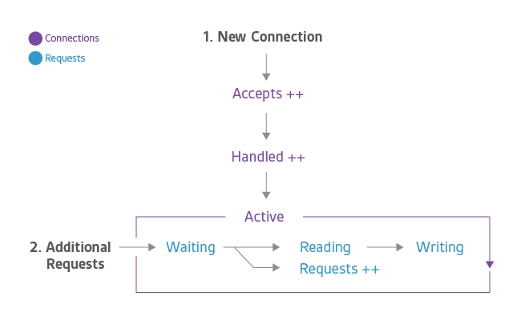
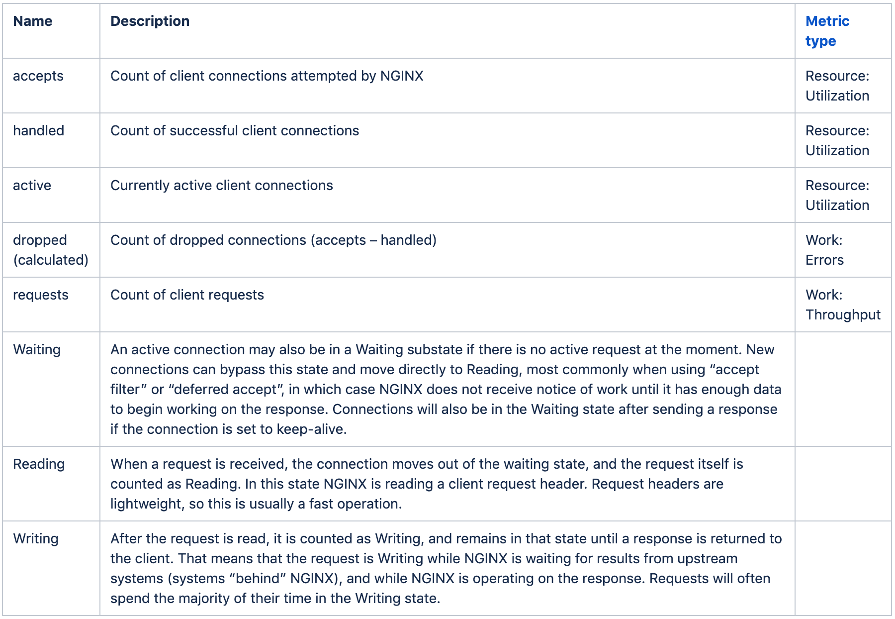
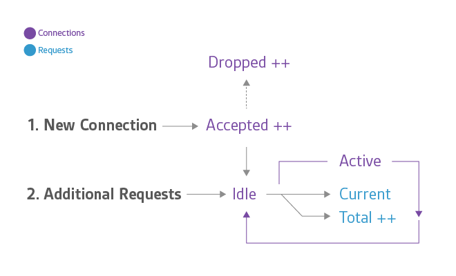

## Nginx性能调优

### Nginx用户连接的Lifecycle

下图是Nginx用户连接的生命周期：


其中的指标具体说明如下：


我们关注的指标包含：

* requests：一个connection可以包含多个request，所以request的数量是大于并发connection数量的。requests指标也是以后计算RPS (Request Per Second)的源数据，其公式等于：total requests/duration。
* error rate：our server error rate is equal to the number of 5xx errors, such as “502 Bad Gateway”, divided by the total number of status codes (1xx, 2xx, 3xx, 4xx, 5xx), per unit of time (often one to five minutes)
* response time：一个request从进入到返回的时间，如下图：



### 和Nginx性能相关的属性

1. Work Processes & Work Connections

在/etc/nginx/nginx.conf中，可以看到如下配置：
```
worker_processes 1;
worker_connections 1024;
```

一般来说，一个core就运行一个worker process；而影响worker connection的相关因素包含其操作系统设置的最大socket descriptor，也就是file descriptor，我们可以通过如下命令查询其file descriptor：
```
$ ulimit -n
```

其中work connection的值一定小于最大file descriptor的值。


2. Timeouts

在/etc/nginx/nginx.conf中，可以看到如下配置：

```
client_body_timeout 12;
client_header_timeout 12;
keepalive_timeout 15;
send_timeout 10;
```

如下是具体解释：

* client_body_timeout and client_header_timeout directives are responsible for the time a server will wait for a client body or client header to be sent after request. If neither a body or header is sent, the server will issue a 408 error or Request time out.
* keepalive_timeout assigns the timeout for keep-alive connections with the client. Simply put, Nginx will close connections with the client after this period of time.
* send_timeout is established not on the entire transfer of answer, but only between two operations of reading; if after this time client will take nothing, then Nginx is shutting down the connection.

如果keepalive_timeout设置过高，会导致worker connection设置的1024的并发上不去，因为Nginx会长久不close连接；如果keepalive_timeout设置过低，会导致请求没回应，Nginx就提前close连接。

### Reference
1. https://www.datadoghq.com/blog/how-to-monitor-nginx/
2. https://www.digitalocean.com/community/tutorials/how-to-optimize-nginx-configuration
3. https://www.nginx.com/blog/tuning-nginx/#worker_connections

