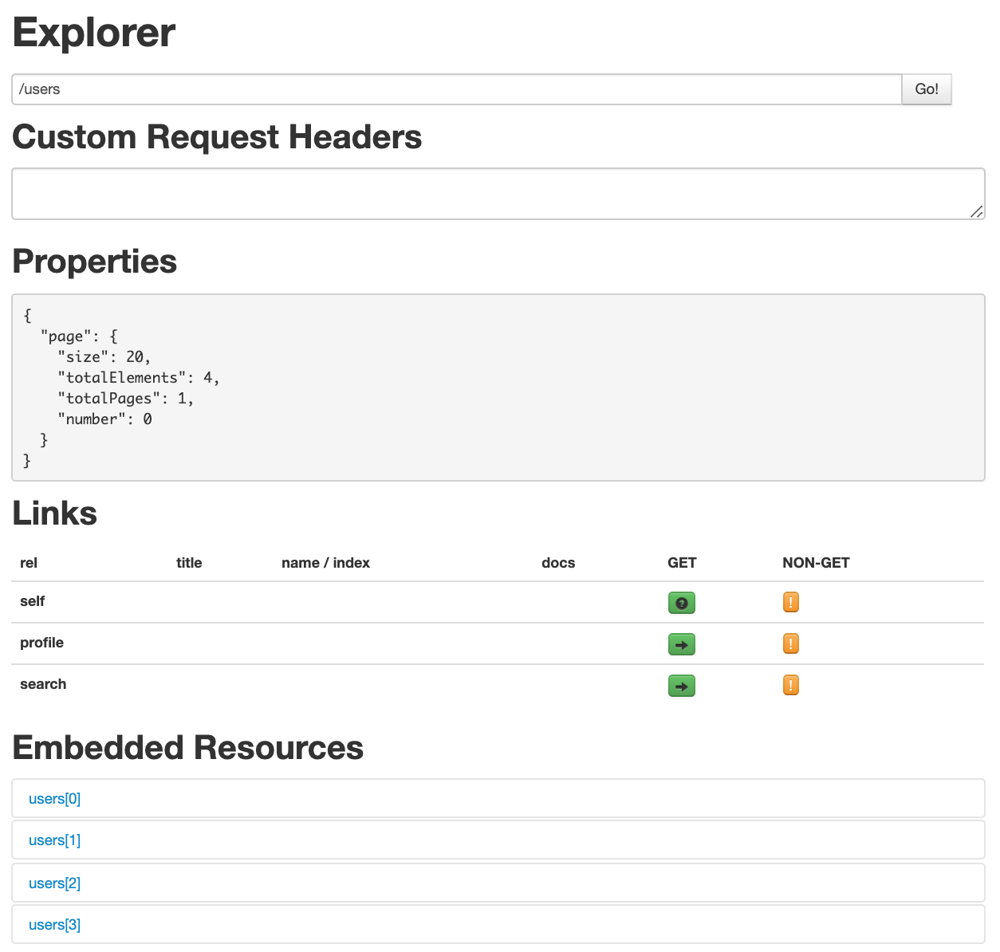
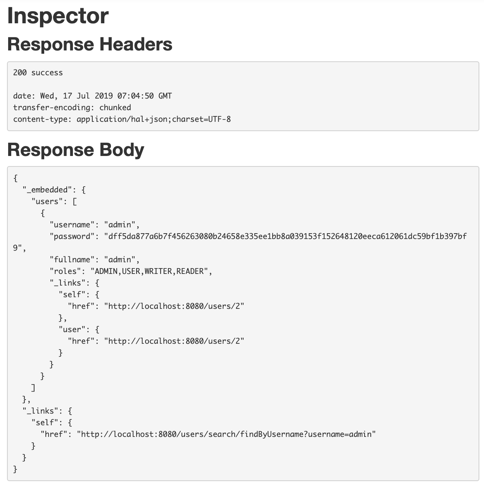
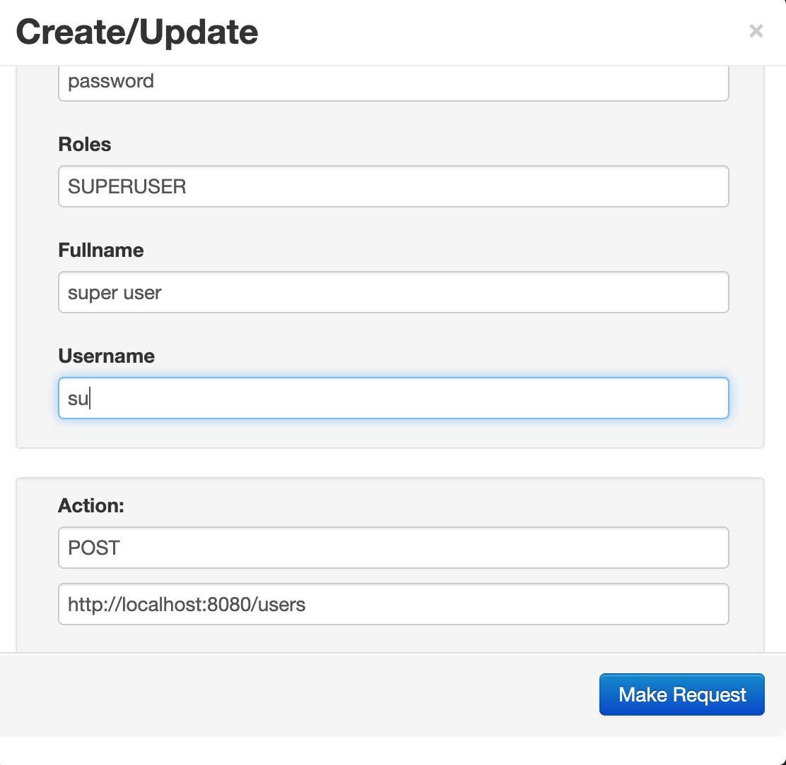
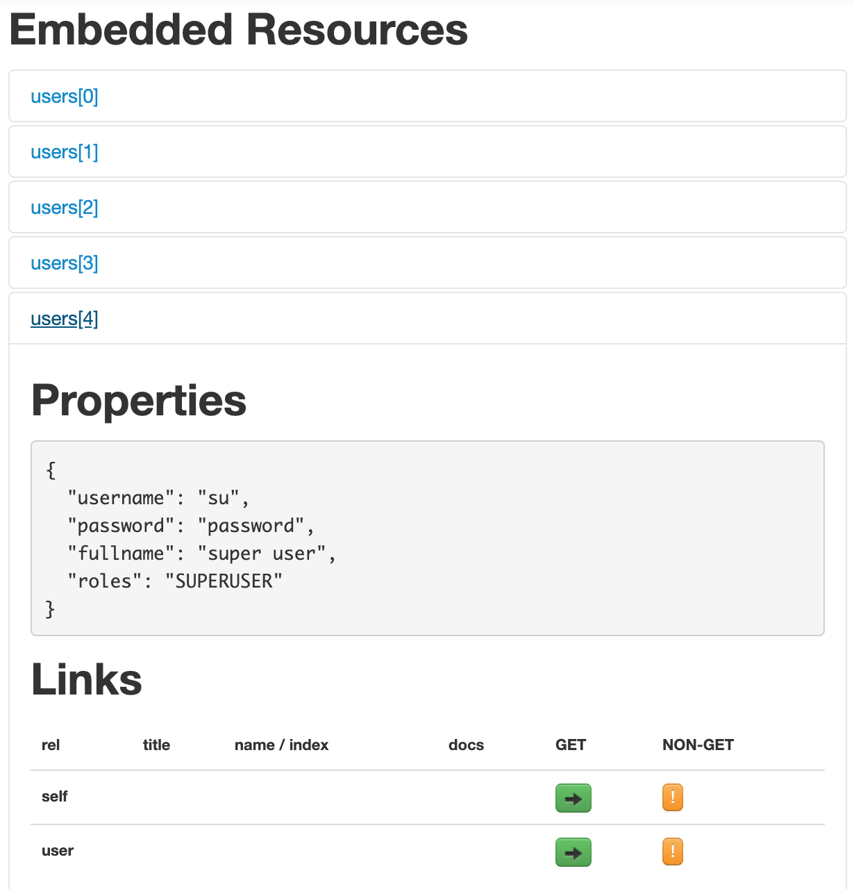

## HAL Browser

[JSON Hypertext Application Language](http://stateless.co/hal_specification.html) (HAL) 是一种数据格式，HAL为JSON定义的media type是application/hal+json。HAL Browser可以展示HAL数据格式，即各个资源和他们API间的hyperlink，让开发能更好的检索、浏览和操作REST API。功能类似于Swagger UI，Swagger UI偏向于API的展示，而HAL Browser偏向于RESTful资源的展示。

简单来讲，HAL模型包含：

1. Resources - 比如Embedded Resources，一组返回的JSON数据(从定义好的POJO序列化出来的)
2. Links - 比如返回Resources本身的URI，以及其他相关的profile、search链接

在Spring Boot项目中引入HAL Browser的前提是：使用spring-boot-starter-data-rest，曝露出基于HAL数据格式的接口。

当前提条件满足，只需在pom.xml中引入如下依赖：
```
<dependency>
    <groupId>org.springframework.data</groupId>
    <artifactId>spring-data-rest-hal-browser</artifactId>
</dependency>
```

这时启动Spring Boot项目，便可在http://localhost:8080/browser/index.html 中查看所有API。

关于HAL Browser，它包含如下两部分：
1. Explorer - 如下，可以看到users资源下有4个资源，及其links包含其搜索链接。


2. Inspector - 如下，可以看到对资源http://localhost:8080/users/2 的Response Headers和Response Body的详细信息。


除此之外，还可以对资源进行增删改查的操作，比如针对http://localhost:8080/users 资源，可以填写如下表单，增加一个新用户：


这时查询users下的资源，可以找到新添加的用户：


