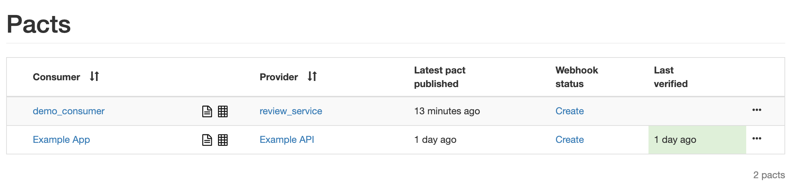
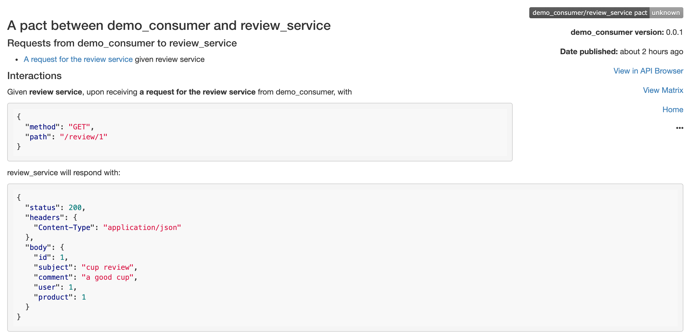
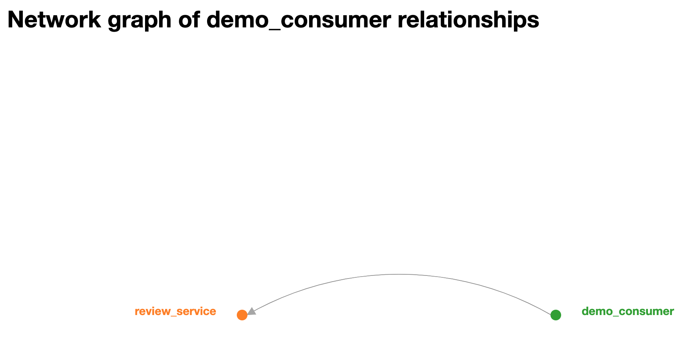

## Pact Broker

Pact Broker用于存储CDC Tests中consumer微服务生成的API合约，便于producer微服务验证其是否遵守了API合约。这有利于各个微服务开发团队之间的独立开发与协作，以及微服务上线的持续集成。

Pact Broker的详细讲解，参见：https://github.com/pact-foundation/pact_broker

### 如何搭建Pact Broker服务器？

如下命令，可以从docker image启用一个temporary的Pact Broker服务器：
```
docker run -p 80:80 -e PACT_BROKER_DATABASE_ADAPTER=sqlite -e PACT_BROKER_DATABASE_NAME=pact_broker.sqlite dius/pact-broker
```

注意：如果需要启动持久的Pact Broker，需要使用postgres或者mysql数据库，具体配置参见：https://hub.docker.com/r/dius/pact-broker

这时访问http://localhost/，可以看到Pack Broker的界面：


### Consumer微服务怎么发布一个contract到Pact Broker?

在consumer微服务pom.xml中，加入如下maven plugin：

```
<plugin>
    <groupId>au.com.dius</groupId>
    <artifactId>pact-jvm-provider-maven_2.12</artifactId>
    <version>3.6.11</version>
    <configuration>
        <pactDirectory>target/pacts</pactDirectory>
        <pactBrokerUrl>http://localhost</pactBrokerUrl>
        <trimSnapshot>true</trimSnapshot>
    </configuration>
</plugin>
```

这时执行如下命令，生成的contract就可以上传到Pact Broker：

```
mvn pact:publish
```

### Producer微服务怎么从Pact Broker获取contract，从而验证其是否遵守合约?

在producer微服务pom.xml中，加入如下maven plugin：

```
<plugin>
    <groupId>au.com.dius</groupId>
    <artifactId>pact-jvm-provider-maven_2.12</artifactId>
    <version>3.6.11</version>
    <configuration>
        <serviceProviders>
            <serviceProvider>
                <name>review_service</name>
                <pactBrokerUrl>http://localhost</pactBrokerUrl>
                <protocol>http</protocol>
                <host>localhost</host>
                <port>6061</port>
                <path>/</path>
            </serviceProvider>
        </serviceProviders>
    </configuration>
</plugin>
```

这时执行如下命令，可以验证producer微服务是否遵守了合约：

```
mvn pact:verify
```

### Pact Broker的其他功能

Pact Broker可以自动生成contract的说明：


还可以自动生成微服务之间的依赖网络关系：


