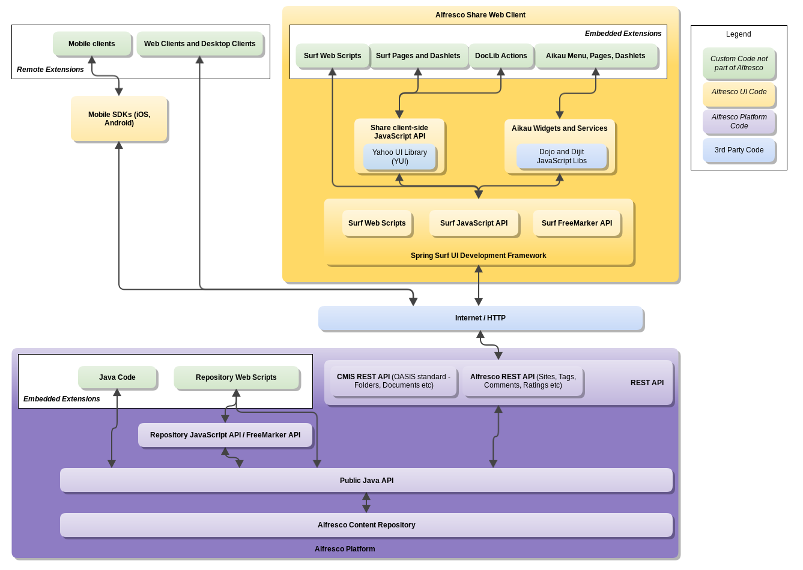

## Alfresco Community

在Activiti中，加入了Alfresco Community文件服务器，用于保存流程中上传的文档/音频/视频，及其在文件服务器中设置Microsoft Word自动转换成Adobe PDF的规则。


### 安装步骤

在Linux服务器中，搭建并启动Alfresco Community文件服务器的步骤，参见：https://docs.alfresco.com/community5.1/tasks/simpleinstall-community-lin.html

### Alfresco Community支持的API

目前Alfresco Community支持的API如下，每个API的具体说明参见：https://docs.alfresco.com/6.0/concepts/dev-reference-guide.html


### REST API的两个例子

本地Alfresco Community测试服务器的信息如下：
* 地址：http://localhost:9081/share
* 用户名：admin
* 密码：admin

1. CMIS REST API的例子

在Java的Maven项目中，需要在pom.xml中配置Apache Chemistry依赖：
```
<dependency>
    <groupId>org.apache.chemistry.opencmis</groupId>
    <artifactId>chemistry-opencmis-client-impl</artifactId>
    <version>0.3.0</version>
</dependency>
```

在5.2版本中，CMIS REST API的相对地址是：“/alfresco/cmisatom”，所以代码中做如下配置：
* username: admin
* password: admin
* URL: http://localhost:9081/alfresco/cmisatom
```
public void uploadMP4() throws Exception {
        Session session = CmisUtil.createCmisSession("admin", "admin", "http://localhost:9081/alfresco/cmisatom");
        Folder folder = CmisUtil.getFolder(session, "documents");

        String path = basePath + "videos/test.mp4";
        Path docPath = Paths.get(path);
        byte[] content = Files.readAllBytes(docPath);

        Document document = CmisUtil.createDocument(session, folder, "test.mp4", "video/mp4", content);
}
```

2. REST API的例子

REST API的相对地址是：“/alfresco/api/-default-/public/alfresco/versions/1/nodes/-my-/children”。所以Curl命令如下，其中@test.png是terminal当下路径中包含的test.png文件：
```
curl -u admin:1234 -X POST http://localhost:9081/alfresco/api/-default-/public/alfresco/versions/1/nodes/-my-/children -F filedata=@test.png

```

关于文件的Node ID
* 可以在http://localhost:9081/alfresco/api/-default-/public/alfresco/versions/1/nodes/-my-/children 里面查看test.png的node ID，例如：25fa80c7-365b-4164-b3c4-ffb66a45b5ca
* 在Curl上传完test.png后，node ID和文件名也会返回，如下是返回信息：
```
{"entry":{"isFile":true,"createdByUser":{"id":"admin","displayName":"Administrator"},"modifiedAt":"2019-07-17T10:24:46.222+0000","nodeType":"cm:content","content":{"mimeType":"image/png","mimeTypeName":"PNG Image","sizeInBytes":74660,"encoding":"UTF-8"},"parentId":"9f3fcc4d-8820-4e73-b818-453276130443","aspectNames":["cm:versionable","cm:titled","cm:auditable","cm:author","exif:exif"],"createdAt":"2019-07-17T10:24:46.222+0000","isFolder":false,"modifiedByUser":{"id":"admin","displayName":"Administrator"},"name":"test1.png","id":"e06b62eb-b7bb-4e96-ba6c-c501d81fd3fb","properties":{"exif:pixelYDimension":912,"cm:versionType":"MAJOR","cm:versionLabel":"1.0","exif:pixelXDimension":1802}}}
```

从服务器下载test.png文件，可以用如下Curl命令：
```
$ curl -u admin:1234 -X GET http://localhost:9081/alfresco/api/-default-/public/alfresco/versions/1/nodes/25fa80c7-365b-4164-b3c4-ffb66a45b5ca/content
```

预览刚刚上传的test.png图片，地址是：http://localhost:9081/share/proxy/alfresco/slingshot/node/content/workspace/SpacesStore/25fa80c7-365b-4164-b3c4-ffb66a45b5ca/test.png