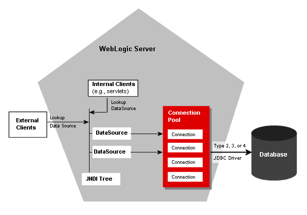
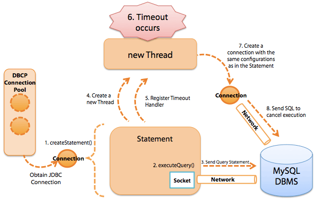
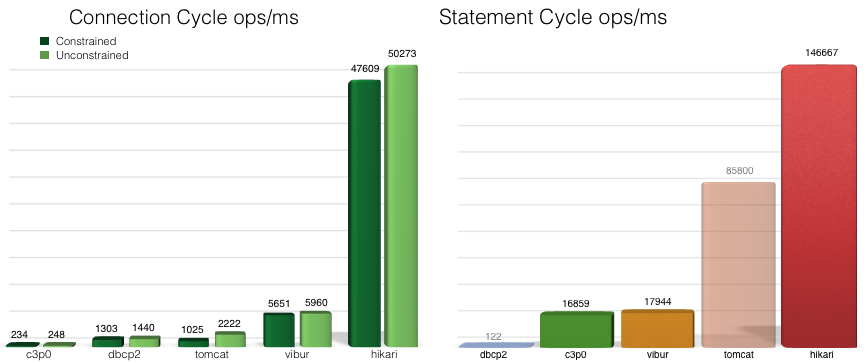
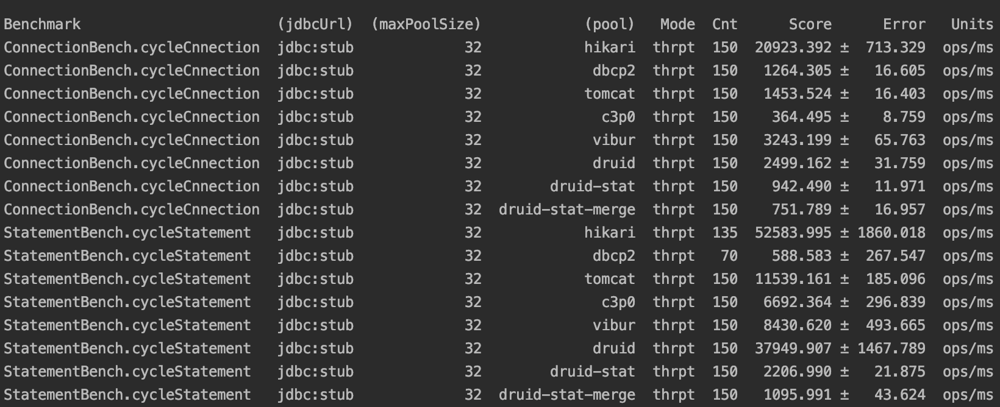
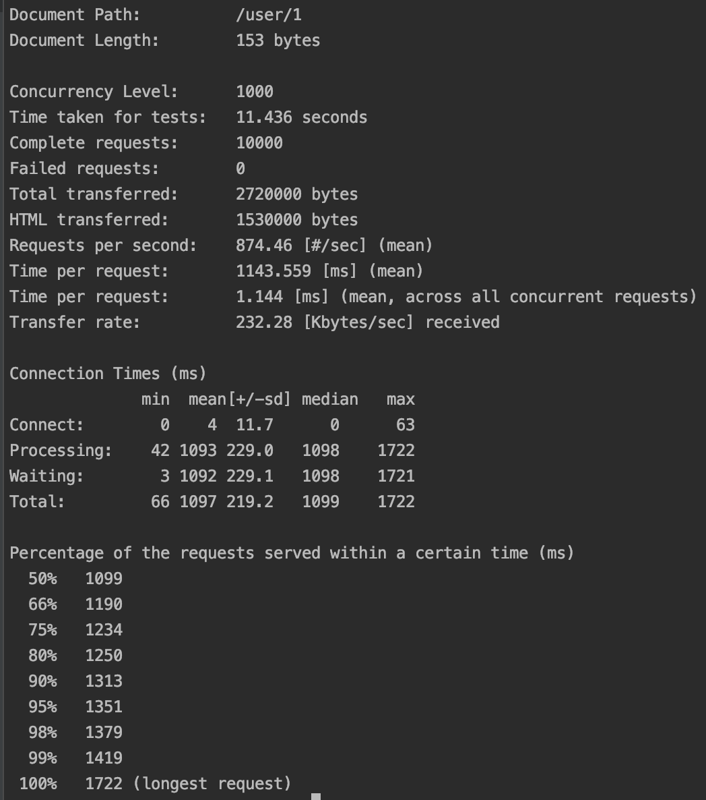
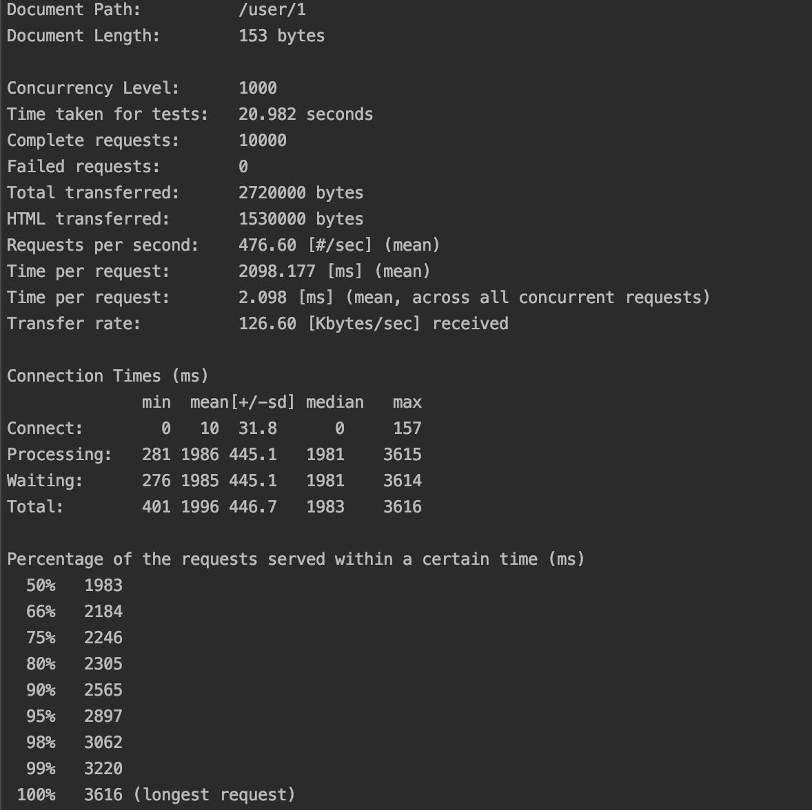
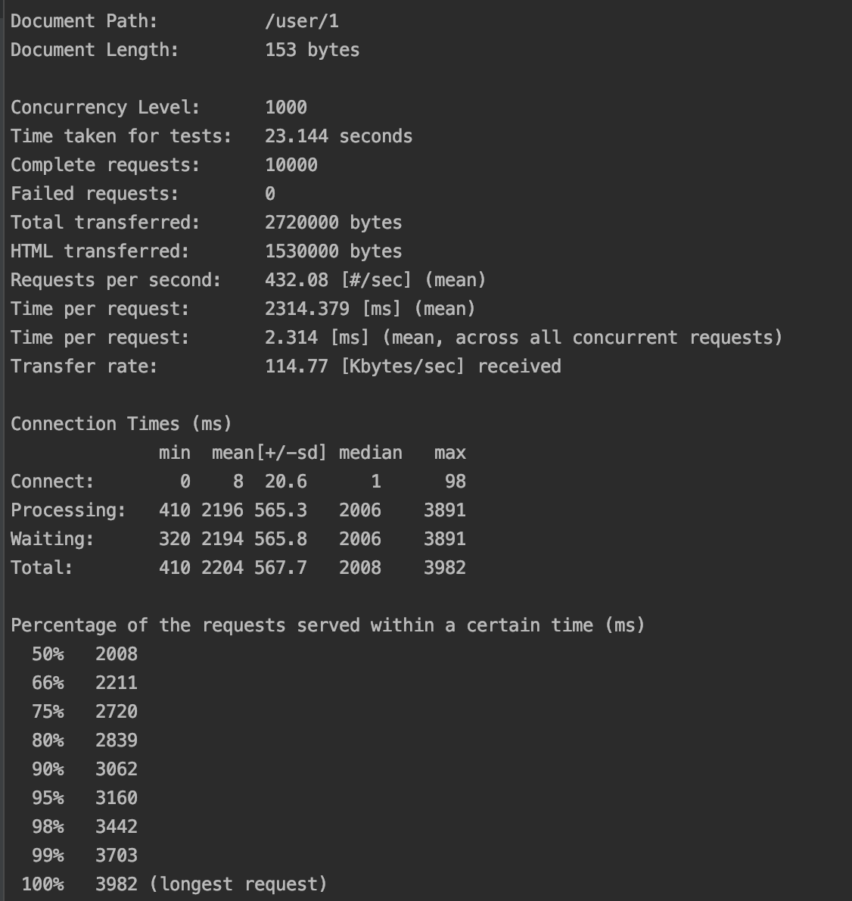
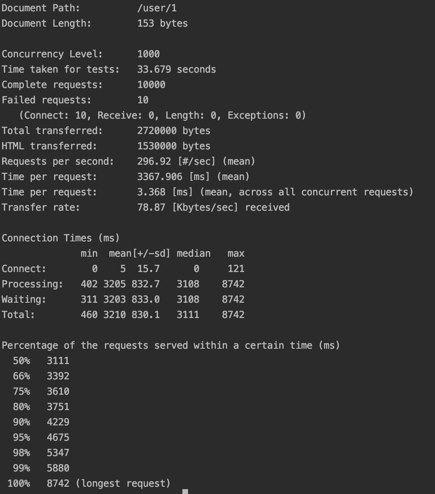
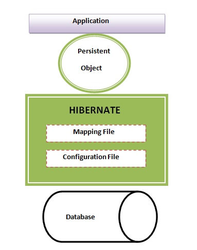
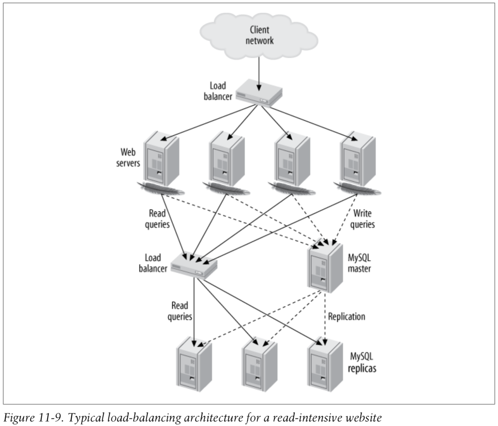

## Database Test

### JDBC

#### JDBC Architecture

Overview Architecture:

Detailed Architecture:

#### What are the common tasks of JDBC ?
* Performing a connection to a database -- through a Connection object.
* Performing an operation on a database (i.e.create, read, update, delete ) -- through a Statement object.
* Obtaining the results of an operation on a database -- through a ResultSet object.

#### What are the two major components of JDBC ?
* The JDBC API used by application developers to connect to a permanent storage system.
* The JDBC SPI (Service Provider Interface) used by permanent storage manufacturers to provide connectivity for JDBC (i.e. through the creation of JDBC drivers).

#### What is a JDBC DataSource ?
A JDBC DataSource is an object used to establish a connection to a permanent storage system. It's the preferred way by which to establish a connection, instead of the older DriverManager approach.

#### What types of DataSource objects are specified in the Optional Package ?
* Basic - Provides a standard Connection object.
* Pooled - Provides a Connection pool and returns a Connection that is controlled by the pool.
* Distributed - Provides a Connection that can participate in distributed transactions.

#### An Example of JDBC API (Pooled Datasource)

#### JDBC Connection Pool & Thread

#### JDBC Connection Pooling Frameworks & Benchmarking

以下测试结果来自：https://github.com/brettwooldridge/HikariCP-benchmark

以下测试结果来自运行其benchmark.sh。可以看到综合性能上比较：hikari > druid > tomcat jdbc > vibur > apache dbcp2 > c3p0。

* One Connection Cycle is defined as single DataSource.getConnection()/Connection.close().
* One Statement Cycle is defined as single Connection.prepareStatement(), Statement.execute(), Statement.close().

以下结果是用Apache Benchmarking做了一个Full-Stack的测试，不同Data Source的测试结果如下：

Hikari的结果：

Druid的结果：

Tomcat JDBC的结果：

DBCP2的结果：

C3P0的结果：

注意Pool Size的设置公式：connections = ((core_count * 2) + effective_spindle_count)。比如4-Core i7 服务器和1个硬盘，connections = ((4 * 2) + 1) = 9。

### Hibernate

### Database Cluster

### Reference
* https://dzone.com/articles/jdbc-api
* https://www.baeldung.com/java-connection-pooling
* https://docs.oracle.com/javase/tutorial/jdbc/overview/architecture.html
* https://www.tutorialspoint.com/jdbc/index.htm
* https://blog.csdn.net/qq_31125793/article/details/51241943
* https://github.com/brettwooldridge/HikariCP-benchmark
* https://github.com/brettwooldridge/HikariCP
* https://github.com/brettwooldridge/HikariCP/wiki/MySQL-Configuration
* https://github.com/brettwooldridge/HikariCP/wiki/About-Pool-Sizing
