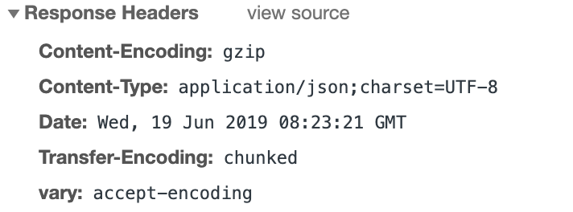
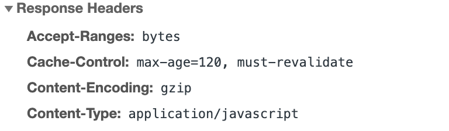
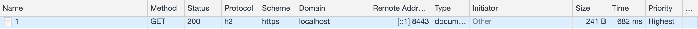

## Embedded Web Servers

### GZip

GZip压缩可以节省网络传输bandwidth，并提升网页访问速度。在Spring Boot中具体设置如下:

在application.yml中，添加如下配置：

* enabled设置为true，开启compression
* mime-types设置包含以逗号分隔的各种文件类型，所列下的文件类型即开启compression
* min-response-size设置最小阀指，当文件大于1024 byte（即1KB）即开启compression

```
server:
  compression:
    enabled: true
    mime-types: text/html,text/xml,text/plain,text/css,text/javascript,application/javascript,application/json
    min-response-size: 1024
```

当设置生效时，可以在Response Headers中看到Content-Encoding为gzip。



### Browser caching of static resources

可以通过设置“cache-control” header来让浏览器缓存静态资源，直到设定的过期日期。在Spring Boot中具体设置如下：

在application.yml中，添加如下配置：

* max-age是以“秒”作为单位，此处设置缓存时间为2秒
* must-revalidate设置为true，表示当被请求的静态资源过期时，需要重新和服务器确认

```
spring:
  resources:
    cache:
      cachecontrol:
        max-age: 120
        must-revalidate: true
```

当设置生效时，可以在Response Headers中看到Cache-Control。



### HTTP/2

HTTP/2是对HTTP 1协议的提升。它可以通过data compression，server push，multiplexing等等来提升page load speed。在Spring Boot中具体设置如下：

在application.yml中，添加如下配置：

```
server:
  http2:
    enabled: true
```

由于“HTTP/2 can be used on JDK 8 if the libtcnative library and its dependencies are installed on the host operating system”，而Embedded Jetty和Undertow却提供了很好的HTTP/2支持，所以在这里把server替换成Undertow：

```
<dependency>
    <groupId>org.springframework.boot</groupId>
    <artifactId>spring-boot-starter-web</artifactId>
    <exclusions>
        <exclusion>
            <groupId>org.springframework.boot</groupId>
            <artifactId>spring-boot-starter-tomcat</artifactId>
        </exclusion>
    </exclusions>
</dependency>
<dependency>
    <groupId>org.springframework.boot</groupId>
    <artifactId>spring-boot-starter-undertow</artifactId>
</dependency>
```

最后HTTP/2只能基于HTTPS运行，所以我们需要先创建keystore，然后把mykeys.jks文件放在resources目录下：

```
$ keytool -keystore mykeys.jks -genkey -alias undertow -keyalg RSA
```

然后在application.yml中，设置ssl：

```
server:
  port: 8443
  ssl:
    key-store: 'classpath:mykeys.jks'
    key-store-password: password
    key-password: password
```

此时向服务器发送请求，可以看到response的协议如下：



### Reference

* https://docs.spring.io/spring-boot/docs/current/reference/html/howto-embedded-web-servers.html