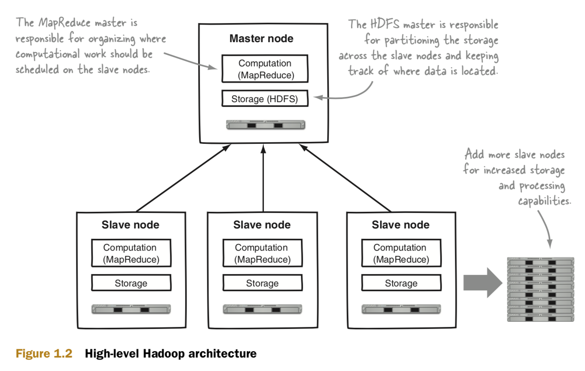
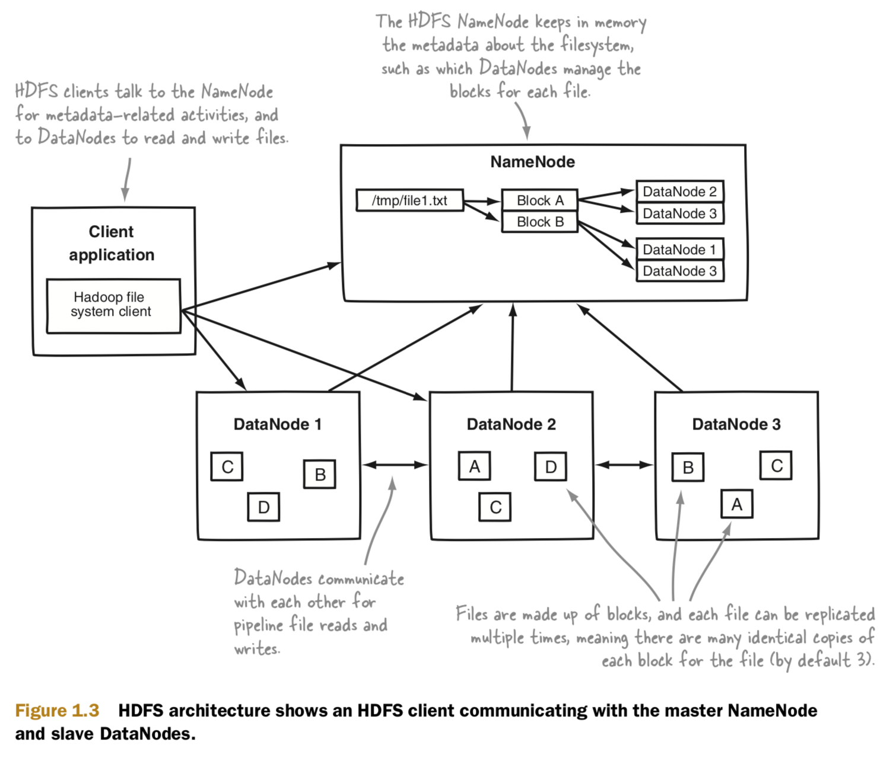
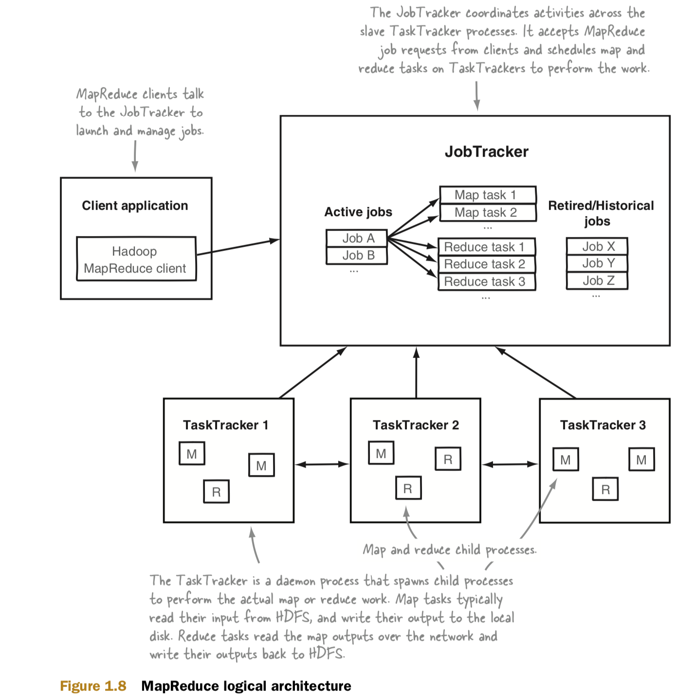
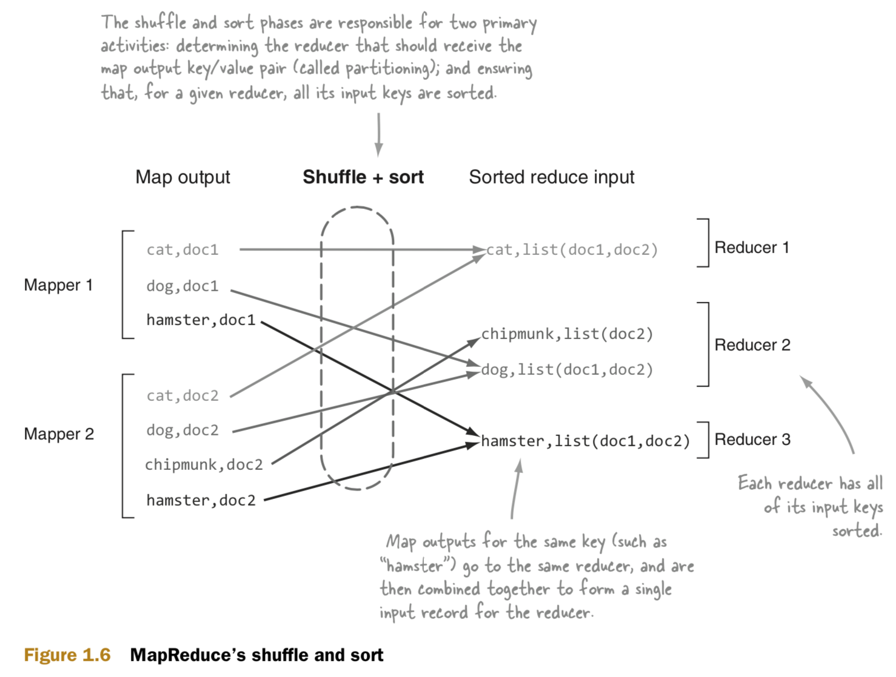

# Hadoop

## Hadoop architecture

<p float="left">
	
</p>

## HDFS architecture

<p float="left">
	
</p>

## MapReduce architecture

<p float="left">
	
</p>

## MapReduce shuffle and sort

<p float="left">
	
</p>

## Installation

### Java

Java must be installed and $JAVA_HOME environment variable should be set.
```bash
$ java -version
$ echo $JAVA_HOME
```

### SSH

SSH should be enabled and SSH keys should be set up to manage remote Hadoop daemons.
```bash
$ sudo systemsetup -getremotelogin
$ sudo systemsetup -setremotelogin on

$ ssh-keygen -t rsa -P '' -f ~/.ssh/id_rsa
$ cat ~/.ssh/id_rsa.pub >> ~/.ssh/authorized_keys
$ chmod 0600 ~/.ssh/authorized_keys
```

Otherwise, the issue ["Permission denied (publickey,password,keyboard-interactive)"](https://stackoverflow.com/questions/62087423/hadoop-permission-denied-publickey-password-keyboard-interactive) will occur.

### Hadoop

Download the latest Hadoop distribution from the official website – https://hadoop.apache.org/releases.html
```bash
$ tar xzvf ../hadoop-3.3.1.tar
```

Update .bash_profile
```bash
export HADOOP_HOME=xxx
export HADOOP_MAPRED_HOME=$HADOOP_HOME
export HADOOP_COMMON_HOME=$HADOOP_HOME
export HADOOP_HDFS_HOME=$HADOOP_HOME
export HADOOP_YARN_HOME=$HADOOP_HOME
export HADOOP_OPTS="-Djava.library.path=$HADOOP_HOME/lib/native"
export HADOOP_COMMON_LIB_NATIVE_DIR=$HADOOP_HOME/lib/native
export YARN_HOME=$HADOOP_HOME
export HADOOP_INSTALL=$HADOOP_HOME
export HADOOP_CONF_DIR=$HADOOP_HOME
export HADOOP_LIBEXEC_DIR=$HADOOP_HOME/libexec
export JAVA_LIBRARY_PATH=$HADOOP_HOME/lib/native:$JAVA_LIBRARY_PATH
export HADOOP_CONF_DIR=$HADOOP_HOME/etc/hadoop
export HADOOP_INSTALL=$HADOOP_HOME
 
export PATH=$PATH:$HADOOP_HOME/bin
export PATH=$PATH:$HADOOP_HOME/sbin
```

```bash
$ hadoop version
$ which hadoop
```

Update the configurations - $HADOOP_HOME/etc/hadoop/hadoop-env.sh
```bash
export JAVA_HOME=$JAVA_HOME
export HADOOP_HOME=$HADOOP_HOME
```

Update the configurations - $HADOOP_HOME/etc/hadoop/mapred-site.xml
```bash
<configuration>

  <property>
    <name>mapreduce.framework.name</name>
    <value>yarn</value>
  </property>

  <property>
    <name>yarn.app.mapreduce.am.env</name>
    <value>HADOOP_MAPRED_HOME=$HADOOP_HOME</value>
  </property>

  <property>
    <name>mapreduce.map.env</name>
    <value>HADOOP_MAPRED_HOME=$HADOOP_HOME</value>
  </property>

  <property>
    <name>mapreduce.reduce.env</name>
    <value>HADOOP_MAPRED_HOME=$HADOOP_HOME</value>
  </property>

  <property>
    <name>mapred.job.tracker</name>
    <value>localhost:8021</value>
  </property>

  <property> 
    <name>mapreduce.application.classpath</name>
    <value>$HADOOP_HOME/etc/hadoop:$HADOOP_HOME/share/hadoop/common/lib/*:$HADOOP_HOME/share/hadoop/common/*:$HADOOP_HOME/share/hadoop/hdfs:$HADOOP_HOME/share/hadoop/hdfs/lib/*:$HADOOP_HOME/share/hadoop/hdfs/*:$HADOOP_HOME/share/hadoop/mapreduce/*:$HADOOP_HOME/share/hadoop/yarn:$HADOOP_HOME/share/hadoop/yarn/lib/*:$HADOOP_HOME/share/hadoop/yarn/*:$JAVA_HOME/lib/tools.jar</value>
  </property>

</configuration>
```

Update the configurations - $HADOOP_HOME/etc/hadoop/yarn-site.xml
```bash
<configuration>

 <property>
    <name>yarn.nodemanager.aux-services</name>
    <value>mapreduce_shuffle</value>
  </property>

   <property>
    <name>yarn.nodemanager.disk-health-checker.max-disk-utilization-per-disk-percentage</name>
    <value>98.5</value>
  </property>

   <property>
    <name>yarn.nodemanager.env-whitelist</name>
    <value>JAVA_HOME, HADOOP_COMMON_HOME, HADOOP_HDFS_HOME, HADOOP_CONF_DIR, CLASSPATH_PREPEND_DISTCACHE, HADOOP_YARN_HOME, HADOOP_MAPRED_HOME, HDFS_HOME</value>
  </property>

</configuration>
```

Update the configurations - $HADOOP_HOME/etc/hadoop/hdfs-site.xml
```bash
<configuration>

  <property>
    <name>dfs.replication</name>
    <value>1</value>
  </property>

  <property>
    <name>dfs.namenode.safemode.threshold-pct</name>
    <value>0</value>
  </property>

</configuration>
```

Update the configurations - $HADOOP_HOME/etc/hadoop/core-site.xml
```bash
<configuration>

 <property>
    <name>fs.defaultFS</name>
    <value>hdfs://localhost:9000</value>
  </property>

</configuration>
```

Format the HDFS filesystem.
```bash
$ hdfs namenode -format
```

Start the Hadoop daemons with scrips - $HADOOP_HOME/sbin
```bash
$ start-all.sh
```

Verify the cluster is up.
```bash
$ jps

30645 Jps
25689 NodeManager
25321 NameNode
25609 ResourceManager
25405 DataNode
25503 SecondaryNameNode
```

Check Hadoop health - http://localhost:9870/dfshealth.html#tab-overview

Check Yarn resource manager - http://localhost:8088/cluster

## Example

Assuming environment variables are set as follows:
```bash
export HADOOP_CLASSPATH=${JAVA_HOME}/lib/tools.jar
```

Compile WordCount.java and create a jar:
```bash
$ hadoop com.sun.tools.javac.Main WordCount.java
$ jar cf wc.jar WordCount*.class
```

Add the input files to HDFS:
```bash
$ hadoop fs -mkdir /input
$ hadoop fs -put ./data/file*.txt /input

$ hadoop fs -ls /
$ hadoop fs -ls /input
$ hadoop fs -cat /input/file1.txt
```

Run the application:
```bash
$ hadoop jar wc.jar WordCount /input /output
```

## References
* https://bigtop.apache.org/index.html
* https://www.cloudera.com/products/open-source/apache-hadoop.html
* https://hadoop.apache.org/releases.html
* https://stackoverflow.com/questions/62087423/hadoop-permission-denied-publickey-password-keyboard-interactive
* https://ashwin.cloud/blog/single-node-cluster-mac/
* https://hadoop.apache.org/docs/stable/hadoop-mapreduce-client/hadoop-mapreduce-client-core/MapReduceTutorial.html
