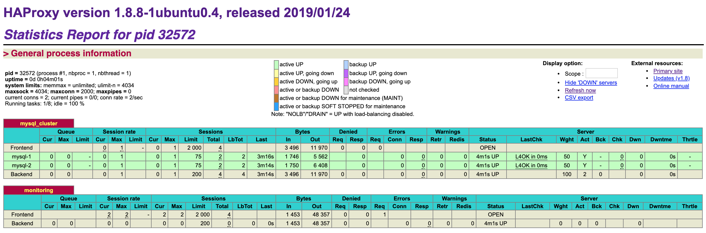

## HAProxy to Load Balance MySQL-Read-Replica Servers

### 架构

数据库Read的Load balancer架构如下：


其中，具体Linux服务器的信息如下：
* HAProxy - 192.168.0.171
* MySQL-1 - 192.168.0.173
* MySQL-2 - 192.168.0.174

### 怎么配置HAProxy所在的服务器

1. 安装HAProxy

```
$ apt-get install haproxy
```

2. 修改/etc/haproxy/haproxy.cfg，添加如下配置：

MySQL的load balancing配置如下：

* 注意：haproxy_check是mysql-1和mysql-2的无需密码登陆的mysql.user，之后会分别加入到如下两个mysql-server的mysql.user中。
```
listen mysql_cluster
    bind 127.0.0.1:3306
    mode tcp
    option mysql-check user haproxy_check
    balance roundrobin
    server mysql-1 192.168.0.173:3306 check weight 1
    server mysql-2 192.168.0.174:3306 check weight 1
```

HTTP的监控配置如下：
```
listen monitoring
        bind 0.0.0.0:8100
        mode http
        stats enable
        stats uri /
        stats realm Strictly\ Private
        stats auth admin:admin
```

3. 配置完后，启动HAProxy：

先验证配置是否有效。如果配置有效，会看到提示："Configuration file is valid"。

```
$ haproxy -c -V -f /etc/haproxy/haproxy.cfg
```

启动HAProxy：

```
$ haproxy -f /etc/haproxy/haproxy.cfg
```

4. 最后安装mysql-client。此mysql-client会在本机，即127.0.0.1，监听3306端口，如有请求会通过HAProxy，forward到mysql-server: mysql1和mysql2。

```
$ apt-get install mysql-client
```

注意：需要在/etc/mysql/my.cnf中设置bind-address为127.0.0.1。具体如下：

```
[mysqld]
bind-address = 127.0.0.1
```

此时HAProxy全部配置完成。余下要做的事项是，在其余两个MySQL服务器中分别添加如下两个mysql.user：
* haproxy_check@192.168.0.171 - 无密码，用于Health Check
* haproxy_root@192.168.0.171 - 有密码，用于从HAProxy服务器，以root权限访问MySQL服务器。

当如上事项完成，当访问http://192.168.0.171:8100/ ，可以看到如下监控页面：


此时，可以通过执行如下命令，查看HAProxy是否load balance了mysql-server的read访问：

```
$ mysql -h 127.0.0.1 -u haproxy_root -p -e "show variables like 'server_id'"
```

如果load balance成功，会看到如下两个response，在以roundrobin的方式交替显示：

| Variable_name  | Value |
|----------------|-------|
| server_id      | 2     |

| Variable_name  | Value |
|----------------|-------|
| server_id      | 3     |

### 怎么配置MySQL所在的服务器

1. 安装mysql-client和mysql-server

```
$ apt-get install mysql-client mysql-server
```

2. 修改/etc/mysql/my.cnf，添加如下配置：

    192.168.0.173的server-id是2，192.168.0.174的server-id是3。这样便于在HAProxy验证load balancing的时候，区分不同MySQL数据库。

```
[mysqld]
bind-address                    = 192.168.0.173/174
server-id                       = 2/3
```

3. 然后重新启动mysql。

```
$ service mysql restart
```

或者

```
$ systemctl restart mysql
```

这时可以通过如下命令，验证bind-address是否设置成功：

```
$ sudo netstat -plutn | grep -i mysql
```

当bind-address设置成功，会看到如下信息：

```
tcp        0      0 192.168.0.173:3306      0.0.0.0:*               LISTEN      19755/mysqld
```

4. 最后以默认root/root登录mysql shell：

```
$ /usr/bin/mysql -u root -p
```

5. 添加haproxy_root@192.168.0.171，到mysql.user：

```
mysql > GRANT ALL PRIVILEGES ON *.* TO 'haproxy_root'@'192.168.0.171' IDENTIFIED BY 'root' WITH GRANT OPTION;
mysql > FLUSH PRIVILEGES;
```

6. 添加haproxy_check@192.168.0.171，到mysql.user：

```
mysql > INSERT INTO mysql.user (Host,User,ssl_cipher,x509_issuer,x509_subject) values ('192.168.0.171','haproxy_check','','','');
mysql > FLUSH PRIVILEGES;
```

这时执行如下query，可以看到新添加的用户：

```
mysql > select user, host from mysql.user;
```

添加的用户如下：

| user             | host          |
|------------------|---------------|
| haproxy_check    | 192.168.0.171 |
| haproxy_root     | 192.168.0.171 |


### Reference

* https://www.digitalocean.com/community/tutorials/how-to-use-haproxy-to-set-up-mysql-load-balancing--3
* https://support.rackspace.com/how-to/installing-mysql-server-on-ubuntu/

* [ufw firewall](https://linoxide.com/firewall/guide-ufw-firewall-ubuntu-16-10/)

```
$ sudo ufw allow mysql
```

* [Determine which MySQL configuration file is being used](https://stackoverflow.com/questions/580331/determine-which-mysql-configuration-file-is-being-used)

```
$ /usr/sbin/mysqld --verbose --help | grep -A 1 "Default options"
```

* [Bind address and MySQL server](https://stackoverflow.com/questions/3552680/bind-address-and-mysql-server)

    * If MySQL binds to 127.0.0.1, then only software on the same computer will be able to connect (because 127.0.0.1 is always the local computer).
    * If MySQL binds to 192.168.0.2 (and the server computer's IP address is 192.168.0.2 and it's on a /24 subnet), then any computers on the same subnet (anything that starts with 192.168.0) will be able to connect.
    * If MySQL binds to 0.0.0.0, then any computer which is able to reach the server computer over the network will be able to connect.