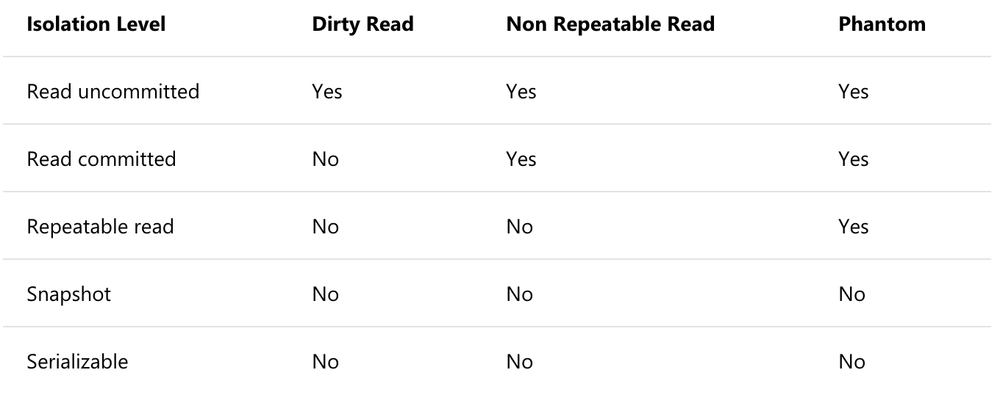

## MySQL Cluster Comparison

### MySQL Server Architecture


### Transaction Isolation Level

Isolation is the I in the acronym ACID; the isolation level is the setting that fine-tunes the balance between performance and reliability, consistency, and reproducibility of results when multiple transactions are making changes and performing queries at the same time.

Isolation level的划分如下图：


注意：
* InnoDB storage engine支持所有的isolation level，其中默认的是REPEATABLE READ。
* NDBCLUSTER storage engine只支持READ COMMITTED。
* Snapshot和Serializable是locking reads，其余的不是。


### Storage Engines

#### Types of Storage Engines

* **[MyISAM:](https://dev.mysql.com/doc/refman/5.6/en/myisam-storage-engine.html)** These tables have a small footprint. Table-level locking limits the performance in read/write workloads, so it is often used in read-only or read-mostly workloads in Web and data warehousing configurations.
* **[InnoDB:](https://dev.mysql.com/doc/refman/5.6/en/innodb-storage-engine.html)** The default storage engine in MySQL 5.6. InnoDB is a transaction-safe (ACID compliant) storage engine for MySQL that has commit, rollback, and crash-recovery capabilities to protect user data. InnoDB row-level locking (without escalation to coarser granularity locks) and Oracle-style consistent nonlocking reads increase multi-user concurrency and performance
* **[NDB (also known as NDBCLUSTER):](https://dev.mysql.com/doc/refman/5.6/en/mysql-cluster.html)** This clustered database engine is particularly suited for applications that require the highest possible degree of uptime and availability.


#### Differences Between the NDB and InnoDB Storage Engines

| Feature                                                          | InnoDB (MySQL 8.0)                                                                            | NDB 8.0                                                                                                                                                                        |
|------------------------------------------------------------------|-----------------------------------------------------------------------------------------------|--------------------------------------------------------------------------------------------------------------------------------------------------------------------------------|
| MySQL Server Version                                             | 8.0                                                                                           | 8.0                                                                                                                                                                            |
| InnoDB Version                                                   | InnoDB 8.0.19                                                                                 | InnoDB 8.0.19                                                                                                                                                                  |
| NDB Cluster Version                                              | N/A                                                                                           | NDB 8.0.18/8.0.18                                                                                                                                                              |
| Storage Limits                                                   | 64TB                                                                                          | 128TB                                                                                                                                                                          |
| Foreign Keys                                                     | Yes                                                                                           | Yes                                                                                                                                                                            |
| Transactions                                                     | All standard types                                                                            | READ COMMITTED                                                                                                                                                                 |
| MVCC                                                             | Yes                                                                                           | No                                                                                                                                                                             |
| Data Compression                                                 | Yes                                                                                           | No (NDB checkpoint and backup files can be compressed)                                                                                                                         |
| Large Row Support (> 14K)                                        | Supported for VARBINARY, VARCHAR, BLOB, and TEXT columns                                      | Supported for BLOB and TEXT columns only (Using these types to store very large amounts of data can lower NDB performance)                                                     |
| Replication Support                                              | Asynchronous and semisynchronous replication using MySQL Replication; MySQL Group Replication | Automatic synchronous replication within an NDB Cluster; asynchronous replication between NDB Clusters, using MySQL Replication (Semisynchronous replication is not supported) |
| Scaleout for Read Operations                                     | Yes (MySQL Replication)                                                                       | Yes (Automatic partitioning in NDB Cluster; NDB Cluster Replication)                                                                                                           |
| Scaleout for Write Operations                                    | Requires application-level partitioning (sharding)                                            | Yes (Automatic partitioning in NDB Cluster is transparent to applications)                                                                                                     |
| High Availability (HA)                                           | Built-in, from InnoDB cluster                                                                 | Yes (Designed for 99.999% uptime)                                                                                                                                              |
| Node Failure Recovery and Failover                               | From MySQL Group Replication                                                                  | Automatic (Key element in NDB architecture)                                                                                                                                    |
| Time for Node Failure Recovery                                   | 30 seconds or longer                                                                          | Typically < 1 second                                                                                                                                                           |
| Real-Time Performance                                            | No                                                                                            | Yes                                                                                                                                                                            |
| In-Memory Tables                                                 | No                                                                                            | Yes (Some data can optionally be stored on disk; both in-memory and disk data storage are durable)                                                                             |
| NoSQL Access to Storage Engine                                   | Yes                                                                                           | Yes (Multiple APIs, including Memcached, Node.js/JavaScript, Java, JPA, C++, and HTTP/REST)                                                                                    |
| Concurrent and Parallel Writes                                   | Yes                                                                                           | Up to 48 writers, optimized for concurrent writes                                                                                                                              |
| Conflict Detection and Resolution (Multiple Replication Masters) | Yes (MySQL Group Replication)                                                                 | Yes                                                                                                                                                                            |
| Hash Indexes                                                     | No                                                                                            | Yes                                                                                                                                                                            |
| Online Addition of Nodes                                         | Read/write replicas using MySQL Group Replication                                             | Yes (all node types)                                                                                                                                                           |
| Online Upgrades                                                  | Yes (using replication)                                                                       | Yes                                                                                                                                                                            |
| Online Schema Modifications                                      | Yes, as part of MySQL 8.0                                                                     | Yes                                                                                                                                                                            |


### MySQL Shell的有用命令

#### 查看Binary Log

查看所有的binary logs：
```
mysql > SHOW BINARY LOGS;
```

以下是具体结果：
```
+---------------+-----------+-----------+
| Log_name      | File_size | Encrypted |
+---------------+-----------+-----------+
| binlog.000001 |       473 | No        |
| binlog.000002 |       908 | No        |
| binlog.000003 |       170 | No        |
| binlog.000004 |     52243 | No        |
+---------------+-----------+-----------+
4 rows in set (0.05 sec)
```

查看binanry log中的events：
```
mysql > SHOW BINLOG EVENTS;
```

以下是具体结果：
```
+---------------+-----+----------------+-----------+-------------+-----------------------------------------------------------------------------------------------------------------------------------------------+
| Log_name      | Pos | Event_type     | Server_id | End_log_pos | Info                                                                                                                                          |
+---------------+-----+----------------+-----------+-------------+-----------------------------------------------------------------------------------------------------------------------------------------------+
| binlog.000001 |   4 | Format_desc    |         1 |         124 | Server ver: 8.0.17, Binlog ver: 4                                                                                                             |
| binlog.000001 | 124 | Previous_gtids |         1 |         155 |                                                                                                                                               |
| binlog.000001 | 155 | Anonymous_Gtid |         1 |         234 | SET @@SESSION.GTID_NEXT= 'ANONYMOUS'                                                                                                          |
| binlog.000001 | 234 | Query          |         1 |         450 | use `mysql`; ALTER USER 'root'@'localhost' IDENTIFIED WITH 'mysql_native_password' AS '*81F5E21E35407D884A6CD4A731AEBFB6AF209E1B' /* xid=3 */ |
| binlog.000001 | 450 | Stop           |         1 |         473 |                                                                                                                                               |
+---------------+-----+----------------+-----------+-------------+-----------------------------------------------------------------------------------------------------------------------------------------------+
5 rows in set (0.00 sec)
```

#### 查看数据库引擎

查看此数据库的引擎，用如下命令：
```
mysql > SHOW ENGINES;
```

以下是具体结果：
```
+--------------------+---------+----------------------------------------------------------------+--------------+------+------------+
| Engine             | Support | Comment                                                        | Transactions | XA   | Savepoints |
+--------------------+---------+----------------------------------------------------------------+--------------+------+------------+
| FEDERATED          | NO      | Federated MySQL storage engine                                 | NULL         | NULL | NULL       |
| MEMORY             | YES     | Hash based, stored in memory, useful for temporary tables      | NO           | NO   | NO         |
| InnoDB             | DEFAULT | Supports transactions, row-level locking, and foreign keys     | YES          | YES  | YES        |
| PERFORMANCE_SCHEMA | YES     | Performance Schema                                             | NO           | NO   | NO         |
| MyISAM             | YES     | MyISAM storage engine                                          | NO           | NO   | NO         |
| MRG_MYISAM         | YES     | Collection of identical MyISAM tables                          | NO           | NO   | NO         |
| BLACKHOLE          | YES     | /dev/null storage engine (anything you write to it disappears) | NO           | NO   | NO         |
| CSV                | YES     | CSV storage engine                                             | NO           | NO   | NO         |
| ARCHIVE            | YES     | Archive storage engine                                         | NO           | NO   | NO         |
+--------------------+---------+----------------------------------------------------------------+--------------+------+------------+
9 rows in set (0.00 sec)
```

### Reference

* https://dev.mysql.com/doc/refman/8.0/en/innodb-transaction-isolation-levels.html
* https://dev.mysql.com/doc/refman/8.0/en/storage-engines.html
* https://dev.mysql.com/doc/refman/5.6/en/storage-engine-setting.html
* https://www.jianshu.com/p/7003d58ea182