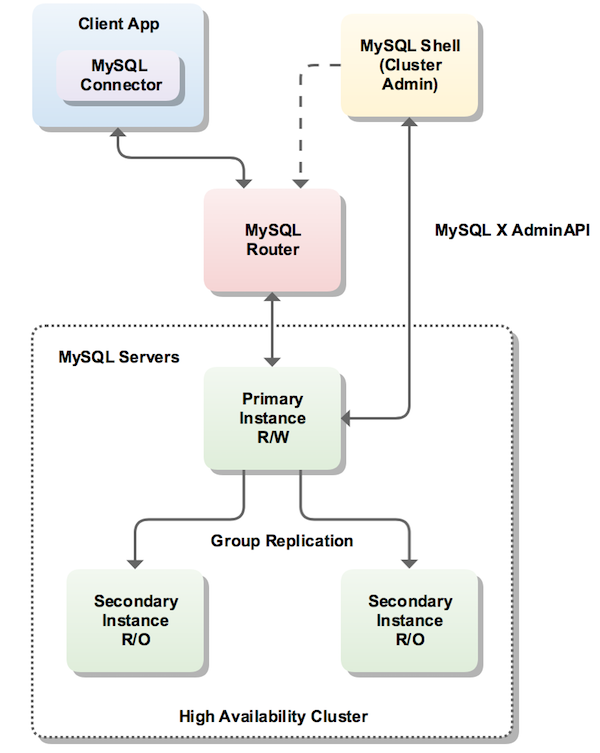

## MySQL InnoDB Cluster

### InnoDB Cluster 架构图


### 如何搭建InnoDB Cluster

#### 服务器总览
* 192.168.0.95：包含Client App，MySQL Shell和MySQL Router
* 192.168.0.172：包含MySQL R/W Primary Instance
* 192.168.0.173：包含MySQL R/O Secondary Instance
* 192.168.0.174：包含MySQL R/O Secondary Instance

#### 准备工作

分别修改上面3个MySQL Instance的DNS文件/etc/hosts，添加如下配置：
```
192.168.0.172   hncy2
192.168.0.173   hncy3
192.168.0.174   hncy4
```
在上面3个MySQL Instance中，登录MySQL Shell，添加如下用户：
```
mysql > create user 'root'@'192.168.0.95' identified by 'root';
mysql > grant all privileges on *.* to 'root'@'192.168.0.95' with grant option;
mysql > flush privileges;
```

#### Step 1: 在Client App所在服务器安装MySQL Shell和MySQL Router

在Ubuntu 18.04，执行如下命令：
```
$ apt-get install mysql-shell
$ apt-get install mysql-router
```

在Mac OS上，直接从如下URL，下载DMG文件安装：
* https://dev.mysql.com/doc/mysql-shell/8.0/en/mysql-shell-install-osx-quick.html
* https://dev.mysql.com/doc/mysql-router/8.0/en/mysql-router-installation-osx.html


#### Step 2: 在Client App，通过MySQL Shell搭建InnoDB Cluster

在Mac OS登录MySQL Shell：
```
$ mysqlsh
```

分别检查各个MySQL Instance的集群配置：
```
MySQL JS > dba.checkInstanceConfiguration("root@hncy2:3306");
MySQL JS > dba.checkInstanceConfiguration("root@hncy3:3306");
MySQL JS > dba.checkInstanceConfiguration("root@hncy3:3306");
```


如果返回的status不是"ok"，是"error"，则执行如下命令：
```
MySQL JS > dba.configureInstance("root@hncy2:3306");
MySQL JS > dba.configureInstance("root@hncy3:3306");
MySQL JS > dba.configureInstance("root@hncy4:3306");
```


当status返回"ok"后，连接需要设置为R/W Primary的MySQL Instance：
```
MySQL JS > shell.connect("root@hncy2:3306");
```

在此instance，即hncy2上，创建集群：
```
MySQL hncy2:3306 ssl JS > cluster = dba.createCluster("testCluster");
```


在创建好的testCluster集群上，添加Instance：
```
MySQL hncy2:3306 ssl JS > cluster.addInstance("root@hncy3:3306");
MySQL hncy2:3306 ssl JS > cluster.addInstance("root@hncy4:3306");
```


最后执行如下命令，查看集群状态：
```
MySQL hncy2:3306 ssl JS > cluster.status();
```


也可以在MySQL Primary R/W Instance，即hncy2的MySQL Shell中，执行如下查询：
```
mysql > SELECT * FROM performance_schema.replication_group_members;
```


这时在hncy2的MySQL Shell中，执行如下查询：
```
mysql > SELECT * FROM performance_schema.global_variables;
```

如下是相关结果：
```
| group_replication_group_seeds                            | hncy3:33061,hncy4:33061                                                                                                                                                                                                                                                                                                                                                                                                                                 |
| group_replication_gtid_assignment_block_size             | 1000000                                                                                                                                                                                                                                                                                                                                                                                                                                                 |
| group_replication_ip_whitelist                           | AUTOMATIC                                                                                                                                                                                                                                                                                                                                                                                                                                               |
| group_replication_local_address                          | hncy2:33061
```

这时在hncy3的MySQL Shell中，执行如下查询：
```
mysql > SELECT * FROM performance_schema.global_variables;
```

如下是相关结果：
```
| group_replication_group_seeds                            | hncy2:33061,hncy4:33061                                                                                                                                                                                                                                                                                                                                                                                                                                 |
| group_replication_gtid_assignment_block_size             | 1000000                                                                                                                                                                                                                                                                                                                                                                                                                                                 |
| group_replication_ip_whitelist                           | AUTOMATIC                                                                                                                                                                                                                                                                                                                                                                                                                                               |
| group_replication_local_address                          | hncy3:33061
```

#### Step 3: 在Client App，配置并启动MySQL Router

自动配置MySQL Rooter，执行如下命令：
```
$ mysqlrouter --bootstrap root@hncy2:3306 --directory testrouter
```


启动MySQL Router:
```
$ ./testrouter/start.sh
```

停止MySQL Router：
```
$ ./testrouter/stop.sh
```

#### 在Client App，验证MySQL Router能分发不同请求

当执行如下mysql-client命令：
```
$ mysql -h "127.0.0.1" -P 6446 -u root -p -e "select @@hostname"
```

得到如下1个返回，即1个R/W Primary Instance的hostname：
```
+------------+
| @@hostname |
+------------+
| hncy2      |
+------------+
```

当执行如下mysql-client命令：
```
$ mysql -h "127.0.0.1" -P 6447 -u root -p -e "select @@hostname"
```

得到如下2个返回交替出现，即2个R/O Secondary Instance的hostname：

```
+------------+
| @@hostname |
+------------+
| hncy4      |
+------------+
```

```
+------------+
| @@hostname |
+------------+
| hncy3      |
+------------+
```

### Apache Benchmarking 测试结果

用如下命令，测试request数量为10000，并发为1000，connection pool size为20的情况下 (read 10 + write 10)，read的性能：
```
$ ab -n 10000 -c 1000 http://localhost:8080/user/1
```

测试结果如下：


### Reference

* https://dev.mysql.com/doc/refman/8.0/en/mysql-cluster-compared.html
* https://dev.mysql.com/doc/refman/8.0/en/mysql-cluster-ndb-innodb-engines.html
* https://dev.mysql.com/doc/refman/8.0/en/mysql-cluster-ndb-innodb-workloads.html
* https://dev.mysql.com/doc/refman/8.0/en/mysql-cluster-ndb-innodb-usage.html
* https://dev.mysql.com/doc/refman/8.0/en/memory-storage-engine.html#memory-storage-engine-compared-cluster
* https://dev.mysql.com/doc/refman/8.0/en/mysql-cluster.html
* https://dev.mysql.com/doc/refman/8.0/en/mysql-innodb-cluster-userguide.html
* https://dev.mysql.com/doc/refman/8.0/en/mysql-innodb-cluster-using-router.html
