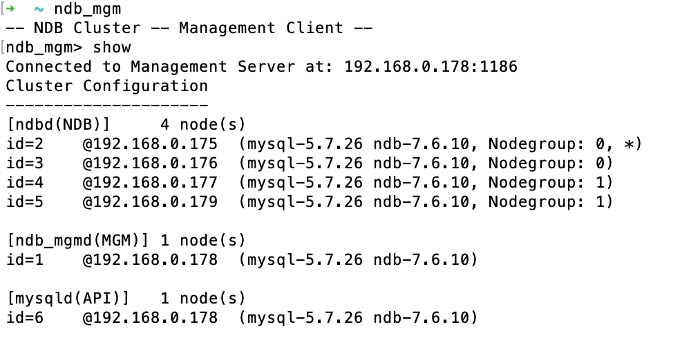
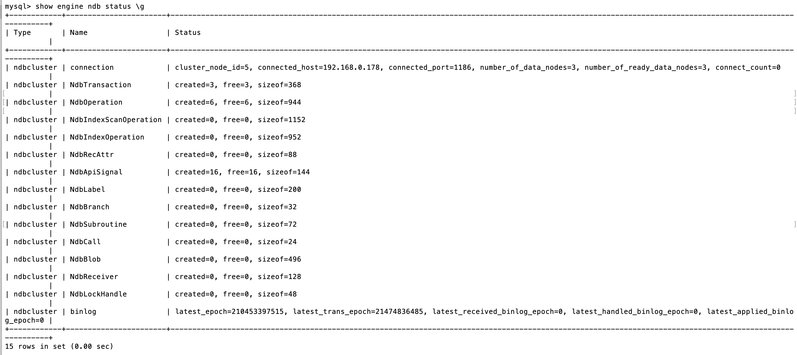
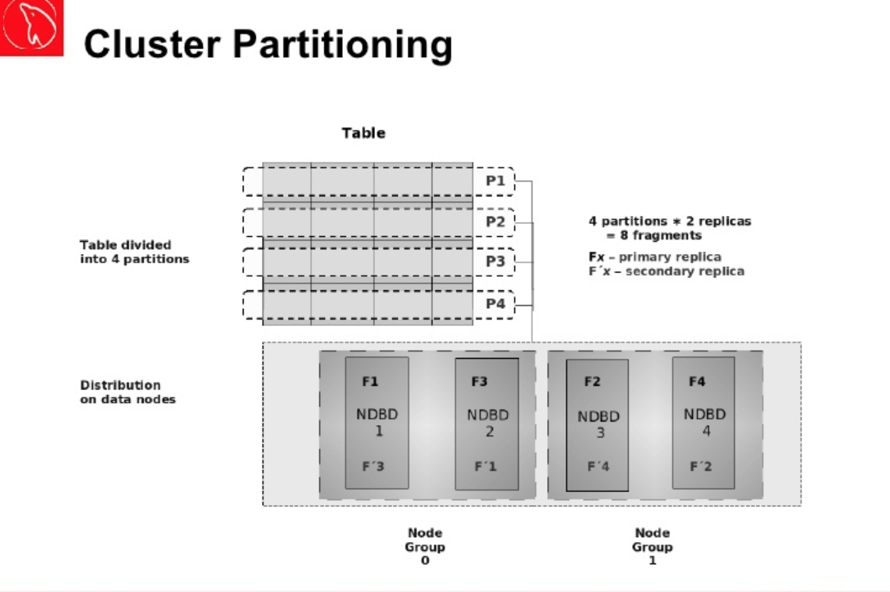
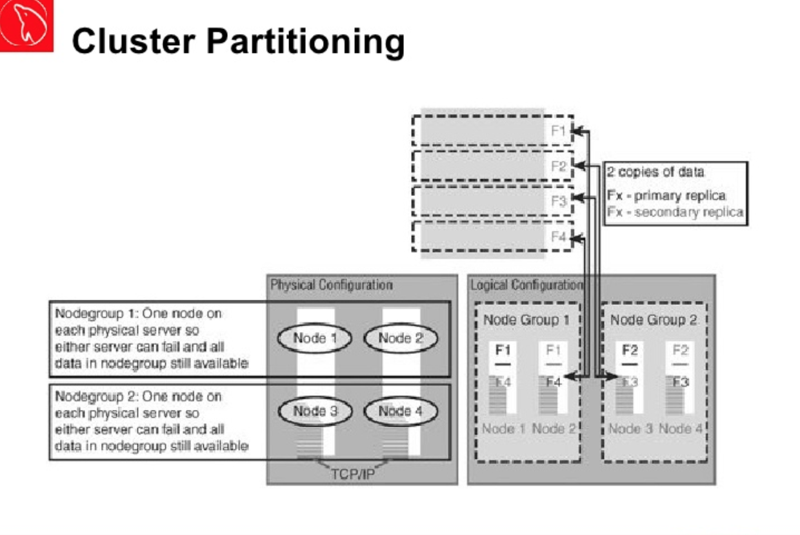

## MySQL NDB Cluster

### NDB Cluster 架构图


### 如何搭建NDB Cluster

#### 服务器总览

* 192.168.0.178：包含NDB Management Server 1 (ndb_mgmd)， NDB Management Client (ndb_mgm)和MySQL Server (mysqld)
* 192.168.0.175：包含Data Node 2 (ndbd)
* 192.168.0.176：包含Data Node 3 (ndbd)
* 192.168.0.177：包含Data Node 4 (ndbd)

#### 如何搭建 NDB Management Server, NDB Management Client和MySQL Server

##### 下载并安装相应的程序

执行如下命令，下载并安装相应的程序。

如下是：mysql-cluster-community-management-server，包含ndb_mgmd和ndb_mgm。
```
~ wget https://mirrors.sohu.com/mysql/MySQL-Cluster-7.6/mysql-cluster-community-management-server_7.6.10-1ubuntu18.04_amd64.deb
~ dpkg -i mysql-cluster-community-management-server_7.6.10-1ubuntu18.04_amd64.deb 
```

如下是：mysql-common，libmecab2和libaio1。
注意：libmecab2和libaio1有最低版本的依赖，不能用apt-get install安装。
```
~ wget https://mirrors.sohu.com/mysql/MySQL-Cluster-7.6/mysql-common_7.6.10-1ubuntu18.04_amd64.deb
~ dpkg -i mysql-common_7.6.10-1ubuntu18.04_amd64.deb
~ wget http://mirrors.kernel.org/ubuntu/pool/universe/m/mecab/libmecab2_0.996-5_amd64.deb
~ dpkg -i libmecab2_0.996-5_amd64.deb
~ wget http://ftp.br.debian.org/debian/pool/main/liba/libaio/libaio1_0.3.112-3_amd64.deb
~ dpkg -i libaio1_0.3.112-3_amd64.deb 

```

如下是：mysql-cluster-community-client和mysql-client。
```
~ wget https://mirrors.sohu.com/mysql/MySQL-Cluster-7.6/mysql-cluster-community-client_7.6.10-1ubuntu18.04_amd64.deb
~ dpkg -i mysql-cluster-community-client_7.6.10-1ubuntu18.04_amd64.deb
~ wget https://mirrors.sohu.com/mysql/MySQL-Cluster-7.6/mysql-client_7.6.10-1ubuntu18.04_amd64.deb
~ dpkg -i mysql-client_7.6.10-1ubuntu18.04_amd64.deb
```

如下是：mysql-cluster-community-server，包含mysqld。
注意：mysql-cluster-community-server依赖于之前安装的libmecab2，libaio1，mysql-common，mysql-client和mysql-cluster-community-client。
```
~ wget https://mirrors.sohu.com/mysql/MySQL-Cluster-7.6/mysql-cluster-community-server_7.6.10-1ubuntu18.04_amd64.deb
~ dpkg -i mysql-cluster-community-server_7.6.10-1ubuntu18.04_amd64.deb
```

最后，用如下命令，查看已经安装了的程序：
```
~ dpkg -l | grep mysql
```

如下是输出结果。可以看到，所安装程序的版本是一致的。
```
iU  mysql-client                              7.6.10-1ubuntu18.04               amd64        MySQL Client meta package depending on latest version
ii  mysql-cluster-community-client            7.6.10-1ubuntu18.04               amd64        MySQL Client
ii  mysql-cluster-community-management-server 7.6.10-1ubuntu18.04               amd64        Management server
iU  mysql-cluster-community-server            7.6.10-1ubuntu18.04               amd64        MySQL Server
ii  mysql-common                              7.6.10-1ubuntu18.04               amd64        MySQL Common
```

##### 添加配置文件并启动

执行如下命令，创建相应文件夹和文件，之后编辑ndb_mgmd的配置文件：config.ini文件 (这是Global配置)。
```
~ mkdir /var/lib/mysql-cluster/
~ cd /var/lib/mysql-cluster
~ vim config.ini
```

config.ini配置如下：
```
[ndbd default]
# Options affecting ndbd processes on all data nodes:
NoOfReplicas=3  # Number of replicas

[ndbd]
hostname=192.168.0.175 # Hostname/IP of the first data node
NodeId=2            # Node ID for this data node
datadir=/usr/local/mysql/data   # Remote directory for the data files

[ndbd]
hostname=192.168.0.176 # Hostname/IP of the second data node
NodeId=3            # Node ID for this data node
datadir=/usr/local/mysql/data   # Remote directory for the data files

[ndbd]
hostname=192.168.0.177 # Hostname/IP of the second data node
NodeId=4            # Node ID for this data node
datadir=/usr/local/mysql/data   # Remote directory for the data files

[ndb_mgmd]
# Management process options:
hostname=192.168.0.178 # Hostname of the manager
datadir=/var/lib/mysql-cluster  # Directory for the log files

[mysqld]
# SQL node options:
hostname=192.168.0.178 # In our case the MySQL server/client is on the same Droplet as the cluster manager
```

编辑mysqld的配置文件mysqld.cnf：
```
~ vim /etc/mysql/mysql.conf.d/mysqld.cnf
```

mysqld.cnf配置如下：
```
[mysqld]
# Options for mysqld process:
ndbcluster                      # run NDB storage engine
bind-address=192.168.0.178

[mysql_cluster]
# Options for NDB Cluster processes:
ndb-connectstring=192.168.0.178  # location of management server
```

启动NDB Cluster:
```
~ ndb_mgmd -f /var/lib/mysql-cluster/config.ini
```

当成功启动NDB Cluster后，可以看到如下输出：
```
MySQL Cluster Management Server mysql-5.7.26 ndb-7.6.10
2019-07-29 11:16:20 [MgmtSrvr] INFO     -- The default config directory '/usr/mysql-cluster' does not exist. Trying to create it...
2019-07-29 11:16:20 [MgmtSrvr] INFO     -- Sucessfully created config directory
```

当更新config.ini，增加节点后重新启动NDB Cluster：
```
~ ndb_mgm
> shutdown

~ ndb_mgmd --reload -f /var/lib/mysql-cluster/config.ini
```

启动MySQL Server
```
~ service mysql start
```

##### 验证启动是否成功

最后剩下的步骤就是：配置并启动Data Node了。

当所有的Data Node正常启动后，可以通过如下ndb_mgm命令，查看Cluster状态：
```
~ ndb_mgm
ndb_mgm > show
```

如下是输出结果，也就是整个集群的状态：


也可以登录MySQL Shell，查看Cluster的状态：
```
~ mysql -u root -p
mysql > SHOW ENGINE NDB STATUS \G
```

如下是输出结果：


最后在Spring Boot的应用中，application.yml作如下配置，连接到192.168.0.178的MySQL Server：
```
spring:
  datasource:
    type: com.zaxxer.hikari.HikariDataSource
    hikari:
      auto-commit: true
    initialization-mode: always
    driver-class-name: com.mysql.cj.jdbc.Driver
    url: jdbc:mysql://192.168.0.178:3306/dbservice?createDatabaseIfNotExist=true&useUnicode=true&characterEncoding=utf8&characterSetResults=utf8
    username: root
    password: root
```

为了验证MySQL Server的远程连接，可以用如下命令：
```
$ mysql -h 192.168.0.178 -u root -p -e "select @@hostname"
```

#### 如何搭建 Data Node

##### 下载并安装相应的程序

如下是：libclass-methodmaker-perl。mysql-cluster-community-data-node依赖这个程序。
```
~ apt-get install libclass-methodmaker-perl
```

如下是：mysql-cluster-community-data-node，包含ndbd。
```
~ wget https://mirrors.sohu.com/mysql/MySQL-Cluster-7.6/mysql-cluster-community-data-node_7.6.10-1ubuntu18.04_amd64.deb
~ dpkg -i mysql-cluster-community-data-node_7.6.10-1ubuntu18.04_amd64.deb
```

##### 添加配置文件并启动

编辑ndbd的配置文件my.cnf (这是Local配置)。
```
~ vim /etc/my.cnf
```

my.cnf配置如下：
```
[mysql_cluster]
# Options for NDB Cluster processes:
ndb-connectstring=192.168.0.178  # location of cluster manager
```

启动Data Node
```
~ ndbd
```

当成功启动Data Node后，可以看到如下输出：
```
2019-07-29 11:16:20 [ndbd] INFO     -- Angel connected to '192.168.0.178:1186'
2019-07-29 11:16:20 [ndbd] INFO     -- Angel allocated nodeid: 2
```

### 实际生产环境的架构





注意如下几点：
1. Partitioning分为Vertical Partitioning和Horizontal Partitioning。在MySQL中支持的是Horizontal Partitioning，即一个Table以Row划分。如图：一个Table被划分为4个Partition。
2. Partition的数量和Data Node的数量相等 (ndbd的LDM threads数量为1，所以Partition = Data Nodes * 1)。如图：有4个Data Node，即有4个Partition。
3. Node Group需要同时正常运行，才能获取所有的Table数据，保证数据完备性。如图：Node Group 0和Node Group 1需要保证都是正常运行的。
4. 在Node Group中，Data Node互为Replica。如图：Partition 1保存在NDBD 1上，Partition 1的Replica保存在NDBD 2上；与此相反，Partition 3保存在NDBD 2上，Partition 3的Replica保存在NDBD 1上。这样一来，一旦某个Data Node宕机，另一个Data Node都能backup。
5. Partitioning实现了Parallel Execution。对于一个query或transaction，可以在多个Data Node上同时执行，减少了response time和增加了transaction per second。

### Reference

* https://dev.mysql.com/doc/refman/8.0/en/mysql-cluster.html
* https://dev.mysql.com/doc/mysql-cluster-excerpt/5.7/en/mysql-cluster-nodes-groups.html
* https://dev.mysql.com/doc/refman/5.7/en/mysql-cluster-programs-ndb-mgmd.html
* https://www.tusacentral.net/joomla/index.php/mysql-blogs/146-mysql-ndb-a-mysql-with-galera-why-we-should-not-compare-them.html
* https://www.slideshare.net/Wagnerbianchi/mysql-cluster-basics
* https://www.digitalocean.com/community/tutorials/how-to-create-a-multi-node-mysql-cluster-on-ubuntu-18-04
* https://mirrors.sohu.com/mysql/MySQL-Cluster-7.6/
* https://www.digitalocean.com/community/tutorials/how-to-configure-a-galera-cluster-with-mysql-5-6-on-ubuntu-16-04
