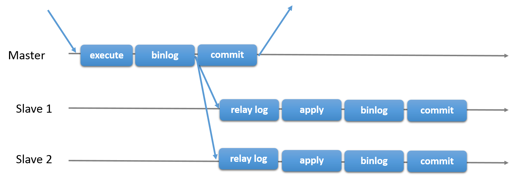
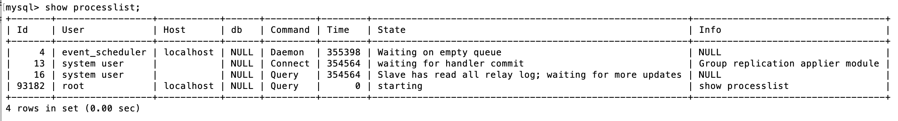
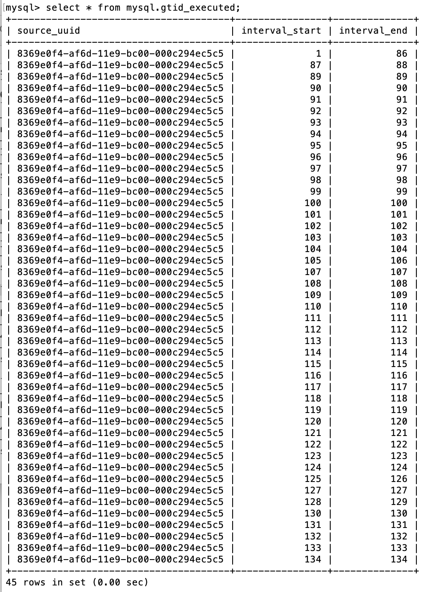
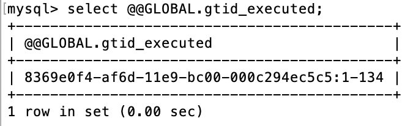
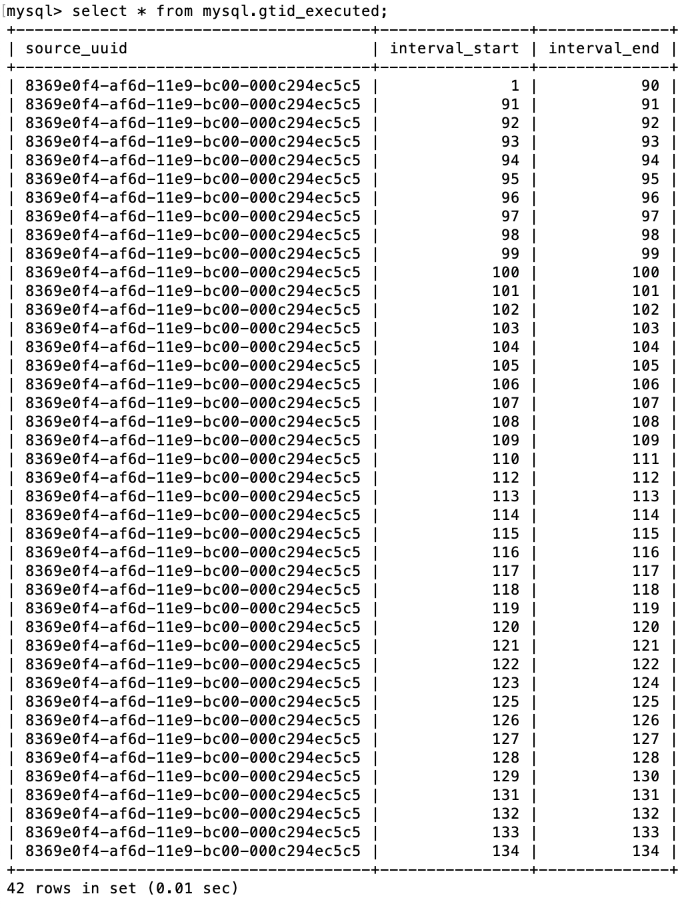
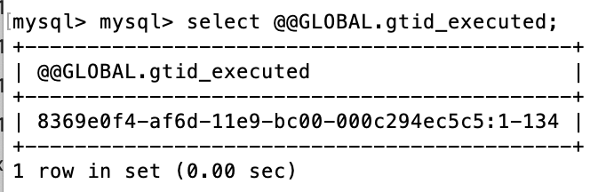

## MySQL Replication

### Replication的种类

#### 1. Primary-Secondary Replication

Primary-Secondary Replication的特征是：
* 有一个primary(master)和多个secondaries(slaves)
* master执行transaction并且commit， 数据之后会asynchronous同步到slaves
* slaves会通过statement-based replication或者row-based replication同步数据
* 这是shared-nothing架构，所有的服务器 (master和slaves) 都会持有相同的数据.



还存在一种semisynchronous replication，其特征是：
* master在commit前会等待，直到所有slaves确认收到transaction


#### 2. Group Replication

Group Replication的特征是：
* eventual consistency - 当incoming traffic降下来时，所有的group member最终有相同的数据
* 其中的consensus算法是基于Paxos：https://en.wikipedia.org/wiki/Paxos_(computer_science)


### Replication Formats

Replication的工作机制是：master的events会记录在master的binary log里，而所有的slaves通过读取master的binary log来同步数据。

master的binary log记录events，有其不同的formats：

1. statement-based binary logging (对应于statement-based replication (SBR)) - master把SQL statements写入binary log，slaves则执行其记录的SQL statements来同步数据。
2. row-based binary logging (对应于row-based replication (RBR)) - master记录各个table的rows的前后变化，slaves则执行其对各个table的rows的更新。
3. a mix of statement-based and row-based binary logging

注意：
* 默认的format为row-based binary logging和row-based replication。InnoDB使用的是ROW。
* MySQL NDB Cluster 8.0使用的是MIXED

可以通过如下命令，查看master和slaves的replication format：
```
mysql > select @@binlog_format;
```

如下是返回结果：
```
+------------------------+
| @@GLOBAL.binlog_format |
+------------------------+
| ROW                    |
+------------------------+

```

### Replication的实现

* **Binlog dump thread.**  The master creates a thread to send the binary log contents to a slave when the slave connects. This thread can be identified in the output of SHOW PROCESSLIST on the master as the Binlog Dump thread. 

    The binary log dump thread acquires a lock on the master's binary log for reading each event that is to be sent to the slave. As soon as the event has been read, the lock is released, even before the event is sent to the slave.

* **Slave I/O thread.**  When a START SLAVE statement is issued on a slave server, the slave creates an I/O thread, which connects to the master and asks it to send the updates recorded in its binary logs.

    The slave I/O thread reads the updates that the master's Binlog Dump thread sends (see previous item) and copies them to local files that comprise the slave's relay log.

    The state of this thread is shown as Slave_IO_running in the output of SHOW SLAVE STATUS or as Slave_running in the output of SHOW STATUS.

* **Slave SQL thread.**  The slave creates an SQL thread to read the relay log that is written by the slave I/O thread and execute the events contained therein.

当在master或者slaves执行如下命令：
```
mysql > SHOW PROCESSLIST\G
```

可以看到如下结果：


### 在MySQL 8.0中开启GTID Replication

注意：如果使用GTID replication，那么replication模式选择row-based replication。

#### 基本服务器信息

Master - 192.168.0.172

Slave 1 - 192.168.0.173

Slave 2 - 192.168.0.174

#### 配置Master和Slave的my.cnf的[mysqld]

在Master和Slave中，进入MySQL Shell，都执行同样的如下配置：

* Master和各个Slave的server_id设置不同值：比如Master为1，Slave为2，3等等。
* gtid_mode的顺序是：OFF -> OFF_PERMISSIVE -> ON_PERMISSIVE -> ON，需要按顺序一步一步设置到ON，初始为OFF。

```
mysql > SET PERSIST server_id=1/2/3/...;
mysql > SET PERSIST enforce_gtid_consistency=ON;
mysql > SET PERSIST gtid_mode=OFF_PERMISSIVE；
mysql > SET PERSIST gtid_mode=ON_PERMISSIVE；
mysql > SET PERSIST gtid_mode=ON；
mysql > RESTART;
```

当重启后，可以通过如下query验证运行时配置是否生效：
```
mysql > select * from performance_schema.global_variables;
```

#### Master中添加Replication User

MySQL 8.0的default_authentication_plugin为caching_sha2_password，而MySQL 5.7的default_authentication_plugin为mysql_native_password。

caching_sha2_password的身份验证有两种方式：
1. SSL - Connections over secure transport
2. RSA private and public key-pair - Unencrypted connections

如果使用SSL，则执行如下命令：

```
mysql > CREATE USER 'slave'@'%' IDENTIFIED BY 'slave' REQUIRE SSL;
mysql > GRANT REPLICATION SLAVE ON *.* TO 'slave'@'%';
```

#### Slave通过Replication User连接到Master

当Master的replication user使用的是caching_sha2_password的SSL，Slave连接到Master，则执行如下命令：

```
mysql > STOP SLAVE;
mysql > CHANGE MASTER TO MASTER_HOST='192.168.0.172', MASTER_PORT=3306, MASTER_USER='slave', MASTER_PASSWORD='slave', MASTER_AUTO_POSITION=1, MASTER_SSL=1;
mysql > START SLAVE;
```

#### 验证Replication是否成功

在Master Shell中，执行如下命令，查看Replication状态：
```
mysql > SHOW MASTER STATUS\G;
```

在Slave Shell中，执行如下命令，查看Replication状态：
```
mysql > SHOW SLAVE STATUS\G;
```

当在master中commit任何transaction后，可以查看其每笔gtid executed记录：
```
mysql > select * from mysql.gtid_executed;
```

结果如下：


也可以执行如下命令查看总的情况：
```
mysql > select @@gtid_executed;
```



这时，也可以在slave中验证replication是否成功：
```
mysql > select * from mysql.gtid_executed;
```

结果如下：


同样，也可以执行如下命令查看总的情况：
```
mysql > select @@gtid_executed;
```

结果如下：


### Reference

* https://dev.mysql.com/doc/refman/8.0/en/replication.html
* https://lefred.be/content/master-slave-replication-with-mysql-8-0-in-2-mins/
* https://docs.oracle.com/cd/E17952_01/mysql-8.0-en/caching-sha2-pluggable-authentication.html
* https://www.thegeekdiary.com/mysql-8-0-persisted-variables/
* https://dev.mysql.com/doc/refman/8.0/en/replication.html
* https://dev.mysql.com/doc/refman/8.0/en/replication-solutions.html
* https://dev.mysql.com/doc/refman/8.0/en/replication-implementation.html
* https://dev.mysql.com/doc/refman/8.0/en/replication-implementation-details.html
* https://dev.mysql.com/doc/refman/8.0/en/replication-channels.html
* https://dev.mysql.com/doc/refman/8.0/en/group-replication.html
* https://dev.mysql.com/doc/refman/8.0/en/group-replication-primary-secondary-replication.html
* https://dev.mysql.com/doc/refman/8.0/en/replication-gtids.html
* https://dev.mysql.com/doc/refman/8.0/en/replication-gtids-lifecycle.html