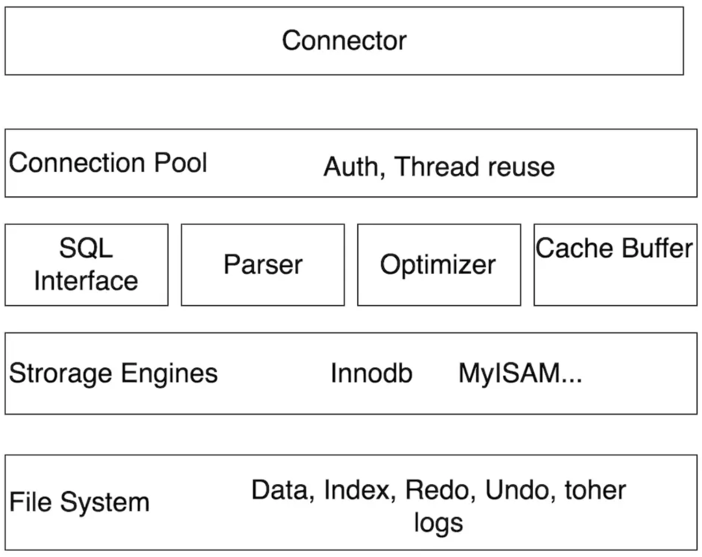
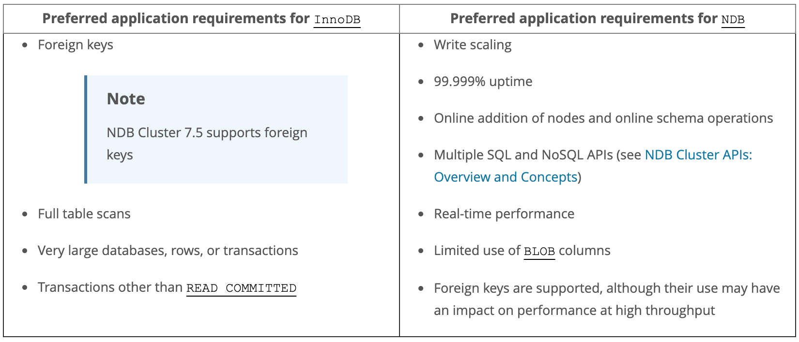

## MySQL Storage Engine Comparison

### MySQL Server Architecture

Overview如下：


细节图如下：



### 影响Storage Engine选型的相关因素
影响Storage Engine选型的相关因素包含以下几项，之后的段落会一一说明：

* Transaction Isolation Level
* Concurrency Control
* Internal Locking Methods
* Replication

下面先进结论，结论如下：

* 比较的Storage Engines包含：MyISAM，InnoDB和NDBCLUSTER。结论是**推荐选用InnoDB，这是目前在权衡高并发，死锁，性能和以后集群的情况下最优的选择**。
* 注意在目前的Spring Boot项目中，在涉及到创建/修改table时，需要自己选择storage engine，比如在SQL语句后添加“engine=innodb”，否则会默认选用MyISAM。


### Transaction Isolation Level

Isolation is the I in the acronym ACID; the isolation level is the setting that fine-tunes the balance between performance and reliability, consistency, and reproducibility of results when multiple transactions are making changes and performing queries at the same time.

Isolation level的划分如下图：


注意：
* InnoDB storage engine支持所有的isolation level，其中默认的是REPEATABLE READ。
* NDBCLUSTER storage engine只支持READ COMMITTED。
* Snapshot和Serializable是locking reads，其余的是nonlocking reads。


### Concurrency Control
Concurrency Control分为如下两种大类：
1. Lock-Based Concurrency Control (LBCC) - 悲观锁
2. Multi-Version Concurrency Control (MVCC) - 乐观锁

MVCC是通过在每行记录后面保存两个隐藏的列来实现的。这两个列，一个保存了行的创建时间，一个保存行的过期时间（或删除时间）。当然存储的并不是实际的时间值，而是系统版本号（system version number)。每开始一个新的事务，系统版本号都会自动递增。事务开始时刻的系统版本号会作为事务的版本号，用来和查询到的每行记录的版本号进行比较。
* **SELECT：** 
    * 创建时间 <= 当前事务版本
    * 过期时间 > 当前事务版本

* **INSERT：** 
    * 创建时间 = 当前事务版本
    * 过期时间未定义

* **DELETE：**
    * 过期时间 = 当前事务版本
    
* **UPDATE：** InnoDB会插入一行新记录。
    * 新纪录的创建时间 = 当前事务版本
    * 新纪录的过期时间未定义
    * 老记录的过期时间 = 当前事务版本

保存这两个额外系统版本号，实现了读的乐观锁，使大多数读操作都可以不用加锁。
* 读不block任何操作，也不被任何操作block；
* 写只被写操作block。

MVCC机制也使得InnoDB实现了REPEATABLE READ。

关于乐观锁和悲观锁：
* **[Optimistic Locking](https://en.wikipedia.org/wiki/Optimistic_concurrency_control)** is a strategy where you read a record, take note of a version number (other methods to do this involve dates, timestamps or checksums/hashes) and check that the version hasn't changed before you write the record back. When you write the record back you filter the update on the version to make sure it's atomic. (i.e. it hasn't been updated between when you check the version and write the record to the disk) and update the version in one hit.

    If the record is dirty (i.e. different version to yours) you abort the transaction and the user can re-start it.

    This strategy is most applicable to high-volume systems and three-tier architectures where you do not necessarily maintain a connection to the database for your session. In this situation the client cannot actually maintain database locks as the connections are taken from a pool and you may not be using the same connection from one access to the next.

* **[Pessimistic Locking](https://en.wikipedia.org/wiki/Record_locking)** is when you lock the record for your exclusive use until you have finished with it. It has much better integrity than optimistic locking but requires you to be careful with your application design to avoid [Deadlocks](https://en.wikipedia.org/wiki/Deadlock). To use pessimistic locking you need either a direct connection to the database (as would typically be the case in a two tier client server application) or an externally available transaction ID that can be used independently of the connection.

    In the latter case you open the transaction with the TxID and then reconnect using that ID. The DBMS maintains the locks and allows you to pick the session back up through the TxID. This is how distributed transactions using two-phase commit protocols (such as [XA](https://publications.opengroup.org/c193) or [COM+ Transactions](https://docs.microsoft.com/en-us/windows/win32/cossdk/com--transactions-concepts) work.


### Internal Locking Methods

Internal Locking Methods分为如下两种大类：
1. Row-Level Locking
2. Table-Level Locking

下面分别说明每种类型。

#### Row-Level Locking

InnoDB默认使用[row-level locking](https://dev.mysql.com/doc/refman/8.0/en/glossary.html#glos_row_lock)，支持多session同时写操作。适合于多用户、高并发的OLTP应用。
* 对于单个Table的同时写操作，为防止deadlock，在transaction开始前，需要先锁定需要改写的rows，statement是"**SELECT ... FOR UPDATE**"，即Record Locks。
* 对于多个Tables的同时写操作，为防止deadlock，需要每个transaction的statement保持**相同**的操作表顺序。

deadlock不产生error，只会影响performance。因为，InnoDB自动发现deadlock。其中，相关设置参数：
* innodb_lock_wait_timeout 
* innodb_deadlock_detect

Row-level locking的优势：
* 当不同的sessions访问不同的rows时，更少的lock conflict
* 更少rollback
* 可以对一行row lock很长时间


#### Table-Level Locking

MyISAM，MEMORY和MERGE使用[table-level locking](https://dev.mysql.com/doc/refman/8.0/en/glossary.html#glos_table_lock)，一次只允许一个session修改同一个Table。适用于读很多、只读或者单用户应用。
* 为防止deadlock，在transaction开始前，需要以同一顺序，锁定所有相关的tables。
* lock的优先级是：
    * 当table没有任何lock，才能有write lock，否则放入write lock queue中；
    * 当table没有任何write lock，才能有read lock，否则放入read lock queue。


### Replication

Replication分为如下两种大类：
1. Primary-Secondary Replication
2. Group Replication

下面分别说明每种类型。

#### Primary-Secondary Replication

Primary-Secondary Replication的特征是：
* 有一个primary(master)和多个secondaries(slaves)
* master执行transaction并且commit， 数据之后会asynchronous同步到slaves
* slaves会通过statement-based replication或者row-based replication同步数据
* 所有的服务器 (master和slaves) 都会持有相同的数据.


还存在一种semisynchronous replication，其特征是：
* master在commit前会等待，直到所有slaves确认收到transaction


#### Group Replication

Group Replication的特征是：
* eventual consistency - 当incoming traffic降下来时，所有的group member最终有相同的数据
* 其中的consensus算法是基于Paxos：https://en.wikipedia.org/wiki/Paxos_(computer_science)


### Storage Engines

#### Types of Storage Engines

* **[MyISAM:](https://dev.mysql.com/doc/refman/5.6/en/myisam-storage-engine.html)** These tables have a small footprint. Table-level locking limits the performance in read/write workloads, so it is often used in read-only or read-mostly workloads in Web and data warehousing configurations.
* **[InnoDB:](https://dev.mysql.com/doc/refman/5.6/en/innodb-storage-engine.html)** The default storage engine in MySQL 5.6. InnoDB is a transaction-safe (ACID compliant) storage engine for MySQL that has commit, rollback, and crash-recovery capabilities to protect user data. InnoDB row-level locking (without escalation to coarser granularity locks) and Oracle-style consistent nonlocking reads increase multi-user concurrency and performance
* **[NDB (also known as NDBCLUSTER):](https://dev.mysql.com/doc/refman/5.6/en/mysql-cluster.html)** This clustered database engine is particularly suited for applications that require the highest possible degree of uptime and availability.


#### Differences Between InnoDB and NDB Storage Engines

| Feature                                                          | InnoDB (MySQL 8.0)                                                                            | NDB 8.0                                                                                                                                                                        |
|------------------------------------------------------------------|-----------------------------------------------------------------------------------------------|--------------------------------------------------------------------------------------------------------------------------------------------------------------------------------|
| MySQL Server Version                                             | 8.0                                                                                           | 8.0                                                                                                                                                                            |
| InnoDB Version                                                   | InnoDB 8.0.19                                                                                 | InnoDB 8.0.19                                                                                                                                                                  |
| NDB Cluster Version                                              | N/A                                                                                           | NDB 8.0.18/8.0.18                                                                                                                                                              |
| Storage Limits                                                   | 64TB                                                                                          | 128TB                                                                                                                                                                          |
| Foreign Keys                                                     | Yes                                                                                           | Yes                                                                                                                                                                            |
| Transactions                                                     | All standard types                                                                            | READ COMMITTED                                                                                                                                                                 |
| MVCC                                                             | Yes                                                                                           | No                                                                                                                                                                             |
| Data Compression                                                 | Yes                                                                                           | No (NDB checkpoint and backup files can be compressed)                                                                                                                         |
| Large Row Support (> 14K)                                        | Supported for VARBINARY, VARCHAR, BLOB, and TEXT columns                                      | Supported for BLOB and TEXT columns only (Using these types to store very large amounts of data can lower NDB performance)                                                     |
| Replication Support                                              | Asynchronous and semisynchronous replication using MySQL Replication; MySQL Group Replication | Automatic synchronous replication within an NDB Cluster; asynchronous replication between NDB Clusters, using MySQL Replication (Semisynchronous replication is not supported) |
| Scaleout for Read Operations                                     | Yes (MySQL Replication)                                                                       | Yes (Automatic partitioning in NDB Cluster; NDB Cluster Replication)                                                                                                           |
| Scaleout for Write Operations                                    | Requires application-level partitioning (sharding)                                            | Yes (Automatic partitioning in NDB Cluster is transparent to applications)                                                                                                     |
| High Availability (HA)                                           | Built-in, from InnoDB cluster                                                                 | Yes (Designed for 99.999% uptime)                                                                                                                                              |
| Node Failure Recovery and Failover                               | From MySQL Group Replication                                                                  | Automatic (Key element in NDB architecture)                                                                                                                                    |
| Time for Node Failure Recovery                                   | 30 seconds or longer                                                                          | Typically < 1 second                                                                                                                                                           |
| Real-Time Performance                                            | No                                                                                            | Yes                                                                                                                                                                            |
| In-Memory Tables                                                 | No                                                                                            | Yes (Some data can optionally be stored on disk; both in-memory and disk data storage are durable)                                                                             |
| NoSQL Access to Storage Engine                                   | Yes                                                                                           | Yes (Multiple APIs, including Memcached, Node.js/JavaScript, Java, JPA, C++, and HTTP/REST)                                                                                    |
| Concurrent and Parallel Writes                                   | Yes                                                                                           | Up to 48 writers, optimized for concurrent writes                                                                                                                              |
| Conflict Detection and Resolution (Multiple Replication Masters) | Yes (MySQL Group Replication)                                                                 | Yes                                                                                                                                                                            |
| Hash Indexes                                                     | No                                                                                            | Yes                                                                                                                                                                            |
| Online Addition of Nodes                                         | Read/write replicas using MySQL Group Replication                                             | Yes (all node types)                                                                                                                                                           |
| Online Upgrades                                                  | Yes (using replication)                                                                       | Yes                                                                                                                                                                            |
| Online Schema Modifications                                      | Yes, as part of MySQL 8.0                                                                     | Yes                                                                                                                                                                            |


### Cluster选型




### MySQL Shell的有用命令

#### 查看Binary Log

查看所有的binary logs：
```
mysql > SHOW BINARY LOGS;
```

以下是具体结果：
```
+---------------+-----------+-----------+
| Log_name      | File_size | Encrypted |
+---------------+-----------+-----------+
| binlog.000001 |       473 | No        |
| binlog.000002 |       908 | No        |
| binlog.000003 |       170 | No        |
| binlog.000004 |     52243 | No        |
+---------------+-----------+-----------+
4 rows in set (0.05 sec)
```

查看binanry log中的events：
```
mysql > SHOW BINLOG EVENTS;
```

以下是具体结果：
```
+---------------+-----+----------------+-----------+-------------+-----------------------------------------------------------------------------------------------------------------------------------------------+
| Log_name      | Pos | Event_type     | Server_id | End_log_pos | Info                                                                                                                                          |
+---------------+-----+----------------+-----------+-------------+-----------------------------------------------------------------------------------------------------------------------------------------------+
| binlog.000001 |   4 | Format_desc    |         1 |         124 | Server ver: 8.0.17, Binlog ver: 4                                                                                                             |
| binlog.000001 | 124 | Previous_gtids |         1 |         155 |                                                                                                                                               |
| binlog.000001 | 155 | Anonymous_Gtid |         1 |         234 | SET @@SESSION.GTID_NEXT= 'ANONYMOUS'                                                                                                          |
| binlog.000001 | 234 | Query          |         1 |         450 | use `mysql`; ALTER USER 'root'@'localhost' IDENTIFIED WITH 'mysql_native_password' AS '*81F5E21E35407D884A6CD4A731AEBFB6AF209E1B' /* xid=3 */ |
| binlog.000001 | 450 | Stop           |         1 |         473 |                                                                                                                                               |
+---------------+-----+----------------+-----------+-------------+-----------------------------------------------------------------------------------------------------------------------------------------------+
5 rows in set (0.00 sec)
```

#### 查看数据库引擎

查看此数据库的引擎，用如下命令：
```
mysql > SHOW ENGINES;
```

以下是具体结果：
```
+--------------------+---------+----------------------------------------------------------------+--------------+------+------------+
| Engine             | Support | Comment                                                        | Transactions | XA   | Savepoints |
+--------------------+---------+----------------------------------------------------------------+--------------+------+------------+
| FEDERATED          | NO      | Federated MySQL storage engine                                 | NULL         | NULL | NULL       |
| MEMORY             | YES     | Hash based, stored in memory, useful for temporary tables      | NO           | NO   | NO         |
| InnoDB             | DEFAULT | Supports transactions, row-level locking, and foreign keys     | YES          | YES  | YES        |
| PERFORMANCE_SCHEMA | YES     | Performance Schema                                             | NO           | NO   | NO         |
| MyISAM             | YES     | MyISAM storage engine                                          | NO           | NO   | NO         |
| MRG_MYISAM         | YES     | Collection of identical MyISAM tables                          | NO           | NO   | NO         |
| BLACKHOLE          | YES     | /dev/null storage engine (anything you write to it disappears) | NO           | NO   | NO         |
| CSV                | YES     | CSV storage engine                                             | NO           | NO   | NO         |
| ARCHIVE            | YES     | Archive storage engine                                         | NO           | NO   | NO         |
+--------------------+---------+----------------------------------------------------------------+--------------+------+------------+
9 rows in set (0.00 sec)
```

查看具体引擎的情况：
```
mysql > SHOW ENGINE INNODB STATUS;
```

以下是具体结果：
```
| InnoDB |      | 
=====================================
2019-07-31 06:36:03 0x7fb858690700 INNODB MONITOR OUTPUT
=====================================
Per second averages calculated from the last 37 seconds
-----------------
BACKGROUND THREAD
-----------------
srv_master_thread loops: 79 srv_active, 0 srv_shutdown, 433571 srv_idle
srv_master_thread log flush and writes: 0
----------
SEMAPHORES
----------
OS WAIT ARRAY INFO: reservation count 375
OS WAIT ARRAY INFO: signal count 235
RW-shared spins 1, rounds 2, OS waits 1
RW-excl spins 7, rounds 212, OS waits 6
RW-sx spins 0, rounds 0, OS waits 0
Spin rounds per wait: 2.00 RW-shared, 30.29 RW-excl, 0.00 RW-sx
------------
TRANSACTIONS
------------
Trx id counter 3205
Purge done for trx's n:o < 3204 undo n:o < 0 state: running but idle
History list length 30
LIST OF TRANSACTIONS FOR EACH SESSION:
---TRANSACTION 421907068951120, not started
0 lock struct(s), heap size 1136, 0 row lock(s)
---TRANSACTION 421907068954576, not started
0 lock struct(s), heap size 1136, 0 row lock(s)
---TRANSACTION 421907068953712, not started
0 lock struct(s), heap size 1136, 0 row lock(s)
---TRANSACTION 421907068952848, not started
0 lock struct(s), heap size 1136, 0 row lock(s)
---TRANSACTION 421907068950256, not started
0 lock struct(s), heap size 1136, 0 row lock(s)
--------
FILE I/O
--------
I/O thread 0 state: waiting for completed aio requests (insert buffer thread)
I/O thread 1 state: waiting for completed aio requests (log thread)
I/O thread 2 state: waiting for completed aio requests (read thread)
I/O thread 3 state: waiting for completed aio requests (read thread)
I/O thread 4 state: waiting for completed aio requests (read thread)
I/O thread 5 state: waiting for completed aio requests (read thread)
I/O thread 6 state: waiting for completed aio requests (write thread)
I/O thread 7 state: waiting for completed aio requests (write thread)
I/O thread 8 state: waiting for completed aio requests (write thread)
I/O thread 9 state: waiting for completed aio requests (write thread)
Pending normal aio reads: [0, 0, 0, 0] , aio writes: [0, 0, 0, 0] ,
 ibuf aio reads:, log i/o's:, sync i/o's:
Pending flushes (fsync) log: 0; buffer pool: 0
831 OS file reads, 3396 OS file writes, 1268 OS fsyncs
0.00 reads/s, 0 avg bytes/read, 0.00 writes/s, 0.00 fsyncs/s
-------------------------------------
INSERT BUFFER AND ADAPTIVE HASH INDEX
-------------------------------------
Ibuf: size 1, free list len 0, seg size 2, 0 merges
merged operations:
 insert 0, delete mark 0, delete 0
discarded operations:
 insert 0, delete mark 0, delete 0
Hash table size 34679, node heap has 0 buffer(s)
Hash table size 34679, node heap has 1 buffer(s)
Hash table size 34679, node heap has 0 buffer(s)
Hash table size 34679, node heap has 0 buffer(s)
Hash table size 34679, node heap has 0 buffer(s)
Hash table size 34679, node heap has 0 buffer(s)
Hash table size 34679, node heap has 2 buffer(s)
Hash table size 34679, node heap has 4 buffer(s)
0.00 hash searches/s, 0.00 non-hash searches/s
---
LOG
---
Log sequence number          20584574
Log buffer assigned up to    20584574
Log buffer completed up to   20584574
Log written up to            20584574
Log flushed up to            20584574
Added dirty pages up to      20584574
Pages flushed up to          20584574
Last checkpoint at           20584574
1330 log i/o's done, 0.00 log i/o's/second
----------------------
BUFFER POOL AND MEMORY
----------------------
Total large memory allocated 137363456
Dictionary memory allocated 483822
Buffer pool size   8192
Free buffers       7038
Database pages     1147
Old database pages 403
Modified db pages  0
Pending reads      0
Pending writes: LRU 0, flush list 0, single page 0
Pages made young 1009, not young 113
0.00 youngs/s, 0.00 non-youngs/s
Pages read 808, created 345, written 1814
0.00 reads/s, 0.00 creates/s, 0.00 writes/s
No buffer pool page gets since the last printout
Pages read ahead 0.00/s, evicted without access 0.00/s, Random read ahead 0.00/s
LRU len: 1147, unzip_LRU len: 0
I/O sum[0]:cur[0], unzip sum[0]:cur[0]
--------------
ROW OPERATIONS
--------------
0 queries inside InnoDB, 0 queries in queue
0 read views open inside InnoDB
Process ID=20440, Main thread ID=140431583274752 , state=sleeping
Number of rows inserted 710, updated 735, deleted 142, read 748530
0.00 inserts/s, 0.00 updates/s, 0.00 deletes/s, 0.00 reads/s
----------------------------
END OF INNODB MONITOR OUTPUT
============================
```


#### 查看table lock contention

执行如下命令：
```
mysql > SHOW STATUS LIKE 'Table%';
```

以下是具体结果：
```
+----------------------------+--------+
| Variable_name              | Value  |
+----------------------------+--------+
| Table_locks_immediate      | 185659 |
| Table_locks_waited         | 0      |
| Table_open_cache_hits      | 0      |
| Table_open_cache_misses    | 0      |
| Table_open_cache_overflows | 0      |
+----------------------------+--------+
5 rows in set (0.01 sec)
```


### Reference

* https://dev.mysql.com/doc/refman/8.0/en/innodb-transaction-isolation-levels.html
* https://www.jianshu.com/p/f692d4f8a53e
* https://stackoverflow.com/questions/129329/optimistic-vs-pessimistic-locking
* https://en.wikipedia.org/wiki/Optimistic_concurrency_control
* https://en.wikipedia.org/wiki/Record_locking
* https://en.wikipedia.org/wiki/Deadlock
* https://en.wikipedia.org/wiki/Multitier_architecture
* https://dev.mysql.com/doc/refman/8.0/en/internal-locking.html
* https://dev.mysql.com/doc/refman/8.0/en/performance-schema-lock-tables.html
* https://dev.mysql.com/doc/refman/8.0/en/innodb-locking.html
* https://www.jianshu.com/p/7003d58ea182
* https://publications.opengroup.org/c193
* https://docs.microsoft.com/en-us/windows/win32/cossdk/com--transactions-concepts
* https://dev.mysql.com/doc/refman/8.0/en/savepoint.html
* https://dev.mysql.com/doc/refman/8.0/en/storage-engines.html
* https://dev.mysql.com/doc/refman/5.6/en/storage-engine-setting.html
* https://dev.mysql.com/doc/refman/5.7/en/mysql-cluster-compared.html
* https://dev.mysql.com/doc/refman/5.7/en/mysql-cluster-limitations.html