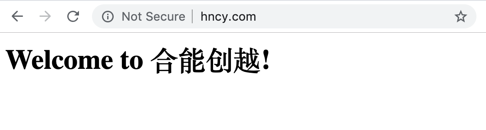

## NginX - Virtual Host + Reverse Proxy

### 安装NGINX

```
brew install nginx
```

### 配置Virtual Host

打开/usr/local/etc/nginx/nginx.conf，配置多个sites:

```
http {

    server {
        listen       80;
        server_name  hncy.com www.hncy.com;

        location / {
            root   html/hncy.com;
            index  index.html index.htm;
        }
    }

    server {
        listen       80;
        server_name  hnzz.com www.hnzz.com;

        location / {
            root   html/hnzz.com;
            index  index.html index.htm;
        }
    }
}
```

在/usr/local/var/www/下先创建hncy.com目录，然后在hncy.com目录下新建如下index.html文件：

```
<html>
    <meta http-equiv="Content-Type" content="text/html; charset=utf-8" />
    <head>
        <title>Welcome to 合能创越!</title>
    </head>
    <body>
        <h1>Welcome to 合能创越!</h1>
    </body>
</html>
```

在/usr/local/var/www/下再创建hnzz.com目录，然后在hnzz.com目录下新建如下index.html文件：

```
<html>
    <meta http-equiv="Content-Type" content="text/html; charset=utf-8" />
    <head>
        <title>Welcome to 合能众智!</title>
    </head>
    <body>
        <h1>Welcome to 合能众智!</h1>
    </body>
</html>
```

### 配置Local DNS

编辑/etc/hosts，如下。其中，192.168.4.111是主机的Public IP。

```
192.168.4.111   hncy.com www.hncy.com
192.168.4.111   hnzz.com www.hnzz.com
```

设置本主机为第一位DNS服务器。


### 测试结果

开启NGINX：

```
brew services start nginx
```

浏览器输入hncy.com，可以看到如下结果：



浏览器输入hnzz.com，可以看到如下结果：


### Virtual Host加入后端API，配置Reverse Proxy，并实现单点登录。

打开/usr/local/etc/nginx/nginx.conf ，配置多个sites的静态页面目录和后端API地址。以下例子包含两个服务：用户平台和Review Service，这两个服务实现单点登录。

```
http {

    upstream USER-PLATFORM {
        server 127.0.0.1:7070;
    }

    upstream REVIEW-SERVICE {
        server 127.0.0.1:6060;
    }

    server {
        listen       80;
        server_name  hncy.com www.hncy.com;
       #root /用户平台的前端静态文件目录

        location / {
            proxy_set_header X-Forwarded-For $proxy_add_x_forwarded_for;
            proxy_set_header Host $http_host;
            proxy_redirect off;
            proxy_pass http://USER-PLATFORM;
        }
    }

    server {
        listen       80;
        server_name  hnzz.com www.hnzz.com;
       #root /Review Service的前端静态文件目录

        location / {
            proxy_set_header X-Forwarded-For $proxy_add_x_forwarded_for;
            proxy_set_header Host $http_host;
            proxy_redirect off;
            proxy_pass http://REVIEW-SERVICE;
        }
    }
}
```

在授权服务器保存的Client信息中，其中包含用户平台Client和Review Service Client，加入如下registeredRedirectUri（例子是图形数据库）：

* 用户平台 - 加入“http://hncy.com/login”
* Review Service - 加入“http://hnzz.com/login”

```
CREATE (用户平台:App {name:'用户平台', clientId:'user', clientSecret:'419feeece1c5630c08b143ea09b794de2a0eff87a73b9116a27e1d10f2ea42c5b426b92693714a19', resourceIds:'user_api', scope:'read,write', authorizedGrantTypes:'authorization_code,client_credentials', registeredRedirectUri:'http://localhost:7070/login,http://hncy.com/login', accessTokenValiditySeconds:3600, refreshTokenValiditySeconds:3600, autoapprove:true})

CREATE (ReviewService:App {name:'ReviewService', clientId:'review', clientSecret:'419feeece1c5630c08b143ea09b794de2a0eff87a73b9116a27e1d10f2ea42c5b426b92693714a19', resourceIds:'review_api', scope:'read,write', authorizedGrantTypes:'authorization_code,client_credentials', registeredRedirectUri:'http://localhost:6060/login,http://hnzz.com/login', accessTokenValiditySeconds:3600, refreshTokenValiditySeconds:3600, autoapprove:true})
```

重启NGINX：

```
brew services restart nginx
```

测试结果如下：

用户平台输入用户名/密码登陆后：


Review Service直接访问，实现单点登录。


