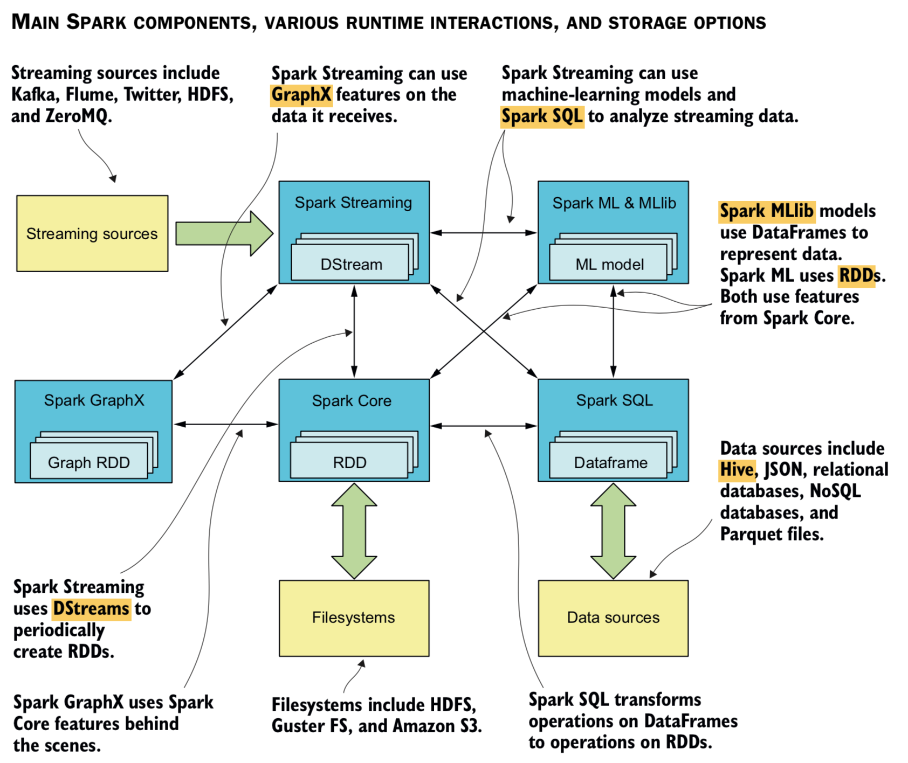
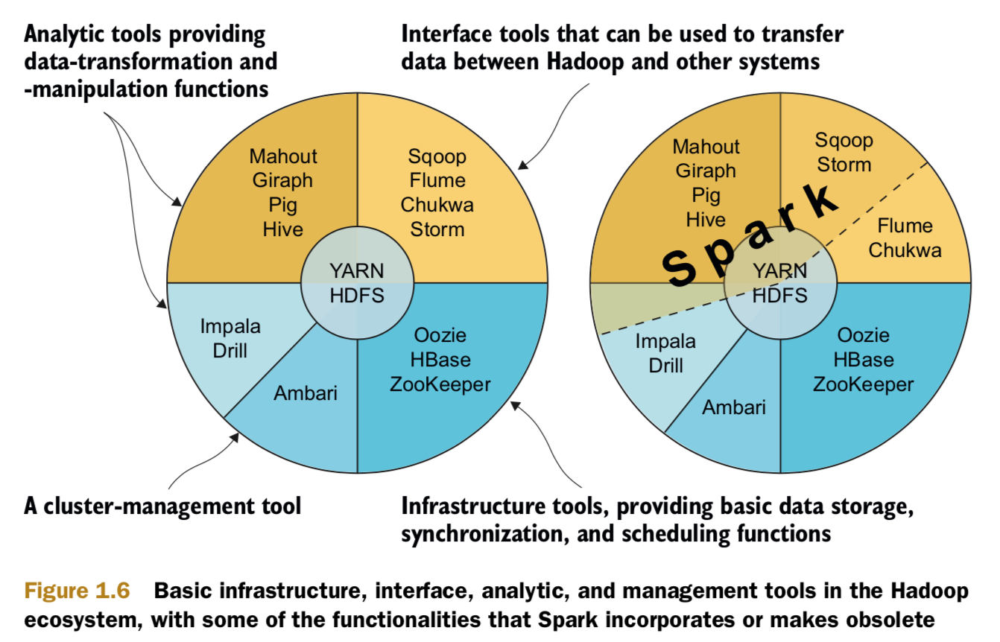
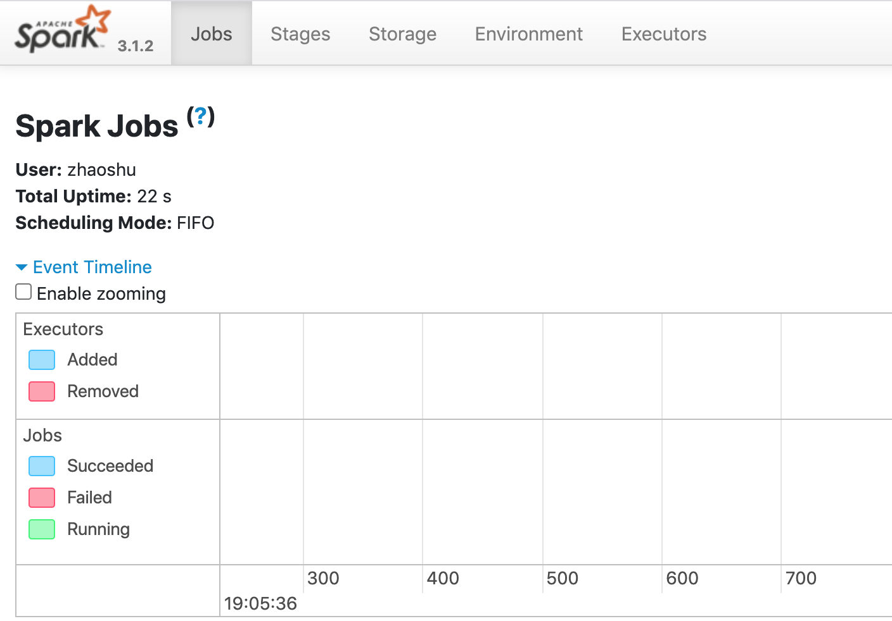
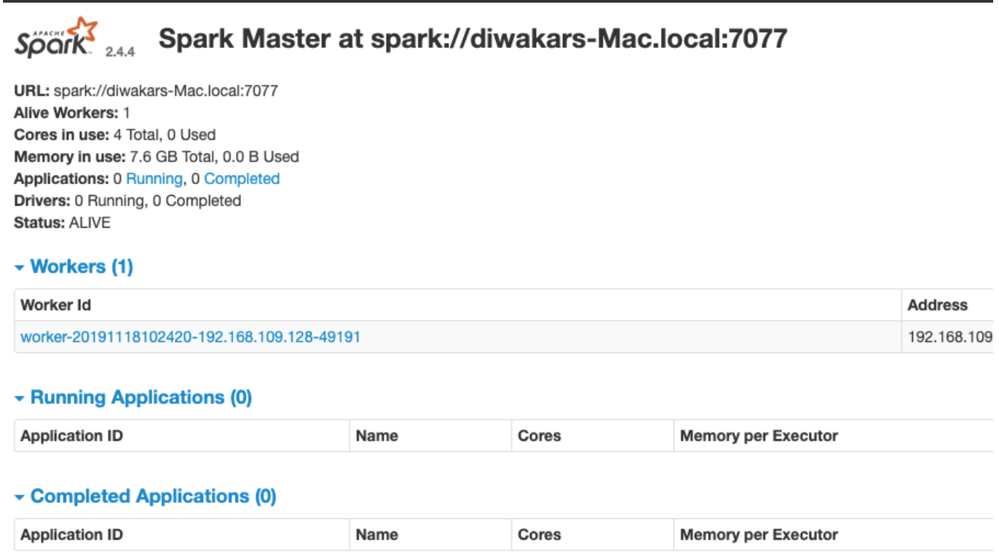

# Spark

## Overview

<p float=left>
	
</p>

## Technical stack

<p float=left>
	
</p>

## Dependencies

1. Scala:

```bash
$ brew install scala
$ scala -version
```

2. Apache Spark:

```bash
$ brew install apache-spark
$ spark-shell
$ pyspark
```

Visit - http://localhost:4040/jobs/
<p float=left>
	
</p>

```bash
$ which spark-shell
$ ls -la /usr/local/bin/spark-shell

$ cd /usr/local/Cellar/apache-spark/3.1.2/libexec/sbin/
$ ./start-all.sh
```

Visit - http://localhost:8080/
<p float=left>
	
</p>

Run with sbt
```bash
$ sbt package
$ spark-submit --class "SimpleApp" --master local[4] target/scala-2.10/samples_2.10-0.1.jar
```

3. Hadoop

```bash
$ brew install hadoop
$ hadoop fs -ls /usr
```

## Issues

```diff
! localhost: ssh: connect to host localhost port 22: Connection refused
```

```bash
$ sudo systemsetup -getremotelogin
Remote Login: Off

$ sudo systemsetup -setremotelogin on
```

## References
* https://codereview.stackexchange.com/questions/28207/finding-the-closest-point-to-a-list-of-points
* http://sortbenchmark.org/
* https://databricks.com/glossary/what-is-parquet
* https://www.scala-sbt.org/index.html
* http://spark.apache.org/docs/1.2.0/quick-start.html#self-contained-applications
* http://spark.apache.org/docs/2.0.0/sql-programming-guide.html#supported-hive-features
* https://cwiki.apache.org/confluence/display/Hive/LanguageManual
* https://spark.apache.org/docs/latest/streaming-kafka-0-10-integration.html
* https://spark.apache.org/docs/latest/structured-streaming-programming-guide.html
* https://spark.apache.org/docs/latest/structured-streaming-kafka-integration.html
* https://spark.apache.org/docs/3.1.2/mllib-guide.html
* https://stackoverflow.com/questions/31618748/how-to-access-coordinatematrix-entries-directly-in-spark
* https://spark.apache.org/docs/latest/ml-features
* https://spark.apache.org/docs/latest/ml-tuning.html
* https://spark.apache.org/docs/latest/ml-clustering.html
* https://spark.apache.org/docs/latest/graphx-programming-guide.html#aggregate-messages-aggregatemessages