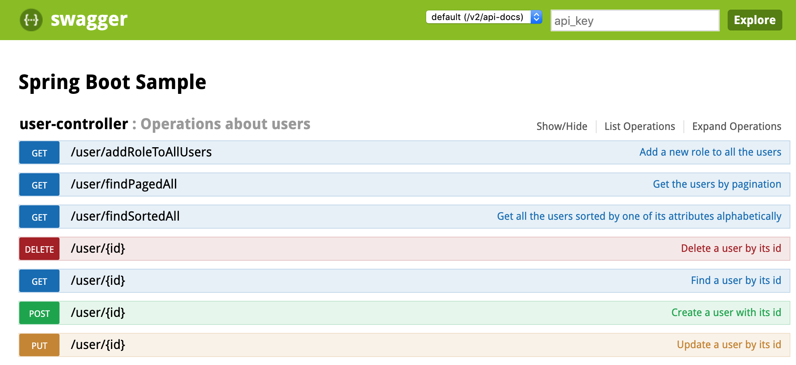
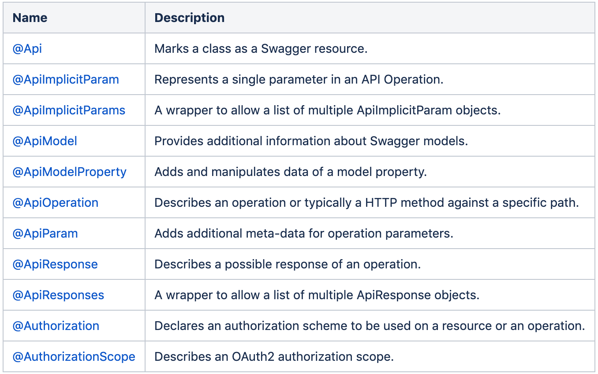

## Swagger UI

配置Swagger UI，可以帮助各个开发团队快速地浏览和使用基于Restful API的微服务。

在Spring Boot中，Swagger UI的具体配置如下：

1. 在pom.xml文件中，加入如下依赖：
```
<dependency>
    <groupId>io.springfox</groupId>
    <artifactId>springfox-swagger2</artifactId>
    <version>2.5.0</version>
</dependency>
<dependency>
    <groupId>io.springfox</groupId>
    <artifactId>springfox-swagger-ui</artifactId>
    <version>2.5.0</version>
</dependency>
```

2. 在Java配置文件中，加入如下配置：
```
@EnableSwagger2
@Configuration
public class SwaggerConfig implements WebMvcConfigurer {

    @Override
    public void addResourceHandlers(ResourceHandlerRegistry registry) {

        registry
                .addResourceHandler("swagger-ui.html")
                .addResourceLocations("classpath:/META-INF/resources/");

        registry
                .addResourceHandler("/webjars/**")
                .addResourceLocations("classpath:/META-INF/resources/webjars/");
    }

    @Bean
    public Docket apiDocket() {

        return new Docket(DocumentationType.SWAGGER_2)
                .apiInfo(getApiInfo())
                .select()
                .apis(RequestHandlerSelectors.basePackage("com.hncy.demo"))
                .paths(PathSelectors.any())
                .build();
    }

    private ApiInfo getApiInfo() {

        return new ApiInfoBuilder()
                .title("Spring Boot Sample")
                .description("")
                .version("0.0.1-SNAPSHOT")
                .build();
    }
}
```

这时启动Spring Boot项目，可以在http://localhost:8080/swagger-ui.html中，看到如下Swagger UI的界面：


除此之外，也可以更丰富以上Swagger UI对各个API、方法和参数的说明，及其引入default参数值。如下是Swagger UI Annotation的一个列表，更具体内容参见：https://github.com/swagger-api/swagger-core/wiki/annotations


1. 对类的说明@Api：
```
@Api(description="Operations about users")
public class UserController {

}
```

2. 对各个HTTP方法的说明@ApiOperation和对其传入参数的说明@ApiParam：
```
@ApiOperation(value = "Create a user with its id", consumes = MediaType.APPLICATION_JSON_VALUE)
public void save(@ApiParam(value = "user data", required = true) @RequestBody User user) {
    userRepository.save(user);
}
```
