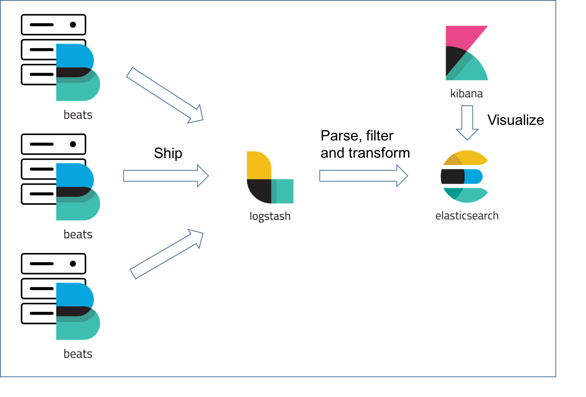

## Log Aggregation

### Technical Stack

As we run the web application across multiple instances or servers, we need to aggregate the log files from each instance or server.

The technical stack we use to retrieve and aggregate the log files is below, and the versions need to be the same!

* Elasticsearch 6.4.0
* Kibana 6.4.0
* Logstash 6.4.0
* Filebeat 6.4.0

The function of each application is as below:



You can download the above applications from https://www.elastic.co/downloads/


To run the above applications, the command lines are as below, and you need to execute the commands in their installed root folder:

1. Elasticsearch:

```
./bin/elasticsearch
```

2. Kibana:

```
./bin/kibana
```

3. Logstash:

```
./bin/logstash -f config/logstash.conf
```

4. Filebeat, please check out this link for your OS - https://www.elastic.co/guide/en/beats/filebeat/current/filebeat-starting.html

```
sudo chown root filebeat.yml
sudo ./filebeat -e
```

### Configuration

Before you spin up the applications, there are 3 things that you need to configure!

1. To set up the logstash.conf, the sample file is as below:

```
input {
  tcp {
  port => 4560
  codec => json_lines
  }
  beats {
    host => "127.0.0.1"
    port => "5044"
  }
}
output{
  elasticsearch {
  hosts => ["localhost:9200"]
  index => "app-%{+YYYY.MM.dd}"
  document_type => "%{[@metadata][type]}"
  }
  stdout { codec => rubydebug }
}
```

2. To set up the filebeat.yml, the sample file is as below:

```
filebeat.inputs:
  - type: log
enabled: true
paths:
  - /[某一个微服务根目录]/logs/trace.log
  - /[某一个微服务根目录]/logs/trace.log
  - /[某一个微服务根目录]/logs/trace.log
output.logstash:
hosts: ["localhost:5044"]
```

3. To set up the Springboot application, first you need to update the "application.yml" file under the folder "resources" with:

```
logging:
  path: logs
  file: ${logging.path}/trace.log
```

Second, add the file "logback.xml" under the folder "resources", and the sample file is as below:

```
<?xml version="1.0" encoding="UTF-8"?>
<!DOCTYPE configuration>
<configuration>
    <appender name="LOGSTASH" class="net.logstash.logback.appender.LogstashTcpSocketAppender">
        <destination>localhost:4560</destination>
        <encoder charset="UTF-8" class="net.logstash.logback.encoder.LogstashEncoder" />
    </appender>

    <include resource="org/springframework/boot/logging/logback/base.xml"/>

    <root level="INFO">
        <!--<appender-ref ref="LOGSTASH" />-->
        <appender-ref ref="CONSOLE" />
    </root>
</configuration>
```

Third, add the following dependencies in Maven:

```
<dependency>
    <groupId>net.logstash.logback</groupId>
    <artifactId>logstash-logback-encoder</artifactId>
    <version>5.1</version>
</dependency>
<dependency>
    <groupId>org.springframework.boot</groupId>
    <artifactId>spring-boot-devtools</artifactId>
    <scope>runtime</scope>
</dependency>
```

After the configuration is done, now you can try all of your settings in Kibana!

### Visualization

Open Kibana at http://localhost:5601 and create a new index for the application with the below steps:

1. Choose: Management->index Patterns->Create Index Pattern, and search for "app-*"


2. Choose: "@timestamp" and click "Create index pattern"


Finally Kibana dashboard will display the aggregated logs from all the services! And you can customize the information by configuring your wanted fields.


