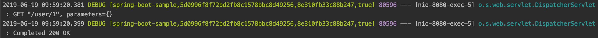
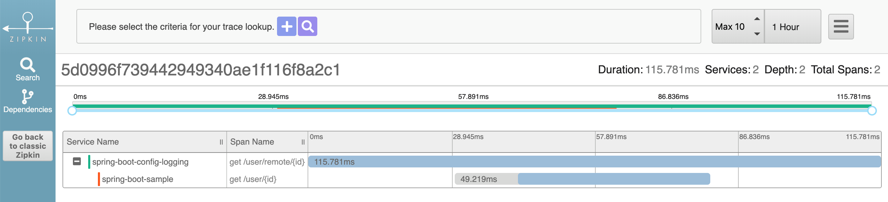

## Log Correlation

### Technical Stack

如果一个request或者transaction横跨了多个service，则需要Log Correlation来跟进它在每个service中的执行情况和时间，所以我们用到了如下技术栈来实现监控：
* Spring Cloud Sleuth
* Spring Cloud Zipkin

### Spring Cloud Sleuth + Zipkin

Spring Cloud Sleuth是一个distributed tracing的工具，可以在每个service中打印[service-name, trace-id, span-id, if-exposed-to-zipkin]格式的日志，来记录每个请求的状态。

* 同一个请求的Trace Id相同
* 同一个请求在不同service上的Span Id不同


在Spring Boot项目中，引入Sleuth，只需做如下两步：

1. 在Maven中，引入Spring Cloud Sleuth + Zipkin依赖:

```
<dependency>
    <groupId>org.springframework.cloud</groupId>
    <artifactId>spring-cloud-starter-sleuth</artifactId>
</dependency>
<dependency>
    <groupId>org.springframework.cloud</groupId>
    <artifactId>spring-cloud-starter-zipkin</artifactId>
</dependency>
```

2. 在application.yml中，加入如下配置:

```
spring:
  application:
    name: spring-boot-sample
  sleuth:
    sampler:
      probability: 1.0
    traceId128: true

logging:
  level:
    org:
      springframework:
        web:
          servlet:
            DispatcherServlet: DEBUG
```

重新启动项目，既可以看到如下日志:



最后执行如下命令，下载并启动Zipkin:

```
curl -sSL https://zipkin.io/quickstart.sh | bash -s
java -jar zipkin.jar
```

我们这时访问Zipkin默认地址 - http://localhost:9411/，便可以看到如下信息：

* spring-boot-config-logging，总共执行了115.781毫秒。
* 其中，spring-boot-config-logging执行了远程请求服务spring-boot-sample，spring-boot-sample执行了49.219毫秒。



