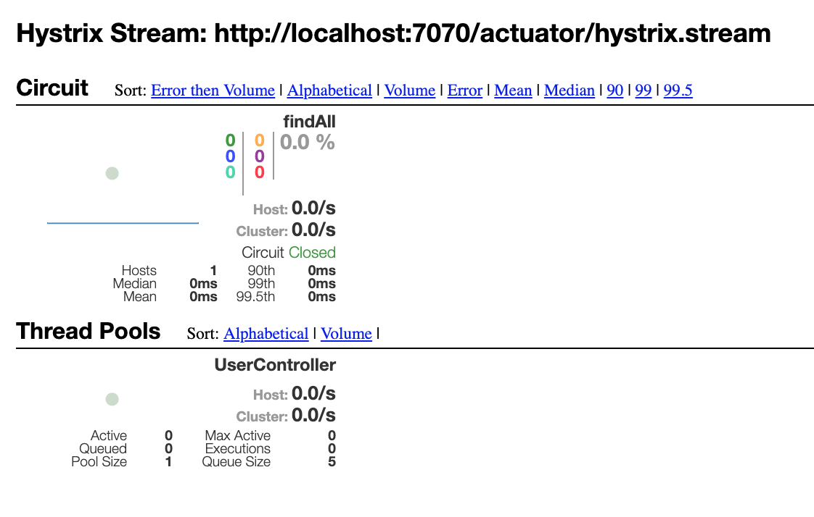
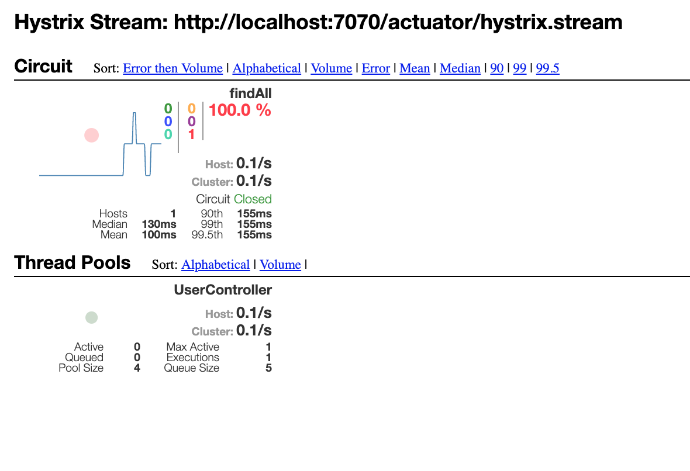
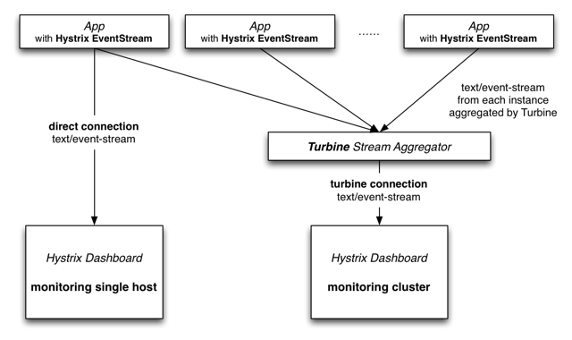
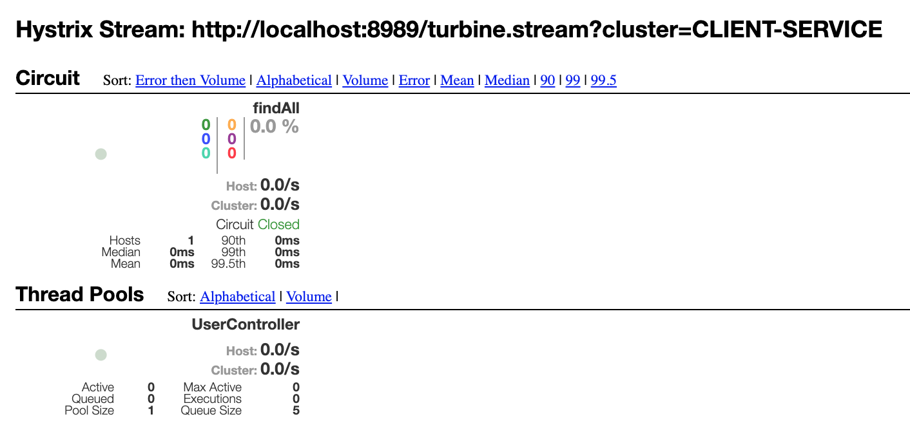

## Hystrix + Turbine

Hystrix and Turbine are used to monitor the inter-service performance.

Hystrix ensures the resilience of the system and prevent the errors from propagating to the whole network by the introduction of the fallback methods. To monitor the metrics, Hystrix dashboard is wired by means of RabbitMQ.

After starting the Hystrix dashboard, you can type in your monitored service's hystrix.stream exposed by Actuator. The sample URL is similar to: http://localhost:7070/actuator/hystrix.stream

The result will display in the Hystrix dashboard in real-time:

If the downstream service does not respond, the dashboard can track the network error in real-time:

Turbine is used to aggregate the stream to track multiple services.

After starting the Turbine server, you can monitor the performance in the Hystrix dashboard with the sample URL as: http://localhost:8989/turbine.stream?cluster=CLIENT-SERVICE

