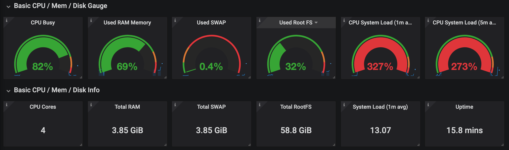

## Redis Monitoring

### 如何监控测试/生产服务器的各项指标

为了监控Linux服务器，我们准备把服务器各项指标统一曝露出来，用Prometheus来存储和查询。其步骤如下：

1. 安装并启动Node Exporter，这会把服务器metrics曝露成Prometheus Format，命令如下：
```
$ wget https://github.com/prometheus/pushgateway/releases/download/v0.8.0/pushgateway-0.8.0.linux-amd64.tar.gz
$ tar xvfz pushgateway-0.8.0.linux-amd64.tar.gz
$ cd pushgateway-0.8.0.linux-amd64
$ ./node_exporter
```

这时访问http://localhost:9100/metrics ，可以看到如下服务器数据：
```
# HELP go_memstats_mspan_sys_bytes Number of bytes used for mspan structures obtained from system.
# TYPE go_memstats_mspan_sys_bytes gauge
go_memstats_mspan_sys_bytes 81920
# HELP go_memstats_next_gc_bytes Number of heap bytes when next garbage collection will take place.
# TYPE go_memstats_next_gc_bytes gauge
go_memstats_next_gc_bytes 4.194304e+06
# HELP go_memstats_other_sys_bytes Number of bytes used for other system allocations.
# TYPE go_memstats_other_sys_bytes gauge
go_memstats_other_sys_bytes 1.029215e+06
```

最后启动Grafana，导入[Node Exporter JSON](./config/NodeExporterFull.json)，便可看到如下监控页面（监控数据很细化，如下只是冰山一角）：


### 一些安装服务器用到的命令

```
ubuntu version:
    lsb_release -a

ruby install:
    apt install ruby-full

go install:
    wget https://dl.google.com/go/go1.12.6.linux-amd64.tar.gz
    tar xvfz go1.12.6.linux-amd64.tar.gz
    vim ~/.profile
    export PATH=$PATH:/root/go/bin
    source ~/.profile

make install:
    apt-get install make

gcc install:
    apt-get install gcc
```