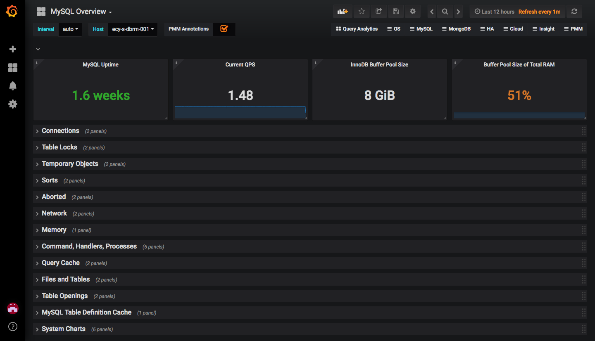

## MySQL Monitoring

### MySQL Exporter

在MySQL运行的前提下，安装并启动mysqld_exporter - https://github.com/prometheus/mysqld_exporter 。 步骤如下：

1. 在MySQL的mysql.user中，加入如下exporter用户：
```
CREATE USER 'exporter'@'localhost' IDENTIFIED BY 'password' WITH MAX_USER_CONNECTIONS 3;
GRANT PROCESS, REPLICATION CLIENT, SELECT ON *.* TO 'exporter'@'localhost';
```

2. 从https://github.com/prometheus/mysqld_exporter/releases 中下载mysqld_exporter-0.12.0.darwin-amd64.tar.gz

3. 进入mysqld_exporter-0.12.0.darwin-amd64文件夹，设置环境变量并运行：
```
$ export DATA_SOURCE_NAME='exporter:password@(localhost:3306)/'
$ ./mysqld_exporter
```

这时访问http://localhost:9104/metrics ， 便可以看到曝露成Prometheus Format的数据。

### Prometheus

之后，在prometheus.yml中，加入如下job：

```
- job_name: 'mysql-exporter'
  static_configs:
    - targets: ['localhost:9104']
```

启动prometheus：

```
$ prometheus --config.file=./prometheus.yml
```

### Grafana

在https://github.com/percona/grafana-dashboards/tree/master/dashboards 中下载相应的dashboard JSON文件，并导入运行的Grafana即可。

比如MySQL Overview的dashboard如下：


### Reference

* https://github.com/prometheus/mysqld_exporter
* https://github.com/percona/grafana-dashboards
