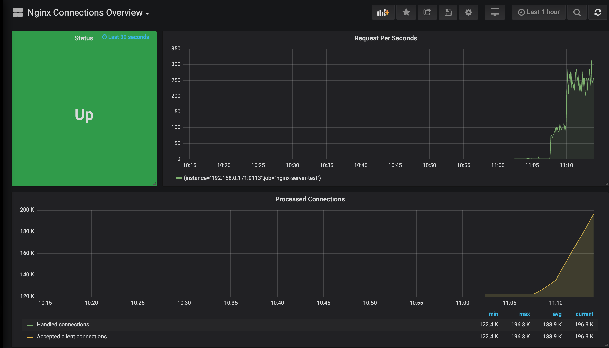
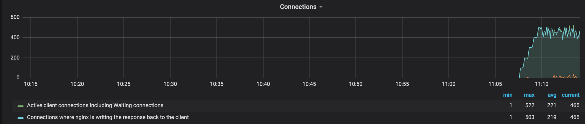

## Nginx Monitoring

### 怎么曝露Nginx监控API

监控Nginx性能和连接的具体步骤如下：

1. 在/etc/nginx/nginx.conf中，添加如下配置：
```
server {
    listen 127.0.0.1:8080;
    server_name 127.0.0.1;

    location /stub_status {
        stub_status;
    }
}
```

2. 从 https://github.com/nginxinc/nginx-prometheus-exporter 下载并启动Prometheus Exporter：
```
$ git clone https://github.com/nginxinc/nginx-prometheus-exporter.git
$ cd nginx-prometheus-exporter
$ make
$ ./nginx-prometheus-exporter -nginx.scrape-uri http://localhost:8080/stub_status
```

这时访问Prometheus Exporter的默认地址 - http://localhost:9113/metrics ，会看到如下暴露成Prometheus Format的Nginx参数：
```
# HELP nginx_connections_accepted Accepted client connections
# TYPE nginx_connections_accepted counter
nginx_connections_accepted 122399
# HELP nginx_connections_active Active client connections
# TYPE nginx_connections_active gauge
nginx_connections_active 1
# HELP nginx_connections_handled Handled client connections
# TYPE nginx_connections_handled counter
nginx_connections_handled 122399
# HELP nginx_connections_reading Connections where NGINX is reading the request header
# TYPE nginx_connections_reading gauge
nginx_connections_reading 0
# HELP nginx_connections_waiting Idle client connections
# TYPE nginx_connections_waiting gauge
nginx_connections_waiting 0
# HELP nginx_connections_writing Connections where NGINX is writing the response back to the client
# TYPE nginx_connections_writing gauge
nginx_connections_writing 1
# HELP nginx_http_requests_total Total http requests
# TYPE nginx_http_requests_total counter
nginx_http_requests_total 138804
# HELP nginx_up Status of the last metric scrape
# TYPE nginx_up gauge
nginx_up 1
# HELP nginxexporter_build_info Exporter build information
# TYPE nginxexporter_build_info gauge
nginxexporter_build_info{gitCommit="a803520",version="0.4.1"} 1
```

3. 接着在Prometheus中配置prometheus.yml，加入如下job：
```
- job_name: 'nginx-monitor'
  metrics_path: '/metrics'
  scrape_interval: 5s
  static_configs:
    - targets: ['localhost:9113']
```

这时用如下命令启动Prometheus：
```
$ prometheus --config.file=./prometheus.yml
```

4. 最后启动Grafana，设置其Datasource为刚刚启动的Prometheus的地址，例如：http://localhost:9090 。加载的Dashboard的JSON文件在：[Nginx Connection Dashboard JSON](./config/NginxConnectionsOverview.json)，在加载完Dashboard后，可以看到如下的监控画面：

