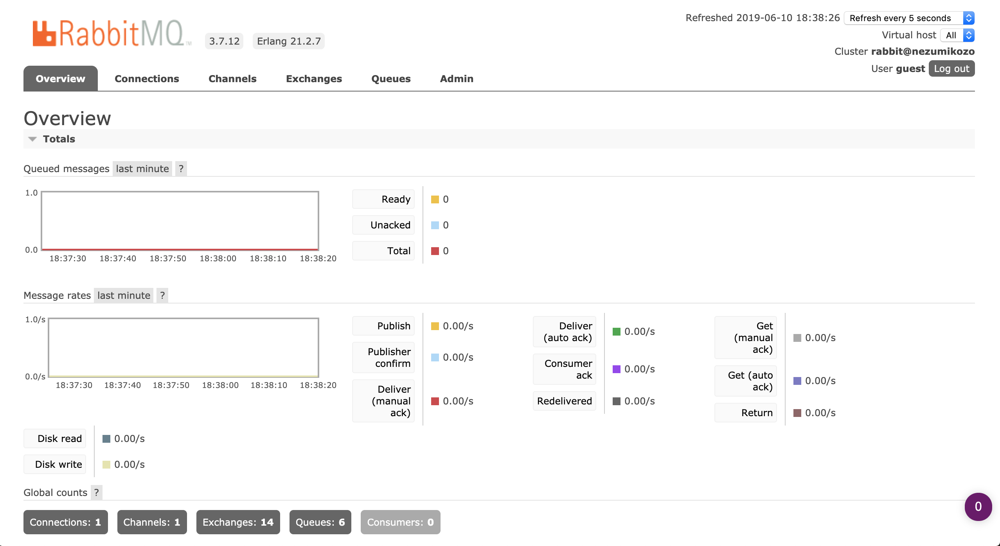
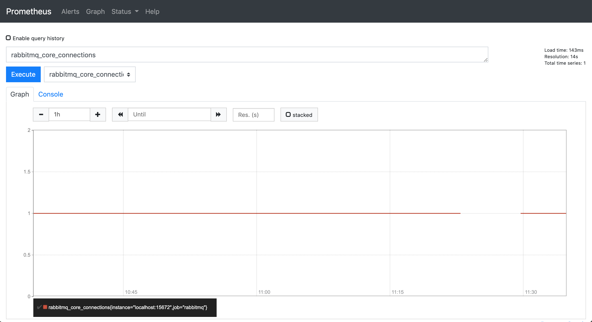
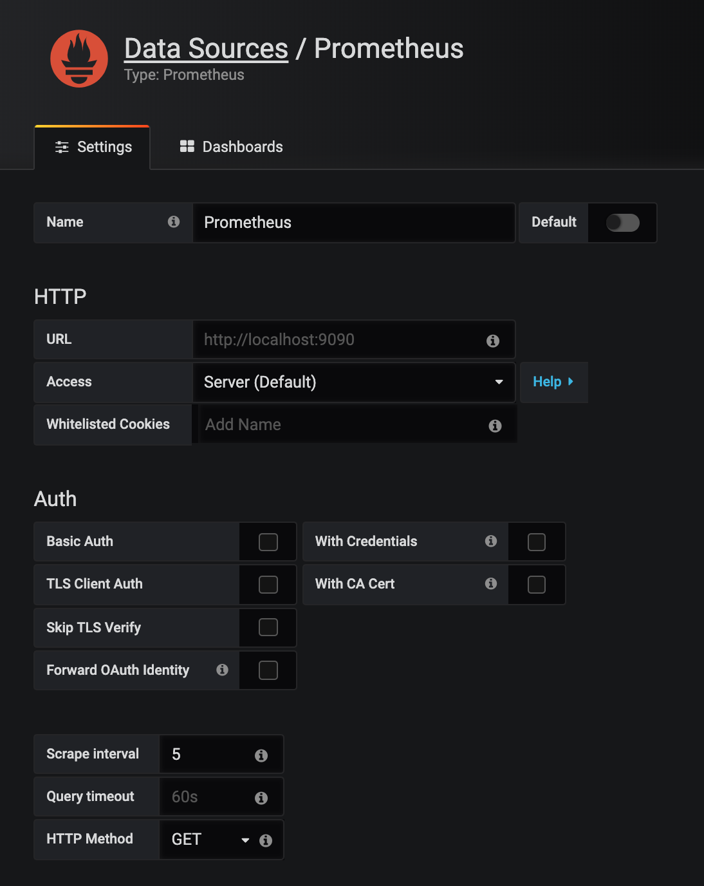
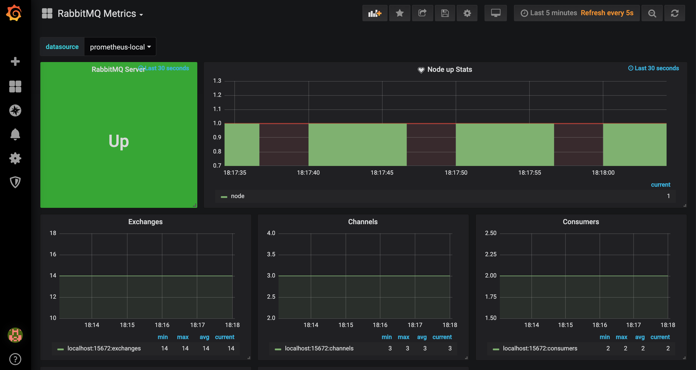

## RabbitMQ Monitoring

为了监控RabbitMQ的健康和性能，我们可以使用如下两种协议：

* 默认 - AMQP (Advanced Message Queue Protocol)
* 插件 - REST API

下面详细讲解怎么用REST API监控RabbitMQ，以及怎么集成Prometheus和Grafana。

### 第一步：RabbitMQ REST API插件

在RabbitMQ安装目录的sbin文件夹下，开启RabbitMQ Management plugin。

```
cd /usr/local/.../rabbitmq/3.7.12/sbin
rabbitmq-plugins enable rabbitmq_management
```

重启RabbitMQ，在默认UI可以看到RabbitMQ的所有metrics信息: http://localhost:15672/#/

比如关键性能指标Queued messages：一旦Queued messages超过阀指，可以进一步检测是否是Consumer出现问题，或者是需要增加更多的Consumer。



比如可以通过如下REST API对RabbitMQ的默认Core node的默认vhost - "/" 进行健康监测：

```
curl -i -u guest:guest http://localhost:15672/api/aliveness-test/%2F

```

### 第二步：RabbitMQ集成Prometheus

先从后面地址下载如下plugins：https://github.com/deadtrickster/prometheus_rabbitmq_exporter/releases

* accept-0.3.5.ez
* prometheus-4.3.0.ez
* prometheus_cowboy-0.1.7.ez
* prometheus_httpd-2.1.10.ez
* prometheus_process_collector-1.4.3.ez
* prometheus_rabbitmq_exporter-3.7.9.1.ez

然后把上面六个plugin复制到RabbitMQ安装目录的plugins文件夹下，比如/usr/local/.../rabbitmq/3.7.12/plugins。

再执行如下命令，启动RabbitMQ的Prometheus插件，使其数据格式export成Prometheus text format。

```
cd /usr/local/.../rabbitmq/3.7.12/sbin
rabbitmq-plugins enable prometheus_rabbitmq_exporter
```

最后重启RabbitMQ，访问http://localhost:15672/api/metrics，便可以看到所有export的RabbitMQ metrics，比如如下Prometheus text format的格式：

```
rabbitmq_core_node_uptime{node="rabbit@localhost"} 4144085
```

### 第三步：安装Prometheus

对于不同的操作系统，安装指南 - https://prometheus.io/docs/prometheus/latest/installation/

对于Mac OS来说，执行如下命令：

```
brew install prometheus
```

最后，下载此repository里的prometheus.yml，并在包含prometheus.yml的目录里启动Prometheus。

```
prometheus --config.file=./prometheus.yml
```

此时访问Prometheus UI - http://localhost:9090/graph，可以看到所有RabbitMQ导出的metrics，并可以在此验证Query语句。



### 第四步：安装Grafana

对于不同的操作系统，安装指南 - https://grafana.com/docs/installation/

对于Mac OS来说，执行如下命令：

```
brew install grafana
```

然后启动Grafana。

对于Mac OS来说，执行如下命令：

```
brew services start grafana
```

再访问Grafana UI - http://localhost:3000/datasources/，添加Prometheus为Data source。



最后在http://localhost:3000/dashboard/import中点击"Upload .json File"，下载并选择此repository里的JSON文件 - RabbitMQAPIMetrics.json，选择"Prometheus"为数据源。当点击"Load"时，可以看到如下监控面板：



Grafana的灵活之处在于，也可以从不同online模板中import不同面板，比如import这个面板：https://grafana.com/dashboards/4279