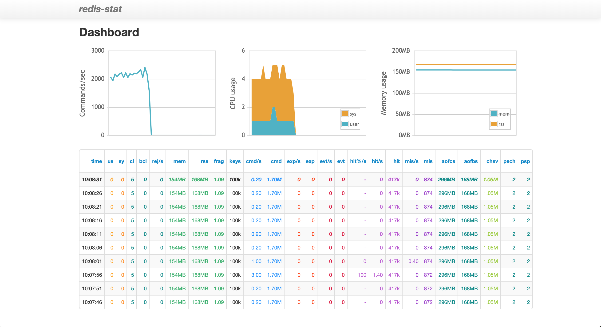
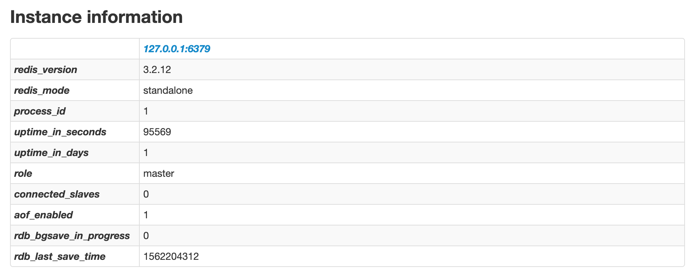
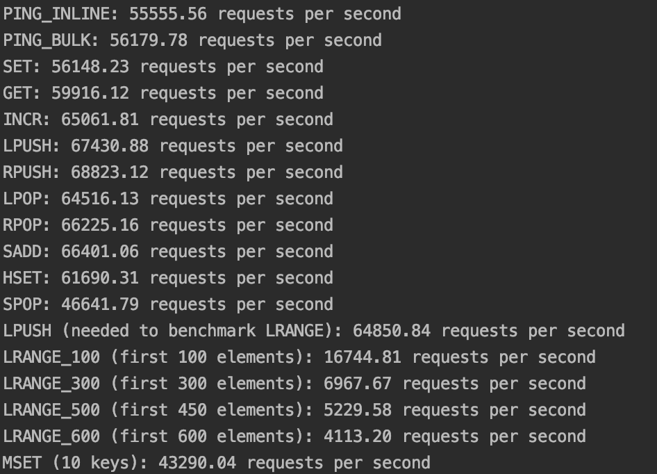

## Redis Monitoring

Redis的性能可以通过其自身的redis-cli monitor实时监控，命令如下：
```
$ redis-cli monitor
```

这时可以看到所有Redis的实时请求数据：
```
OK
1562305424.279057 [0 127.0.0.1:64376] "COMMAND"
1562305426.166254 [0 127.0.0.1:64376] "keys" "*"
1562305439.352967 [0 127.0.0.1:64376] "del" "spring:session:index:org.springframework.session.FindByIndexNameSessionRepository.PRINCIPAL_NAME_INDEX_NAME:admin"
```

也可以安装其他Redis监控工具，比如安装Redis Stat - https://github.com/junegunn/redis-stat ，其安装和启动步骤如下：
```
$ gem install redis-stat
$ redis-stat --verbose --server=7070 5
```

这时访问http://localhost:7070，就可以看到如下监控面板：



上面的指标，我们比较关心的是：

* memory：因为所有DB缓存数据，和用户请求session的数据，都保存在memory里。
* commands per second：在active users在1000的时候，commands per second维持在6000。

可以通过如下命令对Redis进行性能测试，其中的主要参数如下：

-n Total number of requests (default 100000)

-c Number of parallel connections (default 50)

```
$ redis-benchmark -q -n 100000
```

当运行上面命令，可以看到如下Redis性能报告：
