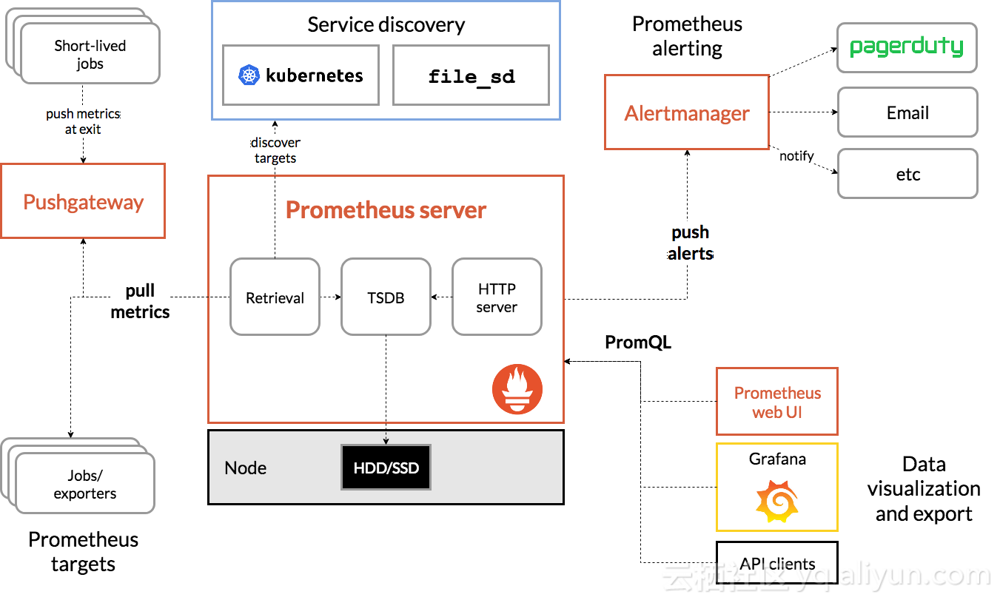
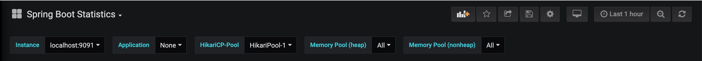
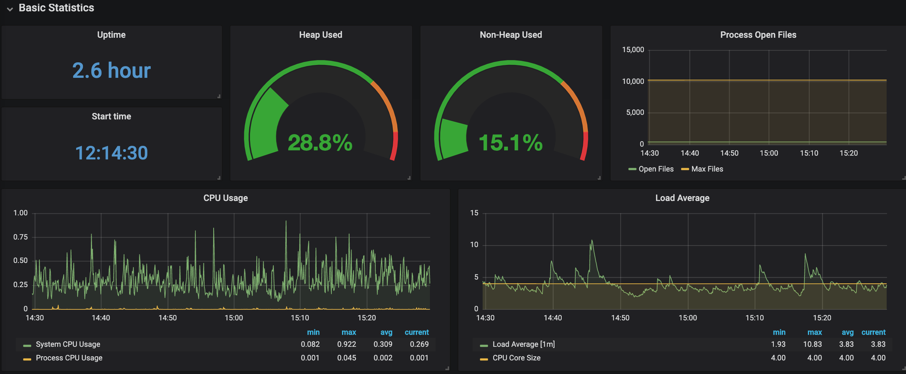
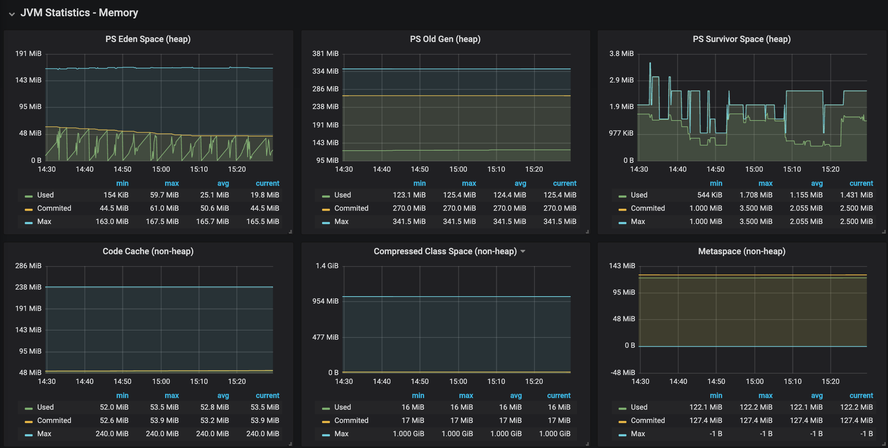
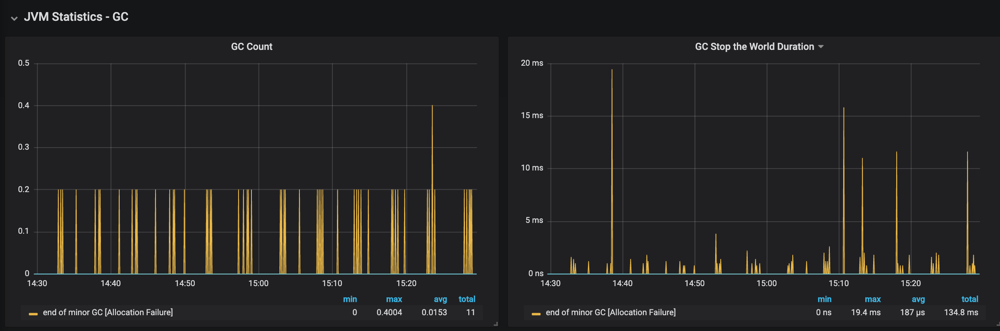
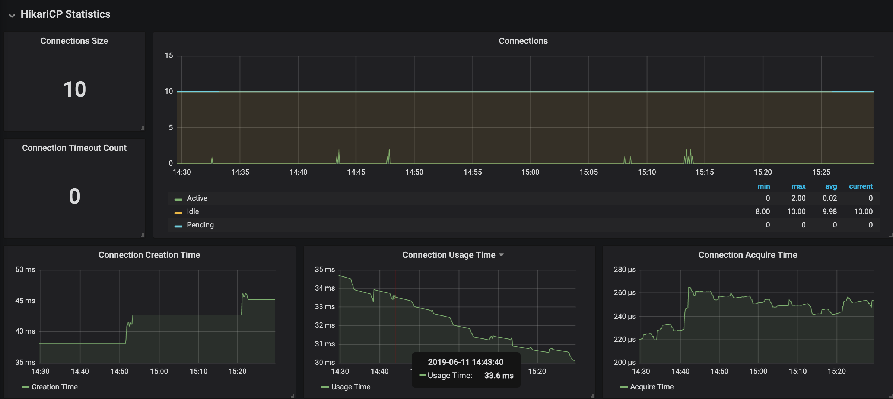
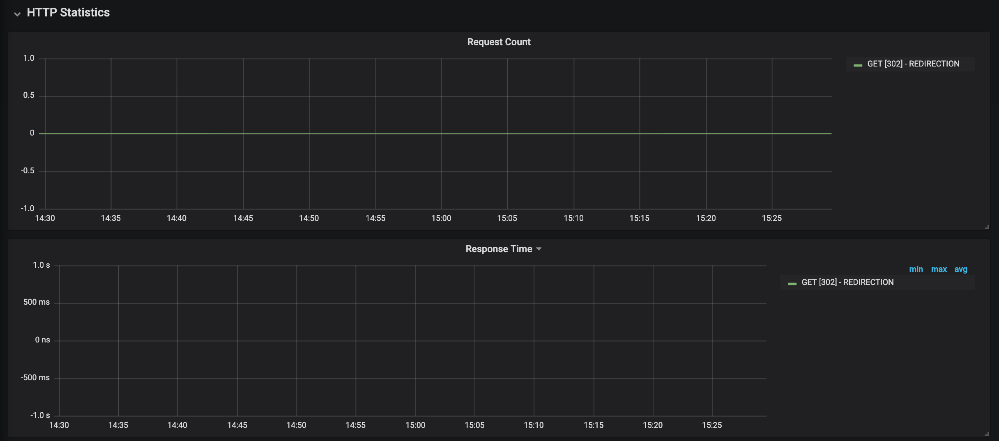
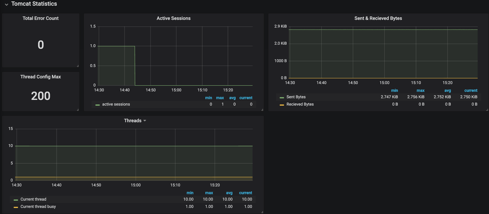
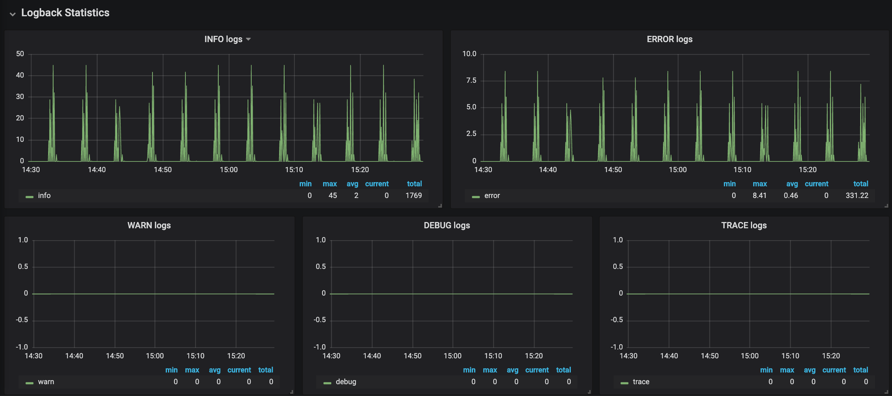

## Spring Boot Monitoring

在微服务体系当中，监控是必不可少的。当系统环境超过指定的阀值以后，需要提醒指定的运维人员或开发人员进行有效的防范，从而降低系统宕机的风险。

Prometheus + Grafana是比较通用的解决方案，在Spring Boot 2.0以后metrics默认与Micrometer集成，而Micrometer有关于Prometheus的MeterRegistry规范的实现，因此我们通过Micrometer这个桥梁能将Spring Boot的监控数据与Prometheus展示出来。然后通过Grafana提供的UI界面进行数据的实时展示。



Prometheus从对应的节点地址获取度量数据并在本地存储所有数据样例根据相关规则将现有数据聚合并记录新的时间序列（或者生成警报）。可以使用Grafana或其他API消费者来可视化收集的数据。

### 怎么集成Micrometer

Spring Boot集成了Micrometer。Micrometer是一个metrics的facade (类似SLF4J之于Logback和Log4j)，它可以把actuator metrics集成到其他的监控软件上，比如Netflix Atlas，AWS Cloudwatch，Datadog，InfluxData，SignalFx，Graphite，Wavefront和Prometheus等等。

为了把Spring Boot的actuator metrics集成到Prometheus，只需如下两步。

1. 在Maven项目中引入如下依赖：

```
<!-- Micrometer core dependency  -->
<dependency>
    <groupId>io.micrometer</groupId>
    <artifactId>micrometer-core</artifactId>
</dependency>

<!-- Micrometer Prometheus registry  -->
<dependency>
    <groupId>io.micrometer</groupId>
    <artifactId>micrometer-registry-prometheus</artifactId>
</dependency>

<dependency>
    <groupId>org.springframework.boot</groupId>
    <artifactId>spring-boot-starter-actuator</artifactId>
</dependency>
```

2. 在application.yml中配置如下：

```
management:
  metrics:
    export:
      prometheus:
        enabled: true
  endpoints:
    web:
      exposure:
        include: "*"
  endpoint:
    metrics:
      enabled: true
    prometheus:
      enabled: true
```

3. 如果是Spring Security的项目，还需要在Web Security Configurer Adapter的类中，把如下路径"/actuator/prometheus"曝露出来：

```
http.authorizeRequests()
.antMatchers("/login**", "/logout**", "/actuator/hystrix.stream", "/actuator/prometheus", "/static/**", "/public/**", "/processes/**").permitAll()
.anyRequest().authenticated()
```

一旦加入上面依赖和配置，重新启动Spring Boot应用，访问如下路径"/actuator/prometheus"，比如http://localhost:9091/actuator/prometheus ，便可以看到如下符合Prometheus text format的metrics：

```
http_server_requests_seconds_max{exception="None",method="GET",outcome="SUCCESS",status="200",uri="/actuator/prometheus",} 0.009496413
```

### Grafana展示Spring Boot Statistics

访问本地默认的Grafana UI - http://localhost:3000 。在http://localhost:3000/dashboard/import 中点击"Upload .json File"，下载并选择此repository里的JSON文件 - SpringBootStatistics.json，选择"Prometheus"为数据源，最后点击"Load"。

在Variables下拉菜单中，选中一个存在的Instance和HikariCP-Pool，如下：



最后Spring Boot Statistics展示如下：

1 - Basic Statistics



2 - JVM Statistics - Memory



3 - JVM Statistics - GC



4 - HikariCP Statistics



5 - HTTP Statistics

这个面板有利于API的性能监控。



6 - Tomcat Statistics



7 - Logback Statistics

