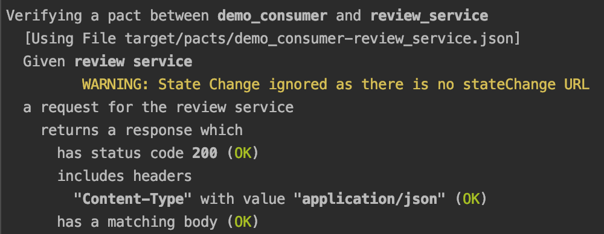

## Consumer-Driven Contract (CDC) Tests

Consumer-Driven Contract (CDC) tests 保证了一个interface的consumer方和producer方能共同遵守一个interface的合约(contract)。顾名思义，CDC测试是由微服务的consumer方发起的，consumer方生成合约，producer方验证合约。这样就保证了微服务间的集成是没有问题的。

CDC测试中，我们用到的工具是Pact - https://docs.pact.io/ ，其具体测试步骤如下：

1. 在consumer微服务的pom.xml中引入如下依赖：
```
<dependency>
    <groupId>au.com.dius</groupId>
    <artifactId>pact-jvm-consumer-junit_2.12</artifactId>
    <version>3.6.11</version>
</dependency>
```

2. 在consumer微服务的集成测试中，加入如下测试：

以下是要注意的参数：
* provider是"review_service"，定义在PactProviderRuleMk2
* consumer是"demo_consumer"，定义在Pact

```
@RunWith(SpringRunner.class)
@SpringBootTest
public class ConsumerTests {

    @Autowired
    private RestTemplate restTemplate;

    @Rule
    public PactProviderRuleMk2 reviewService = new PactProviderRuleMk2
            ("review_service", "localhost", 6061, this);

    @Pact(consumer="demo_consumer")
    public RequestResponsePact createPact(PactDslWithProvider builder) throws IOException {
        return builder
                .given("review service")
                .uponReceiving("a request for the review service")
                .path("/review/1")
                .method("GET")
                .willRespondWith() .status(200)
                .body("{\"id\":1,\"subject\":\"cup review\",\"comment\":\"a good cup\",\"user\":1,\"product\":1}", MediaType.APPLICATION_JSON_VALUE)
                .toPact();
    }

    @Test
    @PactVerification("review_service")
    public void aggregate() {

        Review expectedReview = new Review();
        expectedReview.setId(1l);
        expectedReview.setSubject("cup review");
        expectedReview.setComment("a good cup");
        expectedReview.setUser(1l);
        expectedReview.setProduct(1l);

        assertThat(restTemplate.getForEntity("http://localhost:6061/review/1", Review.class).getBody()).isEqualTo(expectedReview);
    }
}
```

此时执行mvn clean test，可以在target/pacts/的文件夹中找到生成的合约demo_consumer-review_service.json，如下是合约内容：

```
{
  "provider": {
    "name": "review_service"
  },
  "consumer": {
    "name": "demo_consumer"
  },
  "interactions": [
    {
      "description": "a request for the review service",
      "request": {
        "method": "GET",
        "path": "/review/1"
      },
      "response": {
        "status": 200,
        "headers": {
          "Content-Type": "application/json"
        },
        "body": {
          "id": 1,
          "subject": "cup review",
          "comment": "a good cup",
          "user": 1,
          "product": 1
        }
      },
      "providerStates": [
        {
          "name": "review service"
        }
      ]
    }
  ],
  "metadata": {
    "pactSpecification": {
      "version": "3.0.0"
    },
    "pact-jvm": {
      "version": "3.6.11"
    }
  }
}
```

3. 在没有Pact Broker的情况下，将上面生成的合约复制到producer微服务的某个目录下，例如：在review_service根目录下的target/pacts/demo_consumer-review_service.json

4. 在producer微服务的pom.xml中，把如下插件加入到Maven的build中：
```
<build>
    <plugins>
        <plugin>
            <groupId>au.com.dius</groupId>
            <artifactId>pact-jvm-provider-maven_2.12</artifactId>
            <version>3.6.11</version>
            <configuration>
                <serviceProviders>
                    <serviceProvider>
                        <name>review_service</name>
                        <protocol>http</protocol>
                        <host>localhost</host>
                        <port>6061</port>
                        <path>/</path>
                        <consumers>
                            <consumer>
                                <name>demo_consumer</name>
                                <pactFile>target/pacts/demo_consumer-review_service.json</pactFile>
                            </consumer>
                        </consumers>
                    </serviceProvider>
                </serviceProviders>
            </configuration>
        </plugin>
    </plugins>
</build>
```

5. 此时，执行mvn spring-boot:run，启动review_service这个producer微服务。

6. 最后，在review_service这个微服务的根目录下，执行如下命令，验证合约是否满足：
```
$ mvn pact:verify
```

当合约验证成功，可以在terminal中看到如下信息：

