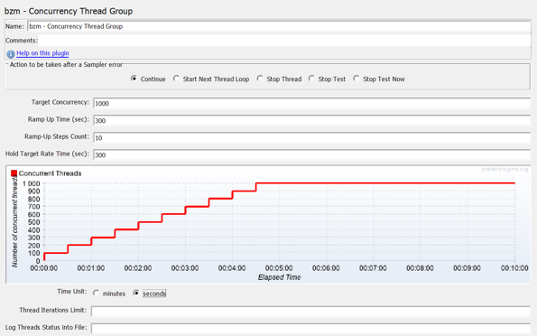
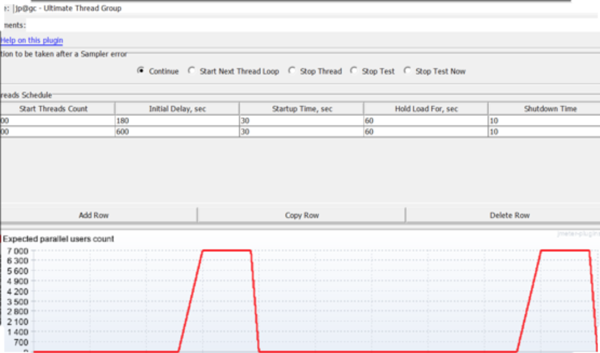

## Performance Test

### Performance Test的定义和目标

Performance Test包含Load Test和Stress Test等，它们的区别如下：

| Performance testing                                                                                                                                                                                                                                                                                                      | Load testing                                                                                                                                                                                                                                                                                                                                                                                                                                                                                                                     | Stress testing                                                                                                                                                                                                                                      |
|--------------------------------------------------------------------------------------------------------------------------------------------------------------------------------------------------------------------------------------------------------------------------------------------------------------------------|----------------------------------------------------------------------------------------------------------------------------------------------------------------------------------------------------------------------------------------------------------------------------------------------------------------------------------------------------------------------------------------------------------------------------------------------------------------------------------------------------------------------------------|-----------------------------------------------------------------------------------------------------------------------------------------------------------------------------------------------------------------------------------------------------|
| Superset of load and stress testing.                                                                                                                                                                                                                                                                                     | A subset of performance testing.                                                                                                                                                                                                                                                                                                                                                                                                                                                                                                 | A subset of performance testing.                                                                                                                                                                                                                    |
| Helps to set the benchmark and standards for the application.                                                                                                                                                                                                                                                            | To recognize the upper limit of the system, set SLA of the app and check how the system can handle a heavy load.                                                                                                                                                                                                                                                                                                                                                                                                                 | To check out how the system behaves under extreme loads and how it recovers from failure.                                                                                                                                                           |
| The aim of performance testing is to get an indication of how an application behaves under regular parameters.                                                                                                                                                                                                           | Generating increased load on a web application is the main aim of load testing.                                                                                                                                                                                                                                                                                                                                                                                                                                                  | Stress testing aims to ensure that under a sudden high load for a considerable duration the servers don't crash, e.g. Spike test or Soak test                                                                                                       |
| Resource usage, availability, and reliability of the product are validated under this testing.                                                                                                                                                                                                                           | The attributes which are checked in a load test are peak performance, server quantity and response time.                                                                                                                                                                                                                                                                                                                                                                                                                         | This kind of testing checks stability response time, etc.                                                                                                                                                                                           |
| In performance testing, Load limit is both below and above the threshold of a break.                                                                                                                                                                                                                                     | In load testing load limit is a threshold of a break.                                                                                                                                                                                                                                                                                                                                                                                                                                                                            | In stress testing load limit is above the threshold of a break.                                                                                                                                                                                     |
| Example of performance testing are:   Checking concurrent users.  HTTP connections.  Checking Suitable response time.                                                                                                                                                                                                    | Example of Load testing are:  Test of a word processor by make change in the large volume of data.  Test a printer by transferring heavy data.  Check mail server with thousands of concurrent users.                                                                                                                                                                                                                                                                                                                            | Example of Stress testing is casually shut down and restart ports of a large network.                                                                                                                                                               |
| Why Performance Testing?  Validating that application performs properly.  Validating to conform the performance needs of the business.  Finding, analyzing and, fixing performance issues.  Validating the hardware adequate to handle the expected load.  Doing capacity planning for future demand of the application. | Why Load Testing?  Find bugs which are not possible with any other testing method. Such as memory management memory leaks, bugs, buffer overflows, etc.  To assure that application able to achieve the performance point recognized during performance testing.  To determine the operating capacity of an application.  To check out that current infrastructure is sufficient to run the application or not.  Numbers of concurrent users which an application can support, and scalability to allow more users to access it. | Why Stress Testing?  It helps the testing unit to test the system in the situation of failures.  To make sure that the system has saved the data before crashing or not.  To check whether any unexpected failures do not harm the system security. |

### Performance Test的主要测试指标 - 响应时间

| Response Time Metrics | Explanation                                                                                                                                                                                                                                                                                                                                                            |
|-----------------------|------------------------------------------------------------------------------------------------------------------------------------------------------------------------------------------------------------------------------------------------------------------------------------------------------------------------------------------------------------------------|
| Average Response Time | The Average Response Time is the average time taken for every round trip request. The Average Response Time includes the loading time of HTML, CSS, XML, images, JavaScript files, etc. Therefore, the average is affected when slow components are present in the system.                                                                                             |
| Peak Response Time    | The Peak Response Time helps us to find potentially problematic components. It helps us to find all the all the irregularity in the website or system where a certain request is not handled correctly. For example, there may be a large database query executed which can affect the response time. This query does not permit the page to load at the desired time. |
| Error Rate            | The Error Rate is a mathematical calculation which displays the percentage of problem requests against all requests. This percentage counts all HTTP status codes displaying an error on the server. It also counts requests which are time out.                                                                                                                       |

| Response Time | Significance                                                                                                                                                                                                                   |
|---------------|--------------------------------------------------------------------------------------------------------------------------------------------------------------------------------------------------------------------------------|
| 10 Seconds    | It is a maximum limit after which response time goes beyond the acceptable limit. However, in today's time, if response time exceeds 6 seconds, the user will leave that site or quit the application.                         |
| 0.1 Second    | It is most preferred response time. If the response time is 0.1, users always feel that the application or system is responding instantly, and do not feel any interruption.                                                   |
| 1.0 Second    | It is the defined as the maximum limit of acceptable response time. Users are unlikely to feel any interruption, though they may experience some delay. The response time of more than 1-second may interrupt user experience. |

### Performance Test的测试工具

测试工具包含如下工具，但不仅仅局限于此：

| Tool name                         | Company name                          | License                        | Type        | Pricing                           | Focus                                                  | Notes                                                                                                                                                                                                     |
|-----------------------------------|---------------------------------------|--------------------------------|-------------|-----------------------------------|--------------------------------------------------------|-----------------------------------------------------------------------------------------------------------------------------------------------------------------------------------------------------------|
| Apache JMeter                     | An Apache Jakarta open source project | Apache License 2.0             | Local       | Free                              |                                                        | Java desktop application for load testing and performance measurement.                                                                                                                                    |
| BlazeMeter                        | BlazeMeter Ltd.                       | Proprietary                    | Cloud based | Free plan available               | Website, web app, mobile, database and other scenarios | Scalable load up to 200,000 concurrent simulated browser users from across eight geographical locations. Can also be used for integration and functional testing.                                         |
| Blitz                             | Spirent Communications                | Proprietary                    | Cloud based | Trial available                   | Websites, mobile and REST APIs                         | It allows to simulate up to 50,000 simultaneous virtual users from different worldwide locations.                                                                                                         |
| CloudTest                         | SOASTA                                | Proprietary                    | Cloud-based | Free, trial and licensed versions | Mobile and web applications                            |                                                                                                                                                                                                           |
| Flood                             | Tricentis                             | Proprietary                    | Cloud based | Trial available                   | Website, web app, mobile, database and other scenarios | Scalable load up to millions of concurrent users from across 14 geographical locations. Pricing is based on infrastructure used, not tests or virtual users. [5] [6]                                      |
| Gatling                           | Open Source                           | Apache License 2.0             | Local       | Free                              | Java web applications                                  | Portable HTML reports.                                                                                                                                                                                    |
| Loader.io                         | SendGrid Labs                         | Proprietary                    | Cloud based | Free plan available               | Web applications and API                               |                                                                                                                                                                                                           |
| LoadRunner                        | HP                                    | Proprietary                    | Local       | Trial available                   |                                                        | Primarily used for executing large numbers of tests (or a large number of virtual users) concurrently. Can be used for unit and integration testing as well.                                              |
| Load Test (included with SOAtest) | Parasoft                              | Proprietary                    | Local       | Demo available                    |                                                        | Performance testing tool that verifies functionality and performance under load. Supports SOAtest tests, JUnits, lightweight socket-based components. Detects concurrency issues.                         |
| loadUI                            | SmartBear Software                    | EUPL                           | Local       | Demo available                    |                                                        | Cross-platform load testing tool, targeted mainly at web services. Integrates with soapUI.                                                                                                                |
| Login VSI                         | Login VSI, Inc.                       | Proprietary                    | Local       | Trial available                   | Virtual windows desktops workloads                     |                                                                                                                                                                                                           |
| NeoLoad                           | Neotys                                | Proprietary                    | Local       | Free plan available               | Web and mobile                                         | Load can be generated from local agents or from the cloud.                                                                                                                                                |
| OpenSTA                           | Open System Testing Architecture      | GNU General Public License 2.0 | Local       | Free                              | Web server                                             | Utilizes a distributed software architecture based on CORBA. OpenSTA binaries available for Windows.                                                                                                      |
| Rational Performance Tester       | IBM                                   | Proprietary                    | Local       | Trial available                   |                                                        | Eclipse based large scale performance testing tool primarily used for executing large volume performance tests to measure system response time for server based applications.                             |
| Siege                             | Open source                           | Open source GPLv3 or later     | Local       | Free                              | Web servers                                            | Supports basic authentication, cookies, HTTP, HTTPS and FTP protocols.                                                                                                                                    |
| Silk Performer                    | Borland                               | Proprietary                    | Local       | Trial available                   |                                                        | Application performance tool with cloud and local virtual agents. Supports most protocols and applications. Licensed.                                                                                     |
| Test Studio                       | Telerik                               | Proprietary                    | Local       | Trial available                   |                                                        | Assess how website would perform if visited by a large number of users at the same time.                                                                                                                  |
| Visual Studio Enterprise edition  | Microsoft                             | Proprietary                    | Local       | Trial available                   |                                                        | Visual Studio Enterprise edition includes a load test tool which enables a developer to execute a variety of tests (web, unit etc...) with a combination of configurations to simulate real user load.[7] |
| WebLOAD                           | RadView                               | Proprietary                    | Local       | Free plan available               | Web and Mobile applications and API                    | Load testing tool for web and mobile applications including Web Dashboard for performance test analysis. Used for large-scale loads which can be generated also from the cloud. Licensed.                 |

### 几个例子

Load Test：如下，测试持续累加的用户并发量对Response Time的影响。

Spike Test 和 Soak Test：如下，测试高峰期或长时间持续高并发的场景，及过后的恢复。

### Demo代码
Demo的代码，参见：https://github.com/tintinrevient/performance-test

### Reference

* https://en.wikipedia.org/wiki/Software_performance_testing
* https://en.wikipedia.org/wiki/Load_testing