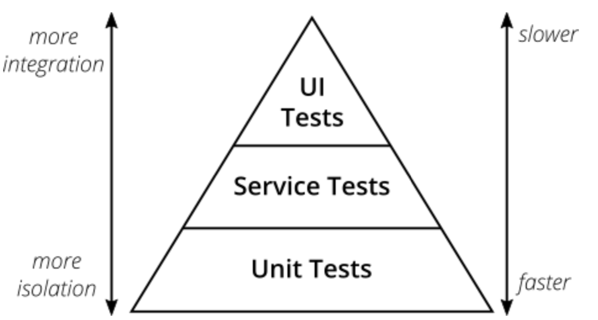
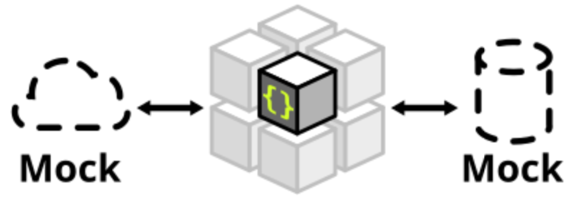
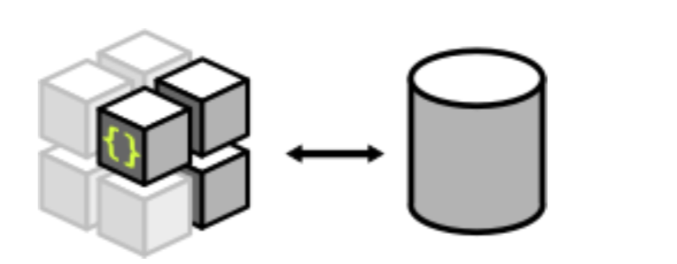
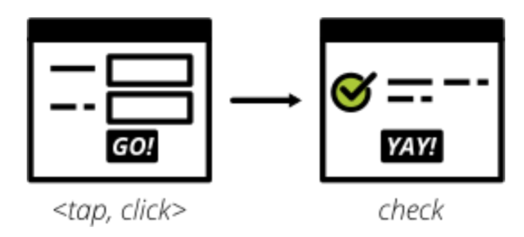

## Spring Boot Test

### 测试金字塔



测试金字塔包含的两个原则：
1. Write tests with different granularity
2. The more high-level you get the fewer tests you should have

### 单元测试



单元测试有两种类型：
1. Solitary unit test
2. Sociable unit test

这两种类型的区别是基于collaborators (e.g. other classes that are called by your class under test)的mock或stub：
1. Solitary unit test - mock或stub所有的collaborators
2. Sociable unit test - 允许调用真实的collaborators

对于单元测试，在Spring Boot中有两种测试方法：

1. Unit Testing with Mockito using MockitoRunner
```
@RunWith(MockitoJUnitRunner.class)
@Mock UserRepository - Create a mock for UserRepository
@InjectMocks UserService - Inject the mocks as dependencies into UserService
```

2. Unit Test launching the complete Spring Context using @MockBean
```
@RunWith(SpringRunner.class) - Spring Runner is used to launch up a spring context in unit tests.
@SpringBootTest - This annotation indicates that the context under test is a @SpringBootApplication.
@MockBean UserRepository - @MockBean annotation creates a mock for UserRepository. This mock is used in the Spring Context instead of the real UserRepository.
@Autowired UserService - Pick the UserService from the Spring Context and autowire it in.
```

至于mock和stub的区别，可以参见：https://martinfowler.com/articles/mocksArentStubs.html

### 集成测试

Integration tests live at the boundary of your service，有如下几种情况：

* Calls to your services' REST API
* Reading from and writing to databases
* Calling other microservices
* Reading from and writing to queues
* Writing to the filesystem

例如和文件系统/数据库的集成：


例如测试REST API/HTTP集成：


### UI测试



UI测试包含如下几种类型：
1. Behaviour
2. Layout
3. Usability


对于Behaviour测试来说：
* Angular，React和Vue.js有自己单元测试的工具和helpers
* 纯Javascript可以用Mocha或者Jasmine来做单元测试
* 对于JSP等Server-side rendered的界面，可用Selenium

### Reference

* https://docs.spring.io/spring-boot/docs/current/reference/html/boot-features-testing.html